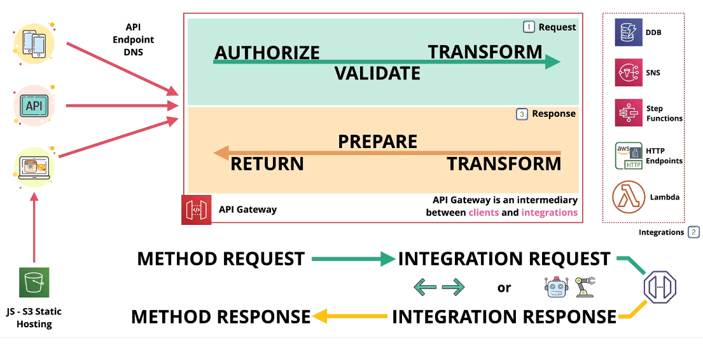
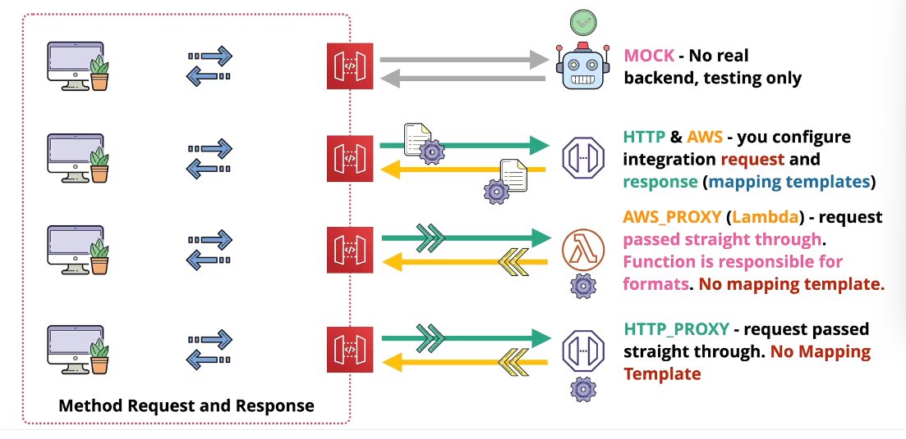
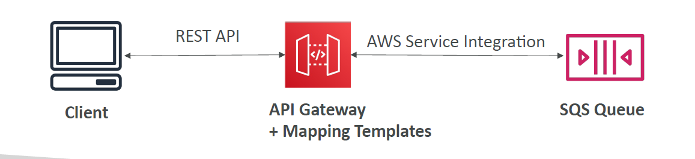
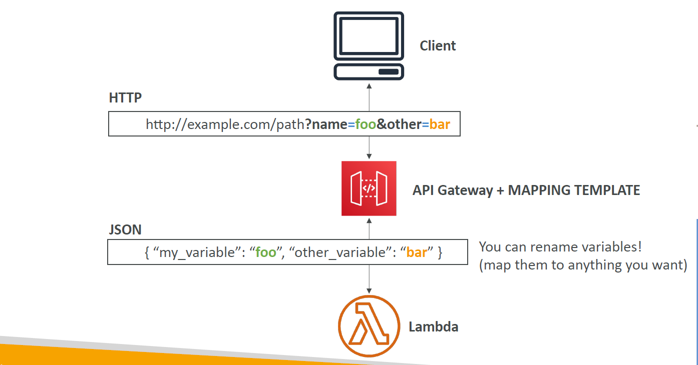
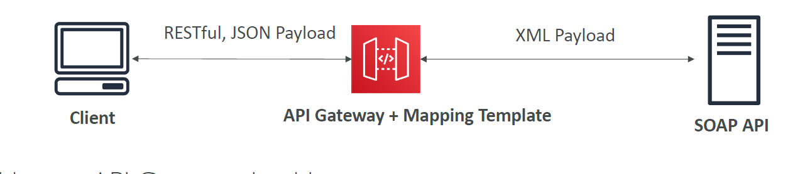

# 🔌🌐 **Amazon API Gateway – Integration Types & Mapping Templates**

> In API Gateway, **integration types** define **how your API connects to its backend** (Lambda, HTTP service, or even nothing).
> You can also use **mapping templates** to reshape the request and response payloads as needed.

---

<div style="text-align: center;">
    
</div>

## ⚙️ **Integration Types Overview**

There are **5 integration types** you can use in REST APIs:

| Integration Type | Purpose                                               | Mapping Supported? |
| ---------------- | ----------------------------------------------------- | ------------------ |
| 🧪 `MOCK`        | Simulate responses without any backend                | ✅ Yes             |
| 🌐 `HTTP`        | Send requests to public/private HTTP backend          | ✅ Yes             |
| 🧰 `AWS`         | Connect to AWS services (e.g., Lambda, SQS, DynamoDB) | ✅ Yes             |
| ⚡ `AWS_PROXY`   | Invoke Lambda via **Lambda Proxy** integration        | ❌ No              |
| 🔄 `HTTP_PROXY`  | Proxy directly to an HTTP endpoint                    | ❌ No              |

Let’s dive into each:

---

<div style="text-align: center;">
    
</div>

---

### 🔮 **1. MOCK Integration**

> Use when you want **API Gateway to return a response without contacting any backend**.

📌 Great for:

- Prototyping
- Returning static responses
- Testing request/response mapping

✅ **Supports full mapping templates** for simulating custom behavior.

---

### 🌐 **2. HTTP Integration**

> For calling **HTTP endpoints** (on-prem, internal, public).

You can:

- Send requests to a server like `https://api.company.com/data`
- Map path/query params, body, and headers
- Transform backend responses before sending to the client

> ✅ You control everything using **mapping templates**.

---

### 🧰 **3. AWS Integration**

> Used to **call AWS services directly** (e.g., SQS, DynamoDB, Step Functions).

---

<div style="text-align: center;">
    
</div>

---

You specify:

- The ARN of the service
- IAM role with permissions
- Any headers or parameters needed by the service

> ✅ Also supports **mapping templates** for full control.

---

### ⚡ **4. Lambda Proxy Integration (AWS_PROXY)**

> API Gateway **forwards the entire request directly to Lambda**
> Lambda returns a **structured JSON response** back to API Gateway.

📦 You get this structure in your Lambda:

```json
{
  "resource": "/example",
  "path": "/example",
  "httpMethod": "GET",
  "headers": { ... },
  "queryStringParameters": { ... },
  "body": "{...}",
  "isBase64Encoded": false
}
```

> ✅ Simple setup  
> ❌ **No mapping templates** — Lambda must do everything.

---

### 🔄 **5. HTTP Proxy Integration**

> API Gateway **forwards the HTTP request as-is** to a backend HTTP endpoint, and forwards the response directly to the client.
> Fast and low-config

---

> ✅ Useful for lifting legacy REST APIs behind an API Gateway
> ❌ Cannot modify requests or responses

---

## 🧪 **Mapping Templates – What & Why**

> A **mapping template** lets you **transform the request/response body** and headers between client and backend.

It uses **Velocity Template Language (VTL)**:

- Supports variables, conditionals, loops
- Extract headers, query params, path params
- Modify JSON/XML payloads

---

### 🧱 Use Cases

| Goal                                | Mapping Needed?    | Example                              |
| ----------------------------------- | ------------------ | ------------------------------------ |
| Rename query parameters             | ✅ Yes             | `name → username`, `id → customerId` |
| Convert REST JSON → SOAP XML        | ✅ Yes             | For SOAP backends                    |
| Extract a header and inject to body | ✅ Yes             | Authorization, device ID, etc.       |
| Convert input to match Lambda input | ✅ Yes (non-proxy) | Required when not using AWS_PROXY    |

---

## 📦 **Mapping Template Examples**

---

### ✅ Example 1: Rename Query Parameters

<div style="text-align: center;">
    
</div>

---

**Incoming request:**

```ini
GET /hello?name=foo&other=bar
```

**Mapping Template:**

```vtl
{
  "my_variable": "$input.params('name')",
  "other_variable": "$input.params('other')"
}
```

**Result sent to backend:**

```json
{
  "my_variable": "foo",
  "other_variable": "bar"
}
```

---

### ✅ Example 2: REST (JSON) → SOAP (XML)

<div style="text-align: center;">
    
</div>

---

**Client Request:**

```json
{
  "orderId": "1234",
  "amount": 99.99
}
```

**Mapping Template:**

```xml
<soapenv:Envelope xmlns:soapenv="http://schemas.xmlsoap.org/soap/envelope/">
   <soapenv:Body>
      <ns1:ProcessOrder xmlns:ns1="http://mycompany.com/soap">
         <orderId>$input.json('$.orderId')</orderId>
         <amount>$input.json('$.amount')</amount>
      </ns1:ProcessOrder>
   </soapenv:Body>
</soapenv:Envelope>
```

✅ Perfect when you’re integrating **API Gateway with legacy SOAP services**

---

### ✅ Example 3: Add a Header to Backend

```vtl
#set($inputRoot = $input.path('$'))
{
  "userId": "$input.params('userId')",
  "authToken": "$input.params().header.get('Authorization')"
}
```

---

## 🔄 **Response Mapping**

You can also transform the **response from the backend** before returning to the client.

**Example:**

From backend:

```json
{
  "internalId": "abc-123",
  "name": "Hady",
  "password": "secret"
}
```

**Mapping template (response):**

```vtl
{
  "id": "$input.path('$.internalId')",
  "name": "$input.path('$.name')"
}
```

✅ Result:

```json
{
  "id": "abc-123",
  "name": "Hady"
}
```

📌 Sensitive field (`password`) is stripped!

---

## 🧠 Summary Table – Integration Types

| Type         | Backend        | Mapping Templates | Notes                                   |
| ------------ | -------------- | ----------------- | --------------------------------------- |
| `MOCK`       | None           | ✅ Yes            | Return static responses (test/demo)     |
| `HTTP`       | HTTP endpoint  | ✅ Yes            | Call web APIs with full control         |
| `AWS`        | AWS services   | ✅ Yes            | Integrate SQS, DynamoDB, Step Functions |
| `AWS_PROXY`  | Lambda (proxy) | ❌ No             | Simple, all logic in Lambda             |
| `HTTP_PROXY` | HTTP endpoint  | ❌ No             | Fast, raw passthrough                   |

---

## ✅ Best Practices

| Practice                                   | Why It’s Smart                             |
| ------------------------------------------ | ------------------------------------------ |
| Use `AWS_PROXY` with Lambda for simplicity | You don’t need to write mapping templates  |
| Use mapping for legacy/strict backends     | When backend format doesn't match client   |
| Avoid mapping in `prod` unless needed      | Mapping increases complexity and latency   |
| Use `MOCK` for frontend contract testing   | Design frontend without backend dependency |
