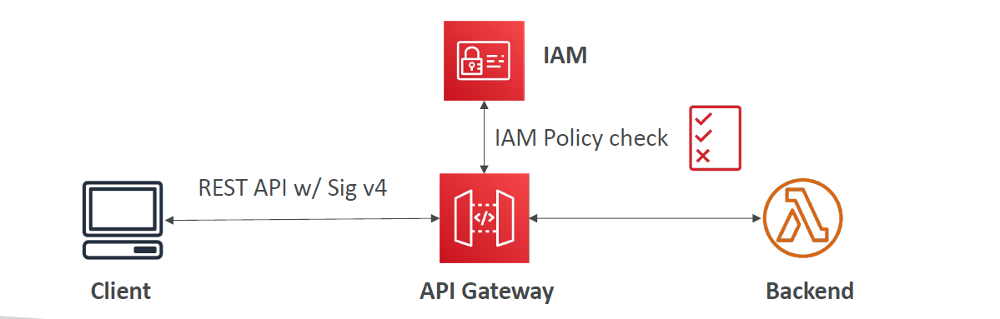
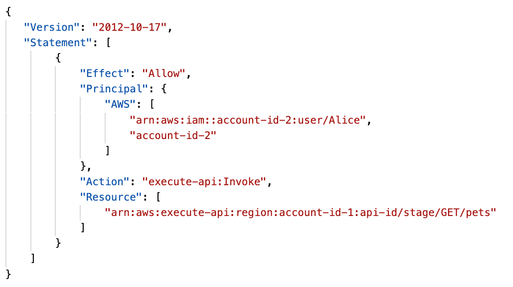
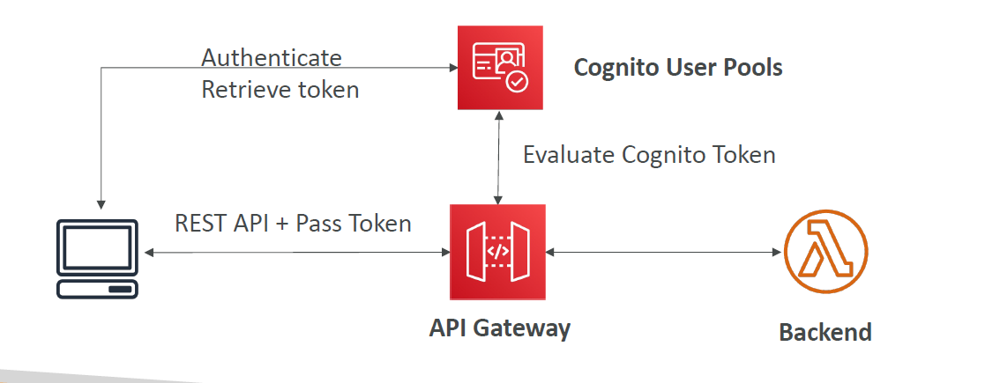
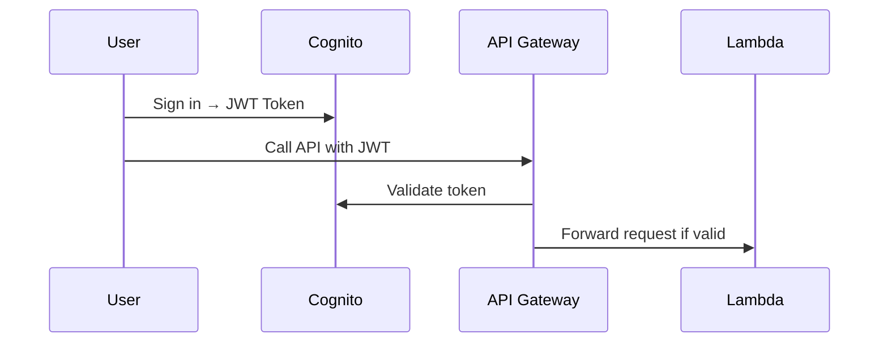
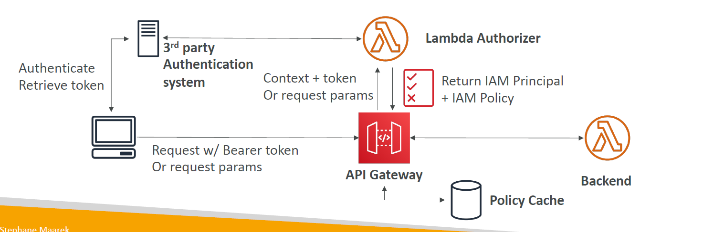

# 🔐 **Amazon API Gateway – Security Deep Dive**

> API Gateway is the front door to your backend — so **securing it is critical**.
> It supports **multiple security layers** depending on your use case, including **IAM**, **Cognito**, **Lambda Authorizers**, and **Resource Policies**.

---

## 🧭 **API Gateway Security – Two Categories**

### 🛡️ **IAM-Based (SigV4)**

Used when **clients are AWS entities** (like EC2, Lambda, CLI, SDK) that can sign requests using IAM credentials.

| Mechanism                | Description                                                                        |
| ------------------------ | ---------------------------------------------------------------------------------- |
| ✅ **IAM Authorization** | Uses **SigV4** signed requests + IAM policy to allow/deny access                   |
| ✅ **Resource Policies** | Attach **resource-level rules** (like IP/VPC restrictions or cross-account access) |
| 🔁 **Combined**          | You can **combine IAM with Resource Policies** for enhanced control                |

📌 **Great for:**

- Internal AWS-to-AWS access
- Cross-account secure access
- IP-restricted public APIs

---

### 🔐 **Authorizers (User-Driven Authentication)**

Used when **external users** or **tokens** are involved. Gateway verifies tokens and grants access.

| Mechanism                          | Description                                                                  |
| ---------------------------------- | ---------------------------------------------------------------------------- |
| ✅ **Cognito User Pools**          | Managed user pool with login, token issuance, auto-validation in API Gateway |
| ✅ **Lambda Authorizer – Token**   | You validate custom token (e.g. JWT, OAuth2) in a Lambda function            |
| ✅ **Lambda Authorizer – Request** | Fully customizable, trigger Lambda based on headers, query, or stage params  |

📌 **Great for:**

- Web/mobile applications
- Social login (Google, Facebook)
- Third-party identity systems
- Advanced custom authorization logic

---

## 🔒 **1. IAM-Based Authorization (SigV4)**

> ✅ Best for **internal AWS clients** (EC2, Lambda, CLI, SDKs)

---

<div style="text-align: center;">
  
</div>

---

### 🔧 How It Works

- Clients **sign requests using AWS Signature Version 4**
- Gateway verifies signature + IAM policy permissions

### 🧠 Authentication & Authorization

| Step           | Responsibility                            |
| -------------- | ----------------------------------------- |
| Authentication | IAM credentials (Access Key & Secret Key) |
| Authorization  | IAM policies (attached to user or role)   |

### 📌 Good For

- EC2, Lambda, or users **inside the same AWS account**
- **Cross-account access** using **resource policies**

---

### ✅ Example IAM Policy (API Invoke)

```json
{
  "Version": "2012-10-17",
  "Statement": [
    {
      "Effect": "Allow",
      "Action": "execute-api:Invoke",
      "Resource": "arn:aws:execute-api:us-east-1:123456789012:api-id/*/GET/resource"
    }
  ]
}
```

---

## 🛡️ **2. API Gateway Resource Policies**

> Like **bucket policies** or **Lambda resource policies**, but for APIs.

---

<div style="text-align: center;">
    
</div>

---

### ✅ What You Can Do

- Allow access from:

  - Specific **AWS accounts**
  - Specific **IP addresses**
  - Specific **VPC endpoints**

- Deny access explicitly (IP block, CIDR range, etc.)

### 🧠 Use With

- IAM or Lambda Authorizer for **fine-grained security**
- Public APIs where you need to restrict based on **network location**

### ✅ Example: Restrict to VPC Endpoint

```json
{
  "Version": "2012-10-17",
  "Statement": [
    {
      "Effect": "Allow",
      "Principal": "*",
      "Action": "execute-api:Invoke",
      "Resource": "arn:aws:execute-api:us-east-1:123456789012:api-id/*",
      "Condition": {
        "StringEquals": {
          "aws:SourceVpce": "vpce-abc123"
        }
      }
    }
  ]
}
```

---

## 🧑‍🤝‍🧑 **4. Cognito User Pools**

> Best for **user-based authentication** (apps, websites, mobile users).

---

<div style="text-align: center;">
    
</div>

---

### ✅ Features

- Managed **user pool** (signup, login, password reset, MFA)
- Supports **federated identity** (Google, Facebook, Apple)
- API Gateway handles **token verification** automatically

### 🧠 Auth Flow



### 📌 Best For

- **External users** (mobile/web apps)
- Simple auth flows with no custom logic

> 🔐 Auth = Cognito
> ⚖️ Authorization = Backend or method-level access control

---

## 🧠 **5. Lambda Authorizers (Custom Authorizers)**

> ✅ Best for **3rd-party tokens** like **OAuth2**, **JWT**, or **custom headers**

---

<div style="text-align: center;">
    
</div>

---

### 📦 How It Works

- API Gateway invokes a Lambda **before forwarding request**
- Lambda **verifies token or custom logic**
- Returns an **IAM policy** with `Allow` or `Deny`

---

### Types of Lambda Authorizers

| Type        | Triggered By             | Use Case                         |
| ----------- | ------------------------ | -------------------------------- |
| **Token**   | `Authorization` header   | JWT, OAuth, custom bearer token  |
| **Request** | Any param, header, query | Flexible – custom logic by input |

### ✅ Example: Token-Based

1. Client sends:

   ```ini
   Authorization: Bearer eyJhbGci...
   ```

2. API Gateway calls your Lambda Authorizer
3. Lambda verifies the token, returns IAM policy:

   ```json
   {
     "principalId": "user123",
     "policyDocument": {
       "Statement": [
         {
           "Effect": "Allow",
           "Action": "execute-api:Invoke",
           "Resource": "arn:aws:execute-api:region:account-id:api-id/*/GET/resource"
         }
       ]
     }
   }
   ```

### 📌 Notes

- Lambda result is **cached** (default: 300 seconds)
- You pay per **Lambda Authorizer invocation**

---

## 🧠 Summary Table – API Gateway Security Options

| Option                | Best For                       | Auth          | Authorization             | Mapping           | Custom Code? |
| --------------------- | ------------------------------ | ------------- | ------------------------- | ----------------- | ------------ |
| **IAM**               | AWS users, EC2, CLI, SDK       | IAM SigV4     | IAM policy                | ❌ No             | ❌ No        |
| **Resource Policy**   | Cross-account, IP, VPC         | None          | Resource policy           | ❌ No             | ❌ No        |
| **Cognito**           | App/mobile users               | JWT (Cognito) | API Gateway or backend    | ❌ No             | ❌ No        |
| **Lambda Authorizer** | 3rd-party tokens, custom logic | External      | Lambda returns IAM policy | ✅ Yes (optional) | ✅ Yes       |

---

## ✅ Best Practices

| Use Case                               | Best Option                      |
| -------------------------------------- | -------------------------------- |
| AWS service → API Gateway              | IAM + Resource Policy            |
| Web/Mobile users with login            | Cognito User Pools               |
| Using Auth0 / Firebase / Google tokens | Lambda Authorizer (Token mode)   |
| Limit access to IP or VPC only         | Resource Policy                  |
| Need custom business logic             | Lambda Authorizer (Request mode) |
