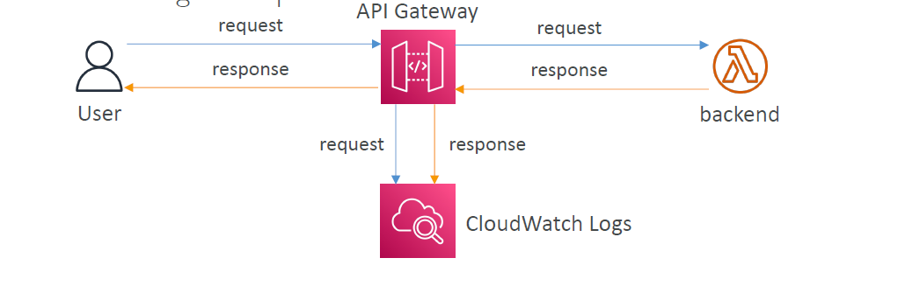

# 📊🔍 **Amazon API Gateway – Logging, Metrics, Throttling & Error Handling**

> Monitoring your API is just as important as building it.
> API Gateway integrates with **CloudWatch Logs**, **CloudWatch Metrics**, **AWS X-Ray**, and supports **throttling limits** and **detailed error responses** to help you observe and protect your APIs.

---

    

---

## 📄 **1. CloudWatch Logs – See the Full Request**

> CloudWatch Logs capture **request and response** details for every API call (if enabled).

✅ You can see:

- Request/response body (for debugging)
- Errors and latency
- Mapping templates in action

### 🔧 How to Enable

- Go to **Stages → \[stage name] → Logs/Tracing**
- Enable **CloudWatch Logs**
- Set **Log Level**: `ERROR`, `INFO`, or `DEBUG`
- Choose whether to log **full request/response**

📌 Logs are organized by **API + Stage name**
📌 You can override logging for **specific methods** if needed

---

## 🧭 **2. AWS X-Ray – Visual Request Tracing**

> Use X-Ray for **distributed tracing** to follow a request **end-to-end** through API Gateway, Lambda, DynamoDB, etc.

✅ Helps find:

- Slow segments
- Integration failures
- Bottlenecks across services

### 🔧 How to Enable

- In the **stage settings**, enable **X-Ray tracing**
- Works best with **Lambda integrations** also using X-Ray

📌 You'll see a **timeline of the request**, broken into logical parts

---

## 📈 **3. CloudWatch Metrics – API Health at a Glance**

> API Gateway publishes built-in **CloudWatch metrics per stage**.

| Metric               | Meaning                                                 |
| -------------------- | ------------------------------------------------------- |
| `Count`              | Total API requests                                      |
| `Latency`            | Total time from receiving request to returning response |
| `IntegrationLatency` | Time taken by the backend (e.g., Lambda)                |
| `4XXError`           | Client-side errors (bad requests, auth issues)          |
| `5XXError`           | Server-side errors (Lambda crash, timeout, etc.)        |
| `CacheHitCount`      | Requests served from cache                              |
| `CacheMissCount`     | Requests that hit backend due to no cache               |

📌 These metrics are **per-stage**, and you can enable **detailed metrics** for finer granularity.

---

## 🚦 **4. Throttling – Protecting Your APIs**

> Throttling helps **prevent abuse and protect backend resources** by limiting request rates.

### 🧱 Types of Throttling

| Level                  | Description                                           |
| ---------------------- | ----------------------------------------------------- |
| **Account-wide limit** | Default: 10,000 req/sec (soft limit) across all APIs  |
| **Stage-level limit**  | Limit per stage (e.g., `prod` gets 1,000 req/sec max) |
| **Method-level limit** | Fine-tune per method (e.g., `GET /orders`)            |
| **Usage Plan limit**   | Per API Key / customer (for monetized APIs)           |

### ⚠️ What Happens on Throttling?

- Returns **HTTP `429 Too Many Requests`**
- Clients can **retry** after a small delay

---

## 🚨 **5. Common API Gateway Error Codes**

| HTTP Code | Meaning             | When It Happens                                   |
| --------- | ------------------- | ------------------------------------------------- |
| **400**   | Bad Request         | Missing param, invalid input format               |
| **403**   | Forbidden           | IAM denied, WAF blocked                           |
| **429**   | Too Many Requests   | Throttling or quota exceeded                      |
| **502**   | Bad Gateway         | Invalid response from Lambda/HTTP backend         |
| **503**   | Service Unavailable | Backend unavailable or scaling limit hit          |
| **504**   | Integration Timeout | Lambda/HTTP backend took too long (>29 sec limit) |

🕐 **API Gateway has a max timeout of 29 seconds** — plan your backend accordingly!

---

## ✅ Summary – API Gateway Observability & Protection

| Category      | Tool                           | Key Benefit                                  |
| ------------- | ------------------------------ | -------------------------------------------- |
| 🔍 Logs       | CloudWatch Logs                | Inspect request/response/errors              |
| 🧭 Tracing    | AWS X-Ray                      | Visual end-to-end request tracing            |
| 📈 Metrics    | CloudWatch Metrics             | Monitor API health and usage                 |
| 🚦 Throttling | Limits at account/stage/method | Control traffic and prevent backend overload |
| 🚨 Errors     | HTTP codes                     | Understand what failed and where             |
