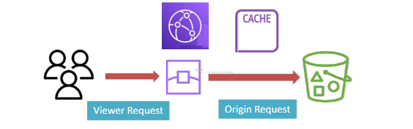
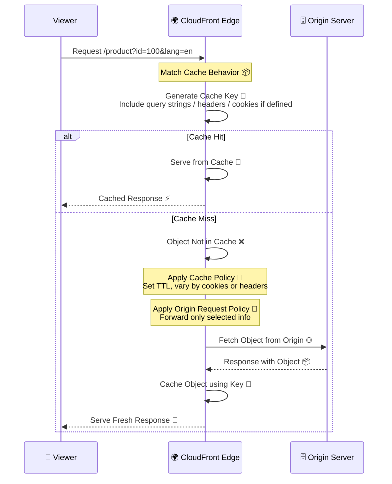
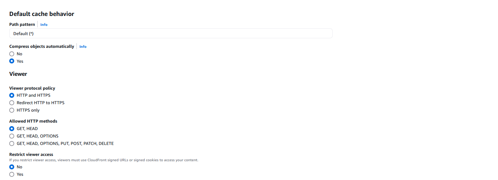
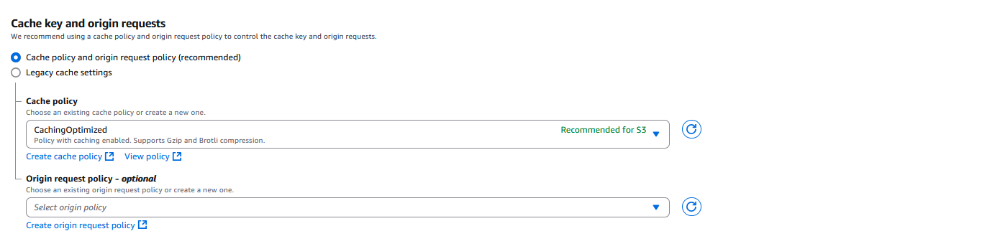

# 🌐 **Amazon CloudFront Cache Configuration – Step-by-Step Workflow**

> 📦 Amazon CloudFront is a **Content Delivery Network (CDN)** that caches content at edge locations to deliver it faster to users. But **how** CloudFront decides what to cache, when to cache, and what to send to the origin depends on four key components:

---

<div style="text-align: center;">
  
</div>

---

## 🧭 **Full Workflow Overview**

<div align="center">



</div>

---

## 🔹 **Step 1: `Cache Behavior` – What to Match?**

> **Cache Behavior** decides **which request pattern** gets which behavior.

---

<div style="text-align: center;">
  
</div>

---

### 🎯 **Purpose:**

- Match request **paths** to specific behaviors
- Define what to **do with that request**

### 🔧 **Config Includes:**

| Option                     | Description                            |
| -------------------------- | -------------------------------------- |
| **Path Pattern**           | e.g., `/images/*` or `/videos/*`       |
| **Origin**                 | Which backend to fetch content from    |
| **Allowed Methods**        | e.g., GET, POST                        |
| **Viewer Protocol Policy** | Redirect HTTP to HTTPS?                |
| **Associated Policies**    | Attach Cache & Origin Request Policies |

---

## 🧩 **Step 2: `Cache Key` – What to Use to Identify a Cached Object?**

> A **Cache Key** is a **unique fingerprint** that CloudFront uses to check if the content is already cached.

### 🧠 **Think of It As:**

> 🤔 “How can I know if I’ve seen this request before?”
> 💡 If two requests have the same cache key → CloudFront can reuse the cached content.

### 🔧 **By Default, the Cache Key Includes:**

1. **Host header** → e.g., `d123.cloudfront.net`
2. **Request path** → e.g., `/images/logo.png`

---

### 🎛️ **Optionally, You Can Add to the Cache Key:**

| Type              | Example                         | Why?                                      |
| ----------------- | ------------------------------- | ----------------------------------------- |
| **Query strings** | `?lang=en&size=large`           | Cache different versions of the same path |
| **Headers**       | `Accept-Encoding`, `User-Agent` | Cache per device, encoding, etc.          |
| **Cookies**       | `session-id`, `user-preference` | Personalize cache by user/session         |

These are **not included by default** — you configure this via a **Cache Policy**.

---

### 📦 Cache Key Construction Example

Say you configure your **Cache Policy** to include:

- Query string: `lang`
- Header: `Accept-Encoding`
- Cookie: `user-id`

Then for this request:

```http
GET /product?id=10&lang=en HTTP/1.1
Host: d123.cloudfront.net
Cookie: user-id=789; session=abc
Accept-Encoding: gzip
```

✅ The Cache Key will be based on:

```ini
d123.cloudfront.net/product
+ lang=en
+ Accept-Encoding=gzip
+ Cookie user-id=789
```

> 🔁 So if another user comes with a different `lang` or `user-id`, they'll **generate a different cache key** → and may get a cache **miss**.

---

## 🧮 **Step 3: `Cache Policy` – How to Cache It?**

> **Cache Policy** controls **how long to cache** and **what to include** in the cache key.

---

<div style="text-align: center;">
  
</div>

---

### 🧰 **What’s Inside:**

| Feature                | Purpose                                  |
| ---------------------- | ---------------------------------------- |
| **TTL (Time To Live)** | How long to keep object cached           |
| **Query Strings**      | Add query values to cache key?           |
| **Headers**            | e.g., `Accept-Encoding` for gzip support |
| **Cookies**            | Different cache per user session?        |

> 🔄 If the cache key doesn’t match or TTL expires → it’s a **cache miss** and CloudFront goes to the origin.

---

## 🚚 **Step 4: `Origin Request Policy` – What to Send to Origin?**

> This controls what info CloudFront forwards **to your backend** (e.g., S3, ALB, EC2, etc.)

### 🔍 **Main Job:**

> Prevent unnecessary data (cookies, headers) from going to the origin.

### 🎛 **What You Can Control:**

| Data              | Example                                     |
| ----------------- | ------------------------------------------- |
| **Query Strings** | Only forward needed ones like `?version=2`  |
| **Headers**       | Forward `Authorization`, block others       |
| **Cookies**       | Send `session-id`, ignore marketing cookies |

> ✅ Less forwarded data = lower origin load = faster responses.

---

## 🏁 **Final Step: Object Caching & Response**

1. CloudFront receives the response from the origin.
2. It stores the object at the edge cache **using the Cache Key**.
3. Serves the response to the viewer.
4. For future requests, **checks the cache first** using the same key.

---

## 🧠 **Summary Table: 4 Key Components**

| Component                 | Think of It As... | Controls                       |
| ------------------------- | ----------------- | ------------------------------ |
| **Cache Behavior**        | Rulebook          | What URLs get what behavior    |
| **Cache Key**             | Object ID         | Helps determine cache hit/miss |
| **Cache Policy**          | Memory Settings   | What to cache + for how long   |
| **Origin Request Policy** | What to Send      | Controls what goes to origin   |

---

## 💡 Real Example

You want:

- `/images/*` to be cached based on query param like `?size=large`
- Only send `Accept-Language` header to origin
- Cache for 1 hour

You’d configure:

| Setting                   | Value                                    |
| ------------------------- | ---------------------------------------- |
| **Cache Behavior**        | Path = `/images/*`, origin = S3          |
| **Cache Policy**          | Include query string `size`, TTL = 3600s |
| **Origin Request Policy** | Forward `Accept-Language` header only    |

---

## 🧠 Tips for Mastery

- Use **Managed Policies** first (like `CachingOptimized`) to avoid over-customizing
- Analyze **cache hit ratio** in CloudFront metrics
- Don’t forward unnecessary headers or cookies unless required by backend
