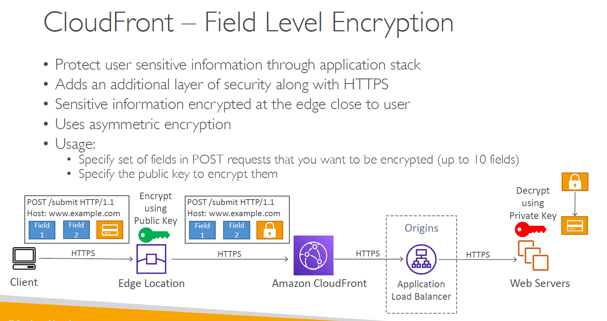

```mermaid
sequenceDiagram
    participant 👤 as 👤 Browser
    participant 🌍 as 🌍 CloudFront (Edge)
    participant 🏠 as 🏠 Origin App

    👤->>🌍: HTTPS POST with encrypted fields (e.g., cardNumber, SSN)
    🌍->>🏠: Forwards encrypted payload (unchanged)
    🏠->>🏠: Decrypts fields using private key 🔐
```

# 🛡️ **Amazon CloudFront Field-Level Encryption (FLE)**

> _Protect the most sensitive form fields with asymmetric encryption — from browser to origin._

---

<div style="text-align: center;">
    
</div>

---

## 🔐 **What Is Field-Level Encryption?**

**Field-Level Encryption** (FLE) in Amazon CloudFront allows you to **encrypt specific fields in HTTP POST requests** at the **client-side (browser)** using a **public key**, so the data remains **secure end-to-end** — even as it passes through **CloudFront edge locations**.

> 🔒 Only your **origin application** (with the **private key**) can decrypt the encrypted fields.

---

## 🧬 **Key Features**

| 🔧 Feature                         | 📘 Description                                                        |
| ---------------------------------- | --------------------------------------------------------------------- |
| 🔐 **End-to-End Field Protection** | Encrypts specific fields from **user browser → origin app**           |
| 🧠 **Asymmetric Encryption (RSA)** | Uses **public-private key pair** (e.g., 2048-bit RSA)                 |
| ✍️ **Targeted Field Encryption**   | Encrypt up to **10 fields** per request (e.g., SSN, credit card, PII) |
| 🌍 **Public Key at CloudFront**    | CloudFront uses it to encrypt form fields                             |
| 🏠 **Private Key at Origin**       | Your backend app decrypts values before processing                    |

---

## 🔁 **How It Works**

> - FLE ensures sensitive data like credit card numbers, SSNs, or passwords are encrypted,
> - so even if an unauthorized entity gains access to your logs or data in transit,
> - they won't be able to read the sensitive information.
> - It is preferred to encrypt sensitive data on the client-side (in the browser) before sending it to CloudFront.
> - However, if the client-side encryption is not possible, CloudFront can encrypt the fields.
> - This is useful for ensuring that sensitive data is not logged or exposed in an unauthorized manner.

---



---

> 🔐 CloudFront never decrypts the fields — it simply forwards the encrypted values to the origin.

---

## 🛠️ **Setup Overview**

1. **Generate RSA Key Pair** (2048-bit recommended).
2. **Upload Public Key** to CloudFront (in console or via API).
3. Create a **Field-Level Encryption Profile**:

   - Define **field patterns** (e.g., `card_number`, `ssn`)
   - Attach **public key**

4. Attach this profile to your **CloudFront Distribution**.
5. At the **origin**, decrypt the fields using your **private key**.

---

## 🎯 **Common Use Cases**

| Use Case                 | Description                                     |
| ------------------------ | ----------------------------------------------- |
| 💳 Secure Card Info      | Encrypt fields like `card_number`, `CVV`, `exp` |
| 🧍‍♂️ PII Protection        | SSNs, phone numbers, names, addresses           |
| 🏥 HIPAA-compliant Forms | Health records and insurance information        |

---

## ✅ **Benefits**

| 🔐 Benefit                    | Why It Matters                                   |
| ----------------------------- | ------------------------------------------------ |
| End-to-end encryption         | Even CloudFront can't view your sensitive fields |
| Defense-in-depth              | Adds another layer beyond HTTPS/TLS              |
| Protection at the field level | Only sensitive parts are encrypted               |
| Zero Trust Data Transport     | Prevents data exposure via logs, middleboxes     |

---

## 📦 When Should You Use FLE?

Use **Field-Level Encryption** if:

- You are collecting sensitive data from **web forms**
- You want to **prevent leakage** of PII via logs, headers, or proxies
- You want to comply with **PCI DSS**, **HIPAA**, or **GDPR** where **edge-to-origin** encryption isn’t enough

---

## 🧠 Pro Tips

| Tip                                      | Why                            |
| ---------------------------------------- | ------------------------------ |
| Use **short-lived keys** and rotate them | Improves crypto hygiene        |
| Use **Field Matching Patterns**          | Encrypt only needed fields     |
| Decrypt server-side securely             | Avoid logging decrypted values |
| Combine with WAF for layered protection  | Block bots or request flooding |

---

## 📚 Resources

- [🔐 CloudFront Field-Level Encryption Docs](https://docs.aws.amazon.com/AmazonCloudFront/latest/DeveloperGuide/data-encryption.html)
- [🔎 Amazon Macie Overview](https://docs.aws.amazon.com/macie/latest/user/what-is-macie.html)
- [💡 AWS Security Best Practices](https://docs.aws.amazon.com/security/?id=docs_gateway)

---

## 🎁 **Bonus: So… How Is the Data Encrypted _Before_ Reaching CloudFront?**

> 🧠 **Answer**: The encryption must happen **on the client side (browser)** using a **JavaScript encryption SDK** provided or generated by AWS tools.

Let’s break this down clearly 👇

---

### 🧩 **FLE Requires Client-Side Encryption in the Browser**

### ✅ This means

- Your **web frontend app** (JavaScript in the browser) is responsible for:

  1. Finding the specific fields (e.g., `card_number`, `ssn`)
  2. Encrypting them using the **public key** before submission
  3. Submitting the encrypted values via a **regular HTTPS POST** request

> ❌ CloudFront **does not encrypt** the fields — it expects them to **already be encrypted** when they arrive.

---

### 📦 How to Do It in Practice?

### Step-by-Step

1. **You define an FLE configuration** in CloudFront:

   - Choose fields to encrypt
   - Upload your public RSA key

2. AWS provides a **JavaScript SDK** or **code snippet** (with field patterns + public key info)
3. You embed that JS code in your form page:

   - It hooks into the form’s `submit` handler
   - It encrypts the configured fields using **RSA encryption**

4. The **browser sends** the encrypted POST request
5. CloudFront forwards it untouched to your origin
6. Your **backend decrypts** using the private key

---

### 🔐 Example: Client-Side JS Flow

```html
<form id="payment-form">
  <input name="card_number" />
  <input name="cvv" />
  <button type="submit">Pay</button>
</form>

<script src="aws-fle-client-lib.js"></script>
<script>
  const publicKeyId = "YOUR_PUBLIC_KEY_ID";
  const fieldsToEncrypt = ["card_number", "cvv"];

  // AWS-provided or custom encryption logic
  const fle = new AwsFleEncryptor(publicKeyId, fieldsToEncrypt);

  document.getElementById("payment-form").addEventListener("submit", function (e) {
    e.preventDefault();
    fle.encryptForm(e.target).then(() => {
      e.target.submit(); // submit with encrypted values
    });
  });
</script>
```

> AWS does not provide an official SDK, but [third-party AWS tools](https://github.com/aws-samples/field-level-encryption-sample-code) exist, or you implement it using the configuration metadata + RSA encryption in JS (like `node-rsa` in browser).
