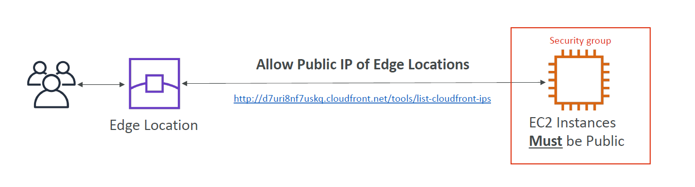
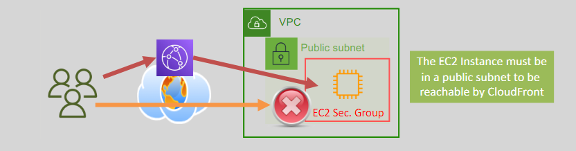
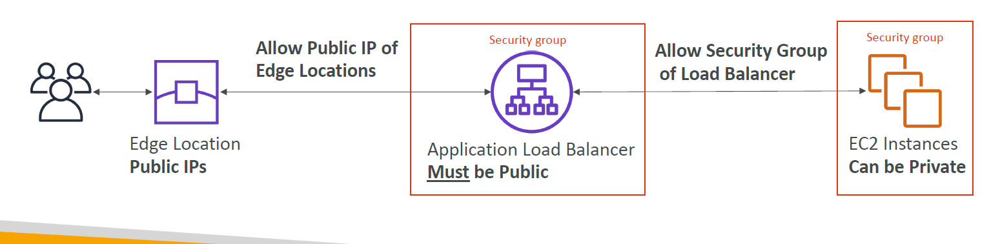
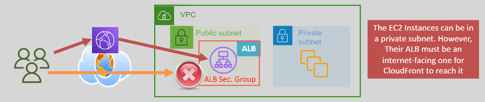

# 🔐 **Limiting Origin Access for EC2, ALB, or NLB via CloudFront Only**

> ✅ Secure your backend by ensuring that **only CloudFront** can access your origin — whether it's exposed publicly or privately inside a VPC.

---

## 🚩 **Why Limit Origin Access?**

When you use **EC2**, **Application Load Balancer (ALB)**, or **Network Load Balancer (NLB)** as CloudFront origins:

- ❌ You **don’t want users to bypass CloudFront** and hit your origin directly.
- ✅ You want **all traffic to go through CloudFront**, where you can apply caching, rate limiting, WAF, geo restriction, etc.

---

## 🛠️ Two Setup Options

| Access Pattern                   | Use Case                                                           |
| -------------------------------- | ------------------------------------------------------------------ |
| **Public Origin (with SG lock)** | Origin has public IP or DNS, but you restrict access to CloudFront |
| **Private Origin (VPC only)**    | Origin is inside private subnet — only CloudFront can reach it     |

Let’s explore both.

---

## 🌍 **Option 1: Restricting a Public Origin (via CloudFront Edge IPs)**

<div align="center">
    
    
</div>

---

<div align="center">
    
    
</div>

### 📌 Use When

- Your EC2, ALB, or NLB is **publicly exposed**
- But you want to **block all traffic** except what comes from CloudFront

---

### ✅ Step-by-Step

#### 1. **Use the CloudFront Managed Prefix List**

AWS provides a **managed prefix list** for all CloudFront edge IPs:

```text
com.amazonaws.global.cloudfront.origin-facing
```

This list includes all IP ranges used by CloudFront to fetch content from origins.

#### 2. **Configure Your Origin's Security Group**

Allow **only** traffic from the managed prefix list. Example for HTTPS:

```bash
Type: HTTPS
Protocol: TCP
Port: 443
Source: Prefix List → com.amazonaws.global.cloudfront.origin-facing
```

Then **remove any 0.0.0.0/0 or ::/0 rules** that allow the public to access your origin directly.

#### 3. **Use the Origin in CloudFront**

In your CloudFront distribution:

- Set the origin domain to your EC2 public DNS or ALB DNS
- Now only CloudFront can reach it

---

### 🧠 Benefits

| Feature               | Description                                      |
| --------------------- | ------------------------------------------------ |
| 🔐 Access Lockdown    | Blocks all non-CloudFront traffic                |
| 🔄 Auto IP Updates    | AWS automatically updates the prefix list        |
| 🛡️ WAF Integration    | Filter and protect requests using CloudFront WAF |
| 🧾 Simpler Management | No need to manually track IP ranges              |

---

## 🔒 **Option 2: Using Private Origins (No Public IP)**

<div align="center">
    
</div>

---

### 📌 Use When

- Your EC2, ALB, or NLB has **no public IP**
- You want to keep your infrastructure **fully inside a VPC**
- Only **CloudFront** should reach your service privately

---

### 🔧 Configuration Options

| Option                     | How It Works                                               |
| -------------------------- | ---------------------------------------------------------- |
| **Private ALB or NLB**     | Place the load balancer in private subnets                 |
| **EC2 in private subnet**  | Host your app in private subnet, exposed via internal ALB  |
| **VPC Link (API Gateway)** | For REST APIs, use API Gateway with **VPC Link to NLB**    |
| **Route 53 Private DNS**   | Use a private DNS name for the origin target in CloudFront |

In all cases, **CloudFront reaches your origin from inside the VPC** — there is **no public internet exposure**.

---

## 🧰 Summary Table

| Feature                        | Public Origin (Prefix List) | Private Origin (VPC Only)           |
| ------------------------------ | --------------------------- | ----------------------------------- |
| ✅ Access restricted to CF     | ✅ Yes                      | ✅ Yes                              |
| 🌐 Needs public IP/DNS         | ✅ Required                 | ❌ Not required                     |
| 🔒 Fully internal architecture | ❌ No                       | ✅ Yes                              |
| ⚙️ Requires VPC setup          | ❌ Minimal                  | ✅ Yes (subnet/NLB config required) |

---

## ✅ Best Practices

- 🛑 Remove direct access (`0.0.0.0/0`) from origin security groups.
- 🔐 Always use **HTTPS** between CloudFront and your origin.
- ✅ Use the **CloudFront prefix list** (public) or **private origin** via VPC.
- 🧩 Add **WAF** to CloudFront for advanced protection.
- 📉 Monitor access using **CloudWatch + access logs**.
