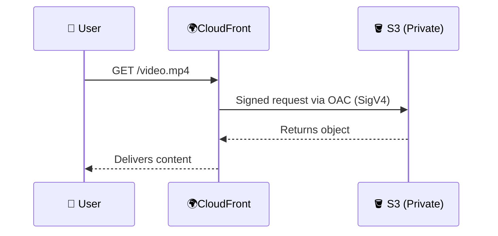
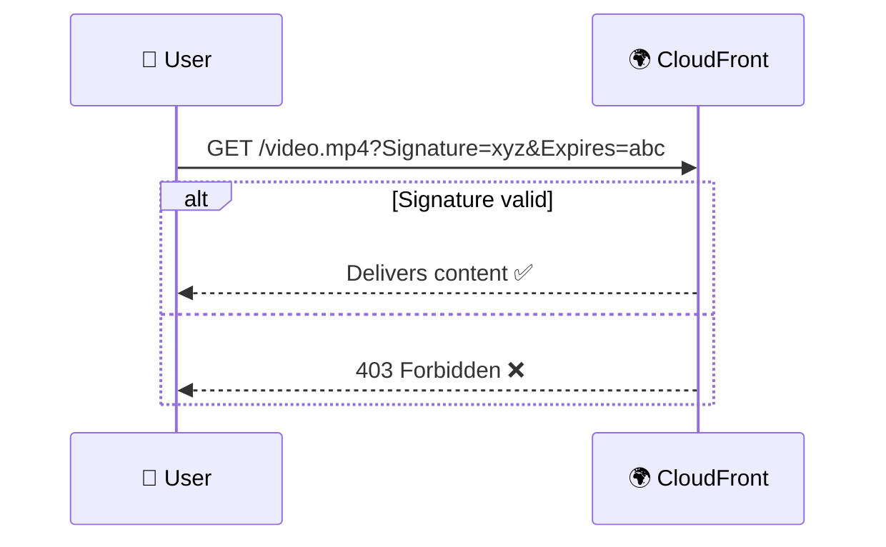

# 🔐 **CloudFront Security: OAC vs. Signed URLs vs. Signed Cookies**

## 🧠 **What Is “Private Content”?**

> Content that you want to restrict access to, such as:

- 🎥 Paid videos
- 📄 Confidential documents
- 🔒 Customer-specific downloads

CloudFront supports **two layers of protection**:

| Purpose                                   | Solution                         |
| ----------------------------------------- | -------------------------------- |
| Prevent **direct origin access**          | ✅ Origin Access Control (OAC)   |
| Restrict **viewer access via CloudFront** | ✅ Signed URLs or Signed Cookies |

---

| Feature                            | Purpose                                                               |
| ---------------------------------- | --------------------------------------------------------------------- |
| **🧠 OAC (Origin Access Control)** | Control **how CloudFront talks to your origin (e.g., S3)** securely   |
| **🔑 Signed URLs/Cookies**         | Control **who can access CloudFront content** (viewer-level security) |

---

## 🔁 They solve **two different problems**

### 🔐 **1. Origin Access Control (OAC)**

> Prevents users from **bypassing CloudFront** and directly accessing your S3 bucket.  
> Think of it as: `"CloudFront --→ S3 pipe security"`

### ✅ Key Role

- CloudFront signs each **origin request** using SigV4.
- Your S3 bucket blocks all public access.
- Only CloudFront (with the correct OAC) can fetch content from the origin.

---

### 🔑 **2. Signed URL / Signed Cookie**

> Controls which **viewers/users** can access CloudFront content.  
> Think of it as: `"User --→ CloudFront viewer access"`

### ✅ Key Role

- You generate a **temporary, signed URL** (or a cookie) with an expiration time.
- Users without the signature **can’t access** the content via CloudFront.
- Used for **paid/private downloads**, streaming, memberships, etc.

---

## 🧭 Sequence Comparison

### 🔐 With OAC (no signed URL)

> Viewer can access **any cached file**  
> No restrictions on **who** the viewer is

---

### 🔑 With Signed URL

> Viewer **must have a valid signature**
> Used for **download access control**

---

## 🧠 TL;DR – When to Use What?

| Goal                             | Use                               |
| -------------------------------- | --------------------------------- |
| 🔐 Keep S3 bucket private        | ✅ Use **OAC**                    |
| 🔑 Restrict who can access files | ✅ Use **Signed URLs or Cookies** |
| 🎯 Do both                       | ✅ Combine both                   |

---

## ✅ Combine Both for Full Security

| Layer        | Tool              | What It Does                  |
| ------------ | ----------------- | ----------------------------- |
| Viewer → CDN | Signed URL/Cookie | Only authorized users allowed |
| CDN → Origin | OAC               | Only CloudFront can reach S3  |
