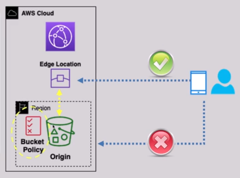

# 🛑 **Restricting S3 Bucket Access to CloudFront Only (Using Origin Access Control - OAC)**

> _Ensure your S3 bucket content is **served only through CloudFront**, not accessible directly over the internet._

---

## 🔐 **What Is Origin Access Control (OAC)?**

**Origin Access Control (OAC)** is the modern, more flexible replacement for Origin Access Identity (OAI). It lets **CloudFront securely access private S3 buckets** by signing requests and authenticating using IAM-style policies.

✅ Use OAC when your S3 bucket is **not a static website endpoint** (i.e., use a **REST API-style S3 bucket**).

---

## ⚙️ **How OAC Works – Behind the Scenes**

🔒 **CloudFront signs requests** to the S3 bucket on your behalf.

📜 **S3 bucket policy** allows access only if:

- The request is **signed by CloudFront**
- The request **matches the CloudFront distribution’s ARN**

❌ **No public access needed** — `Block Public Access` can stay **fully enabled**.

---

<div align="center">
  
</div>

---

## 🔑 **OAC Signing Behavior Options**

| Mode                        | Behavior                                                                                                 |
| --------------------------- | -------------------------------------------------------------------------------------------------------- |
| ✅ **Sign origin requests** | CloudFront **signs** each request to S3 — best for private access                                        |
| 🚫 **Do not sign requests** | CloudFront sends unsigned requests — S3 **must be public** (not recommended)                             |
| 🔄 **Pass authorization**   | CloudFront **forwards the Authorization header** from the client (used in signed URLs/cookies workflows) |

---

## 📜 **Example S3 Bucket Policy (with OAC)**

Here’s a sample policy to **allow only CloudFront** (via OAC) to get objects from the bucket:

```json
{
  "Version": "2012-10-17",
  "Statement": {
    "Sid": "AllowCloudFrontReadOnly",
    "Effect": "Allow",
    "Principal": {
      "Service": "cloudfront.amazonaws.com"
    },
    "Action": "s3:GetObject",
    "Resource": "arn:aws:s3:::my-bucket-name/*",
    "Condition": {
      "StringEquals": {
        "AWS:SourceArn": "arn:aws:cloudfront::<account-id>:distribution/<distribution-id>"
      }
    }
  }
}
```

> 📌 Replace `my-bucket-name`, `<account-id>`, and `<distribution-id>` accordingly.

---

## 💡 **Best Practices for OAC & CloudFront with S3**

| Best Practice                            | Why It Matters                                         |
| ---------------------------------------- | ------------------------------------------------------ |
| 🔒 **Block all public access**           | Ensures objects are **only accessible** via CloudFront |
| ✍️ **Enable request signing**            | Forces CloudFront to authenticate to S3 securely       |
| 🛡 **Avoid legacy OAI if possible**       | Use **OAC**, which is more powerful and flexible       |
| 📈 **Monitor with CloudWatch + S3 logs** | Track access patterns and potential misconfigurations  |
| 🌐 **Use HTTPS only**                    | Ensure secure communication between CloudFront and S3  |

---

## ✅ **Why Use CloudFront + OAC with S3?**

- ✅ **Private content delivery** without exposing your S3 bucket to the internet
- ✅ **WAF protection, caching, geo restriction** and more — all managed through CloudFront
- ✅ **IAM-style policy** for fine-grained access control
- ✅ **Supports modern use cases**, unlike the older OAI approach
