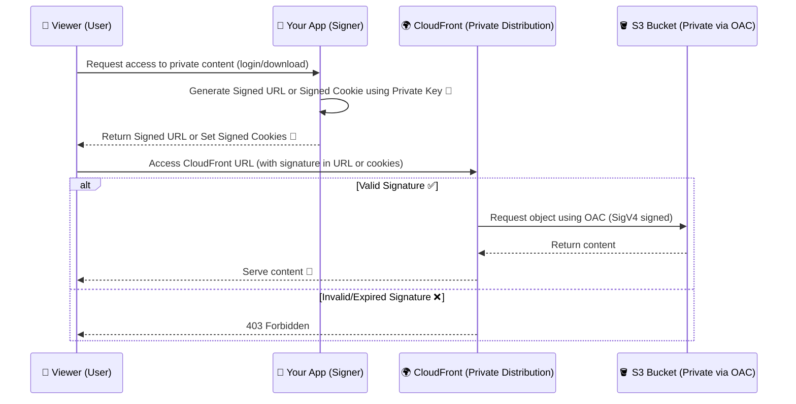

# 🔐 **Serving Private Content with CloudFront – Private Distribution Edition**

> Use **CloudFront Private Distributions** to securely serve files (videos, PDFs, images) **only to authorized users**, and **prevent direct access** from the internet.

---

## 🧠 **What is a CloudFront Private Distribution?**

A **Private Distribution** means:

- Your **origin (e.g., S3 bucket)** is **private**
- **Direct access to content is blocked**
- Only **CloudFront** can access the content (using **OAC** or **OAI**)
- **Viewers need signed proof** to access content (🔗 Signed URL / 🍪 Signed Cookie)

---

## 🔐 CloudFront Security Has Two Layers

| Layer                     | Purpose                            | Tool                            |
| ------------------------- | ---------------------------------- | ------------------------------- |
| 🌍 CDN → 🪣 Origin         | Block direct access to S3          | **OAC (Origin Access Control)** |
| 👤 Viewer → 🌍 CloudFront | Control who can access the content | **Signed URL or Signed Cookie** |

> ✅ Use **both** for full private distribution security.

---

## 🔁 **How Private Distribution Works**

<div align="center">



</div>

---

<div style="text-align: center;">
    
</div>

---

## ✍️ **Signed URL vs. Signed Cookie**

| Feature                | 🔗 **Signed URL**                                       | 🍪 **Signed Cookie**                       |
| ---------------------- | ------------------------------------------------------- | ------------------------------------------ |
| Access scope           | One specific file                                       | Multiple files (entire path/domain)        |
| Ideal for              | Direct downloads, single asset sharing                  | Web apps, video streaming, batch resources |
| Works without cookies? | ✅ Yes                                                  | ❌ No – requires cookie support in browser |
| URL visible to user?   | ✅ Yes – visible in browser                             | ❌ No – cookies are stored in browser      |
| Easy to share links?   | ❌ Anyone with link can use it (unless IP/time-limited) | ✅ Harder to leak (tied to session)        |
| Common use cases       | Email file links, one-time downloads                    | Streaming sites, logged-in web apps        |
| Complexity             | Simple to implement                                     | Slightly more setup (set-cookie logic)     |

---

## 🧰 **When to Use Which?**

| Scenario                                    | Use              |
| ------------------------------------------- | ---------------- |
| One-time PDF or image link                  | 🔗 Signed URL    |
| Authenticated user accessing multiple files | 🍪 Signed Cookie |
| Mobile/desktop apps (no cookies)            | 🔗 Signed URL    |
| Video player or AJAX-based app              | 🍪 Signed Cookie |

---

## 🔐 **Requirements for Private Distribution**

### ✅ 1. S3 Bucket Must Be Private

- Enable **Block Public Access**
- Use **OAC** to let only CloudFront fetch content securely

### ✅ 2. CloudFront Behavior Config

- Edit cache behavior → Enable: **Restrict viewer access**
- Choose: **Use Signed URLs or Cookies**
- Attach: **Key Group** with your public key

### ✅ 3. Use Key Pair to Sign

- Generate RSA key pair locally
- Upload public key to CloudFront
- Use private key in your app to sign URLs or cookies

---

## 🧪 Signed URL Example

```bash
# Expires in 1 hour
https://d123.cloudfront.net/report.pdf
?Expires=1715797200
&Signature=AbCDef123...
&Key-Pair-Id=KABCDEFGHIJK
```

## 🍪 Signed Cookie Example

```http
Set-Cookie: CloudFront-Policy=...
Set-Cookie: CloudFront-Signature=...
Set-Cookie: CloudFront-Key-Pair-Id=...
```

> User’s browser includes these cookies in every request — **no need to change URLs.**

---

## 🛠️ **How to Set It Up in AWS (New Console UI)**

Here’s a step-by-step to generate signed URLs or cookies.

---

### ✅ **Step 1: Create a CloudFront Key Pair**

> This key pair is used to **digitally sign** URLs or cookies.

1. Go to **AWS Management Console** → search for **CloudFront**.
2. On the left, go to **Key management** → **Public keys**.
3. Click **Create public key**.
   - Name: `MyCloudFrontKey`
   - Upload your **public key file** (You’ll generate this in next steps).
4. Go to **Key Groups** → **Create Key Group**.
   - Name: `MyKeyGroup`
   - Select the public key from the list.
   - Save.

---

### 🧾 **Step 2: Generate a Key Pair (Locally)**

Use OpenSSL to create the key pair.

```bash
openssl genrsa -out private_key.pem 2048
openssl rsa -pubout -in private_key.pem -out public_key.pem
```

- Upload `public_key.pem` in **Step 1**.
- Use `private_key.pem` in your app to generate signatures.

---

### 🔐 **Step 3: Restrict Your Content in CloudFront**

> Prevent public access.

1. Go to **CloudFront** → Select your distribution.
2. Choose the **Behavior** tab → Edit your behavior.
3. Under **Restrict Viewer Access (Use Signed URLs or Signed Cookies)**, set it to **Yes**.
4. Choose the **Key Group** you created.
5. Save changes.

---

### ✍️ **Step 4: Generate Signed URL (Example with Python)**

```python
from aws_cloudfront_signer import CloudFrontSigner
import rsa
from datetime import datetime, timedelta

def rsa_signer(message):
    with open('private_key.pem', 'rb') as key_file:
        private_key = rsa.PrivateKey.load_pkcs1(key_file.read())
    return rsa.sign(message, private_key, 'SHA-1')

key_id = 'YOUR_KEY_ID_FROM_CONSOLE'
signer = CloudFrontSigner(key_id, rsa_signer)

url = signer.generate_presigned_url(
    'https://your-distribution.cloudfront.net/private/video.mp4',
    date_less_than=datetime.utcnow() + timedelta(hours=1)
)

print(url)
```

---

## 💡 **Best Practices**

- ❌ Never use root user to create keys.
- ✅ Use short expiry time (e.g., 1 hour).
- 🔒 Store your **private key securely** (use AWS Secrets Manager).
- 📱 Use signed **cookies** for apps that load multiple files in one session.

---

## ✅ Summary

| Task                           | Tool                            |
| ------------------------------ | ------------------------------- |
| Restrict S3 access             | OAC (SigV4 signing)             |
| Secure viewer-level access     | Signed URL or Cookie            |
| One file, no session           | 🔗 Signed URL                   |
| Many files/session-wide access | 🍪 Signed Cookie                |
| Full private content delivery  | Combine OAC + Signed URL/Cookie |

---

## 📚 References

- [🔗 Signed URL Doc](https://docs.aws.amazon.com/AmazonCloudFront/latest/DeveloperGuide/private-content-signed-urls.html)
- [🍪 Signed Cookie Doc](https://docs.aws.amazon.com/AmazonCloudFront/latest/DeveloperGuide/private-content-signed-cookies.html)
