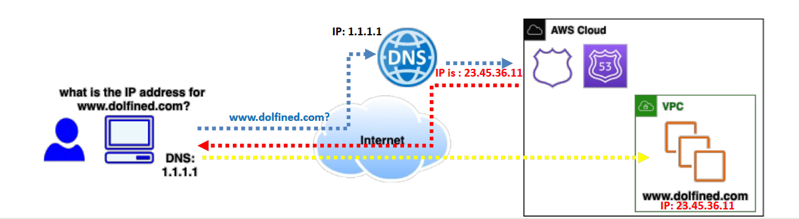
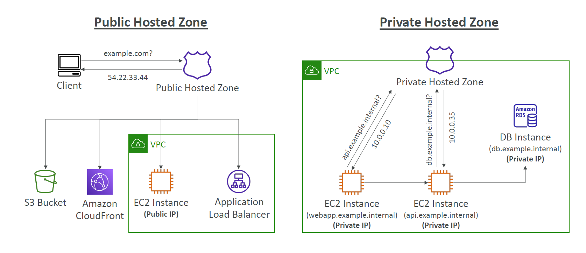
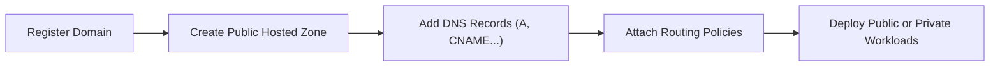

# 🌐 **AWS Route 53 – Scalable DNS for Public & Private Workloads**

> **Route 53** is Amazon’s highly available and scalable **Domain Name System (DNS)** service that routes user requests to AWS or external resources, with smart routing policies and deep integration with AWS services.

---

  

---

## 🧭 What Is Route 53?

- Fully managed **DNS** service by AWS.
- Converts domain names like `www.example.com` ➝ IP addresses.
- Works for both **internet-facing (public)** and **internal (private)** applications.

  > 🔎 **internet-facing workload** → Public Workloads such: Websites, APIs, or services accessed over the internet.  
  > 🔒 **Internal Workloads** → Private Workloads such: databases, services inside a VPC.

- Supports:

  - 🌐 **Public DNS** (internet-facing apps)
  - 🔒 **Private DNS** (within a VPC)
  - 🏷️ **Domain registration**
  - 🧭 **Routing policies**
  - 🧑‍⚕️ **Health checks**

---

## 🧰 Route 53 – Hosted Zones

> A **Hosted Zone** = A container of DNS records for a domain and its subdomains.

---

| Type                       | Use Case                                                            |
| -------------------------- | ------------------------------------------------------------------- |
| 🌍 **Public Hosted Zone**  | For routing traffic on the internet (e.g., `myapp.com`)             |
| 🏢 **Private Hosted Zone** | For internal routing inside one or more VPCs (e.g., `app.internal`) |

💰 **Cost**: \$0.50/month per hosted zone

---

  

---

## 🏷️ Route 53 – DNS Records

> Each DNS record defines how to route traffic for a domain or subdomain.

| Field          | Description                                |
| -------------- | ------------------------------------------ |
| 🧾 **Name**    | Domain/subdomain (e.g., `www.example.com`) |
| 🔠 **Type**    | Record type (e.g., A, AAAA, CNAME...)      |
| 🎯 **Value**   | Destination (e.g., IP address or hostname) |
| 🚦 **Routing** | Routing policy (e.g., simple, weighted)    |
| ⏳ **TTL**     | Time to live (cache duration at resolvers) |

---

## 🧾 Supported Record Types (Must-Know First)

| Record Type | Description                                     |
| ----------- | ----------------------------------------------- |
| **A**       | Maps domain to IPv4 address                     |
| **AAAA**    | Maps domain to IPv6 address                     |
| **CNAME**   | Maps domain to another domain (alias), not root |
| **NS**      | Name servers for the domain (authoritative)     |
| **MX**      | Mail server routing                             |
| **TXT**     | Text data (e.g., verification, SPF, DKIM)       |
| **SOA**     | Start of Authority – contains DNS metadata      |

📚 **Advanced types**: CAA, DS, NAPTR, PTR, SPF, SRV

---

## 📸 CNAME vs Alias – What’s the Difference?

| Feature        | **CNAME**                                  | **Alias**                                                  |
| -------------- | ------------------------------------------ | ---------------------------------------------------------- |
| Works on Root? | ❌ No – only subdomains                    | ✅ Yes – works on apex/root too                            |
| Target Type    | Any hostname (`example.other.com`)         | AWS resources (ELB, S3, CloudFront...)                     |
| TTL            | ✅ You must set it                         | ❌ AWS manages it automatically                            |
| Cost           | Normal DNS charges                         | 💸 Free with AWS resources                                 |
| Use Case       | Redirect to any external/internal hostname | Redirect to AWS services (Load Balancer, CloudFront, etc.) |

---

## 🛰️ Alias Record Targets – Where You Can Point

- ✅ `Elastic Load Balancers - ELB`
- ✅ `Amazon CloudFront`
- ✅ `Amazon API Gateway`
- ✅ `AWS Global Accelerator`
- ✅ `S3 Static Websites`
- ✅ `VPC Interface Endpoints`
- ✅ `Elastic Beanstalk`
- ✅ `Another Route 53 Record (same hosted zone)`

❌ Not supported: EC2 DNS names

---

## ⏱️ TTL – Time To Live Explained

> TTL controls **how long DNS resolvers cache your record**.

---

| TTL Duration                | Behavior                                         |
| --------------------------- | ------------------------------------------------ |
| ⏰ **High TTL** (e.g., 24h) | - 🔄 Less DNS traffic   - ⛔️ Slower updates |
| ⚡ **Low TTL** (e.g., 60s)  | - ✅ Quick changes   - 💰 More queries/costs |

---

## 📍 **Routing Policies in Route 53**

| Policy               | Description                                              |
| -------------------- | -------------------------------------------------------- |
| 🎯 **Simple**        | One record ➝ One destination                             |
| ⚖️ **Weighted**      | Split traffic (e.g., 70% to `us`, 30% to `eu`)           |
| 🧭 **Latency-Based** | Route users to the lowest-latency AWS region             |
| 🌎 **Geolocation**   | Route based on user's country/continent                  |
| 🚨 **Failover**      | Primary/secondary routing (fallback to healthy endpoint) |

---

## 🧑‍⚕️ Health Checks & Monitoring

- 🧠 **Health Checks is only for Public Resources**
- ✅ Checks endpoint health (e.g., every 30s)
- 🔁 Automatically reroutes traffic when a target is **unhealthy**
- 💡 Required for **Failover Routing**
- 🔗 Can be linked to CloudWatch alarms

---

## 📘 Domain Lifecycle in Route 53

### ⚙️ **How To Use Route 53**

1. **📦 Create a Hosted Zone**  
   Choose between **Public** or **Private** based on your use case.

2. **📝 Add DNS Records**  
   Add `A`, `CNAME`, `MX`, `NS`, or other record types to define routing behavior.

3. **🌐 Route Traffic**  
   When users enter your domain, Route 53 resolves it to the correct public or private IP address.

---

## 📌 Summary Table

| ✅ Feature          | 💬 Description                                |
| ------------------- | --------------------------------------------- |
| 🌐 Route 53         | DNS service for AWS and external domains      |
| 🗂️ Hosted Zones     | Public = for internet, Private = inside VPC   |
| 🧾 Record Types     | A, AAAA, CNAME, Alias, NS, MX, TXT, SOA, etc. |
| ⏳ TTL              | Controls DNS caching behavior                 |
| 🎯 Routing Policies | Simple, Weighted, Latency, Geo, Failover      |
| 🧑‍⚕️ Health Checks | Monitor targets and reroute on failure        |
| 💡 Alias vs CNAME   | Alias supports AWS services + root domain     |

---

> By using **Route 53**, you get a DNS service that’s not just a name resolver—but a **smart, integrated, health-aware traffic controller** for your modern applications 🚀🌍
