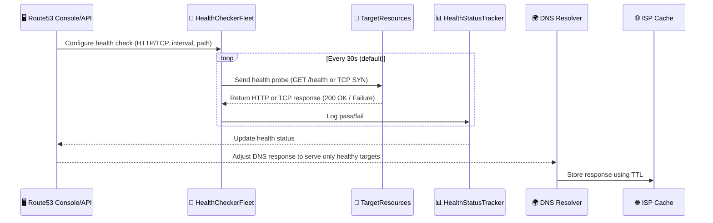
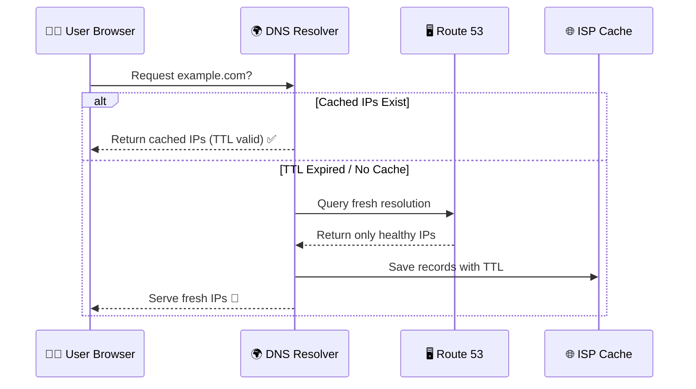

# 🧠 **Deep Dive: How Route 53 Health Checks Work Internally**

> **Not just pinging.** It’s a globally distributed system for real-time DNS routing based on health!

---

## 💡 **What’s a Health Check in Route 53 (at a glance)?**

Health Checks in Route 53 continuously **probe endpoints** like:

- Web servers
- Load balancers
- APIs

If an endpoint becomes **unhealthy**, Route 53 automatically **stops routing traffic** to it and redirects traffic to a healthy one — depending on your routing policy (**failover**, **latency-based**, or **weighted**).

But what’s happening **under the hood**? Let’s visualize it 🔍

---

## 🔄 **Behind the Scenes: Health Checks Workflow + DNS Routing**

<div align="center">



</div>

---

## 🕒 **How TTL Affects the Flow (Caching Behavior)**

<div align="center">



</div>

---

## 🧪 **Example Response (Healthy Targets Only)**

```txt
DNS Query: example.com
Route 53 Response:
54.193.127.2 (TTL: 300s)
18.144.23.89 (TTL: 300s)
192.0.2.156 (TTL: 300s)
```

✔️ Only **healthy** IPs returned  
📦 TTL used to **cache at ISP level**

---

## 🌍 **1. Health Checker Fleet – Global & Independent**

AWS runs a **global fleet** of health checker agents — small EC2s or containers — from \~15+ AWS regions:

🔹 Each one checks **independently**  
🔹 No result sharing or central cache  
🔹 All probes are made **publicly over the internet**

By default:

> 🔄 **3–5 agents probe your endpoint every 30 seconds**

---

## ⚙️ **2. What Health Checkers Actually Do**

Depending on your config:

| Protocol       | What It Does                                                                     |
| -------------- | -------------------------------------------------------------------------------- |
| **HTTP**       | Sends GET to a path (e.g. `/health`) → expects 2xx or 3xx response               |
| **HTTPS**      | Same as HTTP + TLS handshake                                                     |
| **TCP**        | Attempts a socket connection to the port                                         |
| **Calculated** | Logical combo of other checks (e.g. AND/OR conditions across multiple resources) |

🧠 **Each probe:**

- Doesn’t use cache
- Times out in 4 seconds (default)
- Retries on failure before declaring unhealthy

---

## 🗳️ **3. Consensus Logic – Majority Vote System**

AWS uses **quorum logic** to determine health:

✅ **If ≥80% probes are successful** → Healthy  
❌ **If >20% fail** → Unhealthy

> Prevents false alarms due to regional outages or random failures.

---

## 🔁 **4. Real-Time Sync With DNS Responses**

When a target is unhealthy:

- Route 53 **removes it** from DNS answers
- If failover is enabled → it switches to a secondary target
- With weighted/latency → unhealthy IP is **skipped**

> This happens **immediately**, even before TTL expires, if:
>
> `EvaluateTargetHealth = true`

---

## 🧬 **5. Alias Records: Smarter Health Evaluation**

When using **Alias Records** (e.g., pointing to ALB, NLB, CloudFront):

✔️ You **don’t need** a custom health check  
✔️ Route 53 checks health **internally**

> ⚠️ Requires you to set **Evaluate Target Health = true**

---

## 🧪 **Full Example: HTTPS Health Check Flow**

Imagine:

```ini
Protocol = HTTPS
Target IP = 3.122.150.10
Path = /health
Port = 443
Interval = 30s
```

Every 30 seconds:

```bash
GET https://3.122.150.10/health
```

Checks:

- TLS handshake OK?
- Status 200/302?
- Response within timeout?

→ 4/5 agents say OK → ✅  
→ ≥3 fail → ❌ DNS stops routing to it

---

## 🔐 **Security Checklist**

| Do / Don’t              | Notes                                                                                                                                                                             |
| ----------------------- | --------------------------------------------------------------------------------------------------------------------------------------------------------------------------------- |
| ✅ Public access        | Health checkers must reach your target over the internet                                                                                                                          |
| ✅ IP allowlists        | Use AWS published health check [IP ranges](https://ip-ranges.amazonaws.com/ip-ranges.json) - [Docs](https://docs.aws.amazon.com/general/latest/gr/route53.html#route53-ip-ranges) |
| ❌ Internal-only checks | Instead use **Alias + Evaluate Target Health**                                                                                                                                    |

---

## ⚠️ **Common Pitfalls & Fixes**

| ❌ Pitfall                            | ✅ Solution                                                |
| ------------------------------------- | ---------------------------------------------------------- |
| Blocking health checker IPs           | Allow Route 53 IPs in security groups/NACLs                |
| TTL too long                          | TTL doesn't block failover, but can delay fresh resolution |
| Monitoring private/internal endpoints | Use AWS-native targets with alias records                  |

---

## ✅ **Wrap-Up: End-to-End Recap**

| 🔍 Layer            | 🔧 What Happens                                                 |
| ------------------- | --------------------------------------------------------------- |
| 📄 Config           | You define protocol, path, port, interval, threshold            |
| 🌐 Global Probes    | Route 53 health checkers ping your target from multiple regions |
| 🧠 Quorum           | AWS stores results and uses majority to decide health           |
| 📉 DNS Impact       | Unhealthy targets are removed from DNS answers                  |
| 🔁 Auto Failover    | DNS routes traffic to backup if primary fails                   |
| 🧠 Alias Efficiency | Skip custom checks by using AWS-native health for alias targets |
