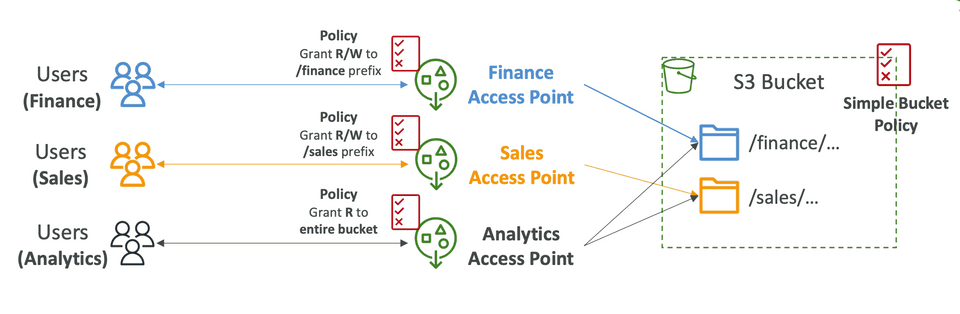
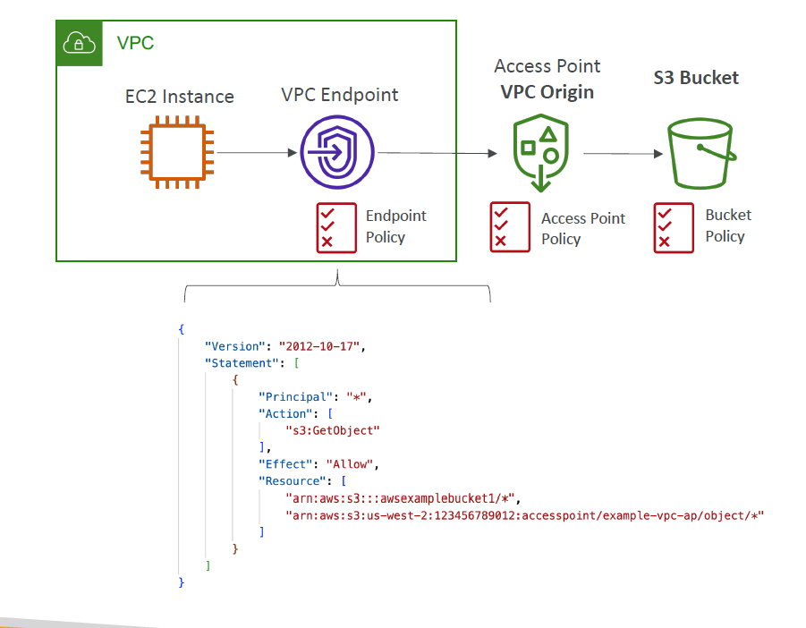
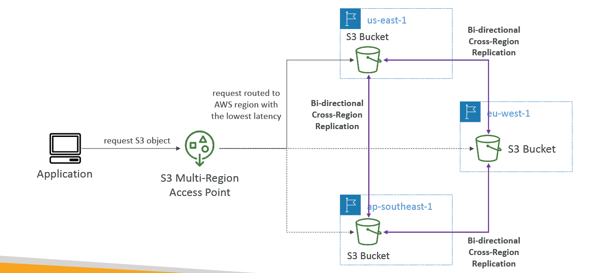
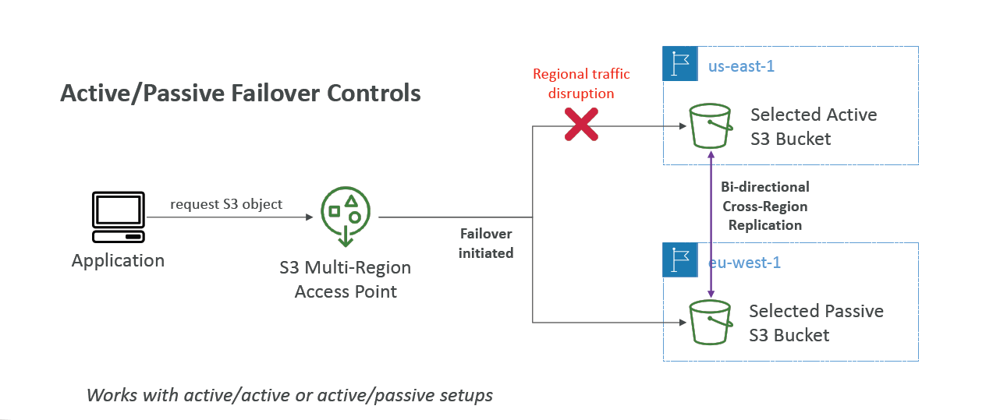

# 🛣️ **Amazon S3 Access Points – Secure & Scalable Data Access**

> _Fine-grained access for shared S3 data, without the complexity of managing monolithic bucket policies._

---

<div align="center">
  
</div>

---

## 🔍 What Are S3 Access Points?

**S3 Access Points** provide a **dedicated entry point** to an S3 bucket with **individual IAM-style access policies**.

Each access point:

- Has a unique **DNS-compliant name**
- Is **attached to a single S3 bucket**
- Can be restricted to a specific **VPC**
- Has its own **access point policy**

✅ They **don’t change your bucket policy**, and allow **multiple isolated policies** for different apps or users.

---

## 🎯 **Why Use Access Points?**

| 🚀 Traditional Way                        | 🧠 Access Points Advantage                     |
| ----------------------------------------- | ---------------------------------------------- |
| A single bucket policy governs all access | Create multiple isolated entry points          |
| Complex conditions for many users/apps    | Simple, readable, per-app or per-team policies |
| No easy way to restrict access to a VPC   | Can restrict access to a specific VPC/subnet   |

They’re especially helpful when:

- You manage **multi-tenant applications**
- You want to **enforce VPC-only access**
- You need to **delegate** access to different teams

> Each access point enforces its **own policy**, and all requests eventually land on the **same S3 bucket** — but with different levels of access.

---

## ⚙️ How S3 Access Point Policies Work

Each access point has a **resource policy** like a bucket policy.

BUT to **fully secure the bucket**, you must also configure a **bucket-level guardrail** to **deny any direct access unless it comes from your Access Point(s)**.

---

## ✅ Full & Secure Configuration: Step-by-Step

### Step 1: Create Access Point `analytics-read`

- Attach to `logs-archive`
- Restrict access to VPC (optional)
- Define **Access Point policy** (IAM-style)

### Step 2: Attach a Secure Bucket Policy to Enforce Least-Privilege

- Deny all non-access point access
- Allow specific access points only from your AWS account

---

## 🧾 Example Access Point Policy (`analytics-read`)

```json
{
  "Version": "2012-10-17",
  "Statement": [
    {
      "Sid": "AllowReadAccessToPrefix",
      "Effect": "Allow",
      "Principal": "*",
      "Action": "s3:GetObject",
      "Resource": "arn:aws:s3:us-east-1:123456789012:accesspoint/analytics-read/object/2024/*"
    }
  ]
}
```

---

## 🧱 Example Bucket Policy (Secure Guardrail)

This bucket policy denies access unless the request **comes via a valid access point from your account**:

```json
{
  "Version": "2012-10-17",
  "Statement": [
    {
      "Sid": "DenyNonAccessPointAccess",
      "Effect": "Deny",
      "Principal": "*",
      "Action": "s3:*",
      "Resource": ["arn:aws:s3:::logs-archive", "arn:aws:s3:::logs-archive/*"],
      "Condition": {
        "StringNotEquals": {
          "s3:DataAccessPointAccount": "123456789012"
        }
      }
    }
  ]
}
```

> 🔒 This ensures **no one can bypass access points**, even if they try to use the bucket name directly.

---

## 🌍 Access Point URL Format

Each access point has a URL like:

```ini
https://<access-point-name>-<account-id>.s3-accesspoint.<region>.amazonaws.com
```

To **access an object**, use this format:

```ini
https://analytics-read-123456789012.s3-accesspoint.us-east-1.amazonaws.com/2024/my-report.csv
```

---

## 🔐 VPC-Only Access

Want to ensure access is **only allowed from within your VPC**?

### Just set this in the access point config

- Restrict network origin to `VPC`
- Use **VPC endpoint for S3**

This blocks public access even if credentials are leaked ✅

---

<div style="text-align: center;">
    
</div>

---

## 💡 When to Use Access Points

| Use Case                     | Access Points Benefit                              |
| ---------------------------- | -------------------------------------------------- |
| 🔄 Multi-tenant environments | Delegate per-tenant policies without risk          |
| 🔐 Secure internal data      | Lock down with VPC-only access                     |
| 🤹 Complex team permissions  | Avoid global bucket policy sprawl                  |
| 🚀 Multi-Region access       | Combine with S3 Multi-Region Access Points (MRAPs) |

---

## 🔁 Access Point vs Bucket Policy

| Feature           | Bucket Policy                  | Access Point Policy                  |
| ----------------- | ------------------------------ | ------------------------------------ |
| Scope             | Applies to full bucket         | Per access point (granular)          |
| Management        | One central policy             | Decentralized, flexible              |
| VPC Restriction   | Requires VPC endpoint setup    | Built-in with policy configuration   |
| Access Delegation | Requires careful policy tuning | Natural per-role delegation possible |

---

## 🛡️ Best Practices

✅ **DO**:

- Use one access point per use case/team/app
- Combine access point + bucket policy for defense-in-depth
- Use VPC-only access for internal applications

🚫 **AVOID**:

- Using access points with public websites (not supported)
- Bypassing access points by calling the bucket directly

---

## 🌍 Bonus: Multi-Region Access Points (MRAP)

You can define **multi-region access points** to access data replicated across S3 buckets in multiple regions.

---

Great for:

- 🌐 Global apps
- 📊 Distributed analytics
- 🛠️ Fault-tolerant designs

---

<div align="center">
  
</div>

---

<div align="center">
  
</div>

---

<div align="center">
  
</div>

---

## 📌 Final Recap

| Feature               | Benefit                                     |
| --------------------- | ------------------------------------------- |
| Access Point Policies | IAM-style per use case                      |
| VPC Restriction       | Built-in private access control             |
| Bucket Guardrail      | Deny all except valid access point requests |
| Multi-Region Access   | Seamless global data access                 |

> Access Points = 🔐 simplified security + 🚀 clean scaling + 🧠 maintainable permissions
