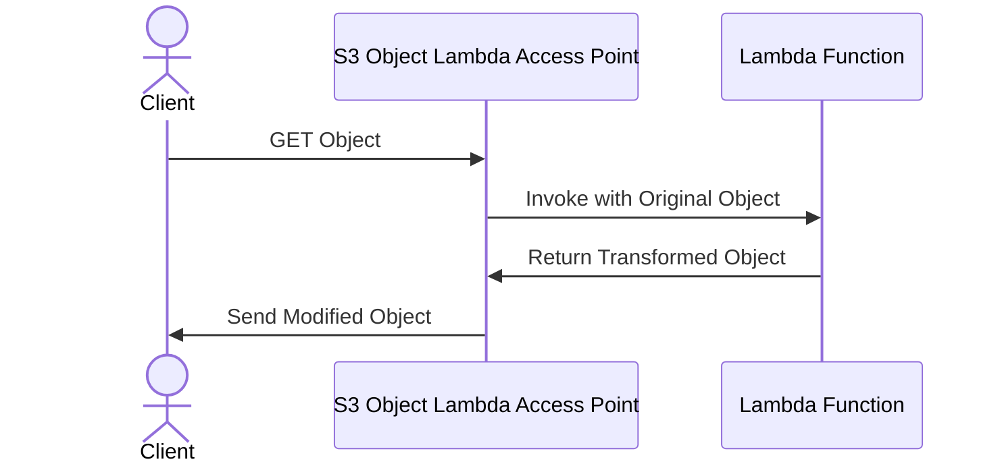
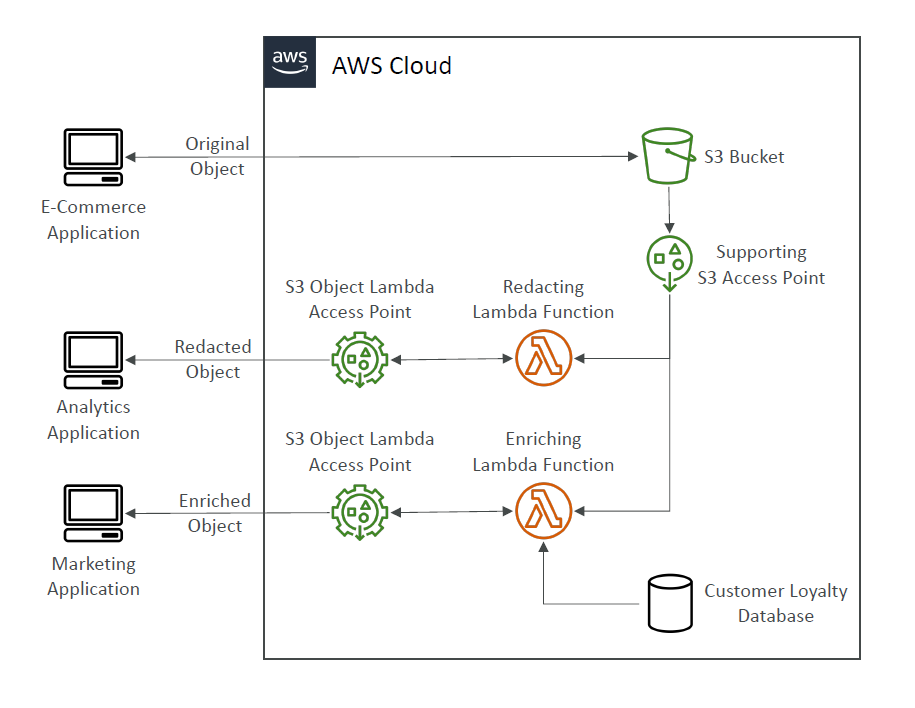

# 🧠✨ **What Is S3 Object Lambda?**

> ✅ **S3 Object Lambda lets you change an object _on the fly_ using a Lambda function before it reaches the user.**

---

## 🧃 **Imagine this...**

You have a file in your S3 bucket (like an image, or a JSON file), but:

- You want to **hide sensitive data** 📵 (like name or SSN)
- Or **convert the format** 📄➡️🧾 (XML → JSON)
- Or **resize/watermark an image** 🖼️🔧

Instead of saving different versions of the file...

👉 You write a **Lambda function** that transforms the object **at read time**.

---

## 🔄 **How It Works (Simple Steps)**

1. 🧑 App asks for object **via S3 Object Lambda Access Point**
2. 🧠 Lambda runs → **modifies object**
3. 📦 Modified version is returned — no changes to the original file

---

---

## 🧰 **What You Need**

- ✅ 1 regular **S3 bucket**
- ✅ 1 **S3 Access Point**
- ✅ 1 **S3 Object Lambda Access Point**
- ✅ 1 **Lambda Function** (to process the object)

---

    

---

## 🎯 **When to Use S3 Object Lambda**

| Use Case                      | Description                            |
| ----------------------------- | -------------------------------------- |
| 🔒 Redaction                  | Hide personal info for non-prod use    |
| 🔄 Format conversion          | XML → JSON or CSV → JSON               |
| 🎨 Dynamic image manipulation | Resize, blur, or watermark per request |
| 🧠 Data enrichment            | Add extra info before returning object |

---

## 📝 **Exam Tips to Remember**

| Concept                        | Explanation                                          |
| ------------------------------ | ---------------------------------------------------- |
| One bucket only                | You don’t need to create a new bucket                |
| Transforms at **read time**    | Not stored permanently                               |
| Uses **Lambda + Access Point** | Lambda is triggered by S3 Object Lambda Access Point |
| Secure and scalable            | Same IAM controls as regular S3                      |

---

> 🧠 Think of S3 Object Lambda like a **"smart filter"** between your S3 object and whoever’s requesting it!
