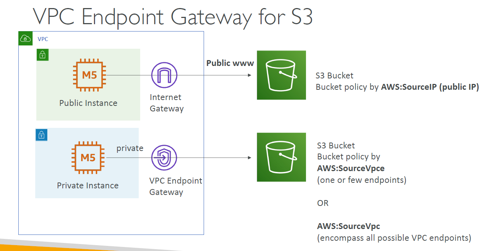

---
tags:
  - aws
  - aws/service
  - aws/domain/storage
  - aws/topic/s3
aliases:
  - "Amazon VPC Endpoint Gateway for S3"
  - "Vpc Endpoint Gw For S3"
---

# 🛡️ **Amazon VPC Endpoint Gateway for S3**

    

---

## Related Notes
- [[aws-services/4.storage/1.s3/|Index]] - folder map
- [[aws-services/4.storage/1.s3/10.2.s3-object-lambda|What Is S3 Object Lambda]] - previous lesson
- [[aws-services/4.storage/1.s3/11.1.s3-inventory|Amazon S3 Inventory]] - next lesson
- [[aws-services/3.network/1.vpc/1.fundmentals/5.1.vpc-endpoint|AWS VPC Endpoints]] - mentions Vpc Endpoint

---
