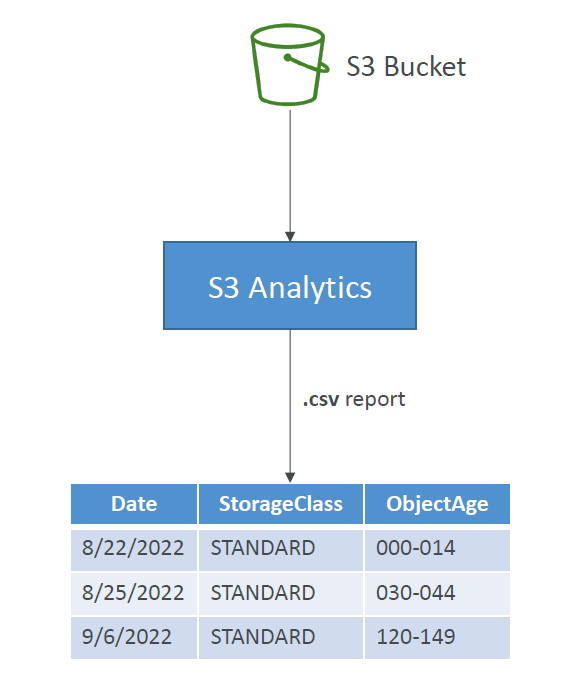
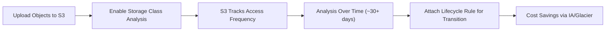
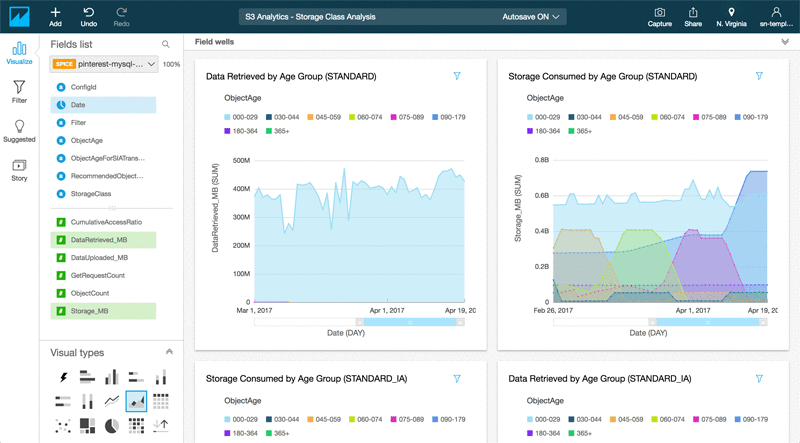

# 📦 **Amazon S3 Storage Class Analysis**

_Optimize storage cost based on real access patterns!_

---

    

---

## 🔍 **What Is It?**

**S3 Storage Class Analysis** helps you **analyze object-level access patterns** over time to determine **when to transition data to lower-cost storage classes** like:

- 🧊 **S3 Standard-IA (Infrequent Access)**
- ❄️ **S3 Glacier / Glacier Deep Archive**

> 📉 _If you’re not sure which objects are "cold" – this tool tells you._

---

## 🧠 **How It Works**

---

## ⚙️ **How to Enable S3 Storage Class Analysis**

### 🖥️ **Using AWS Console:**

1. Go to your **S3 bucket → Management tab**
2. Scroll to **Storage Class Analysis → Create analysis**
3. Configure:

   - **Name**: e.g., `cold-objects-analysis`
   - **Scope**: Entire bucket / specific prefix / object tags
   - **Export location**: An S3 bucket for `.csv` reports

4. Click ✅ **Create**

---

## 📊 **Where Results Go**

- Exported daily to the S3 destination bucket as **.csv files**
- You can:

  - Query them with **Amazon Athena**
  - Visualize trends in **Amazon QuickSight**
  - View basic results via **S3 Console**

---

  

---

## 🧰 **Key Features & Facts**

| Feature                | Description                                                             |
| ---------------------- | ----------------------------------------------------------------------- |
| 🎯 **Purpose**         | Analyze how often your objects are accessed                             |
| ⏳ **Latency**         | Requires \~**30 days** to gather meaningful metrics                     |
| 📁 **Scope Control**   | Choose **entire bucket**, **prefix-based**, or **tag-based** analysis   |
| 🤖 **Automation**      | Easily combine with **Lifecycle rules** to transition cold objects      |
| 📤 **Export Format**   | Data saved to S3 in **CSV**, usable with **Athena, Quicksight, or CLI** |
| 💡 **Cost Efficiency** | Helps avoid keeping rarely used data in S3 Standard unnecessarily       |

---

## 💡 **Use Case Example: E-Commerce Product Images**

> You're storing 500K product images. Some are popular, most are rarely viewed.

1. 🎯 Enable **Storage Class Analysis** on the `images/` prefix
2. 🧠 After 30 days, check which files have **low/no access**
3. 🌀 Apply a **Lifecycle rule** to auto-transition cold images to **Standard-IA** or **Glacier**
4. 💰 Save significant storage cost, automatically

---

## ✅ **Quick Recap – Why Use It?**

- 🔍 Find and classify "hot" vs. "cold" data automatically
- 💸 Optimize cost with **zero guesswork**
- ⚙️ Combine with **Lifecycle** for hands-free storage transitions
- 📊 Query historical trends with Athena or visualize with QuickSight

---

## 📌 **Exam Tip**

Look for questions like:

> _“You want to identify infrequently accessed S3 objects before moving them to S3 Glacier. What should you use?”_
> ✅ **Answer: S3 Storage Class Analysis + Lifecycle Rule**
