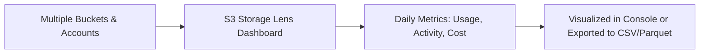
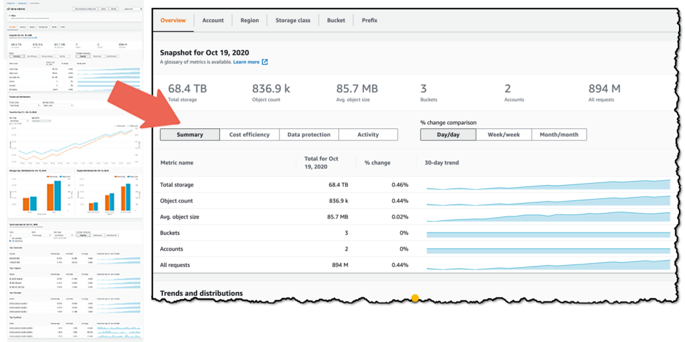

# 🧠 **Amazon S3 Storage Lens – Quick Exam Guide**

**S3 Storage Lens** helps you **analyze, optimize, and monitor** S3 storage usage **across all accounts in your AWS Organization**.

---

  

---

## 📊 **What It Does**

- ✅ Analyze **storage usage & activity** (30-day historical data by default)
- ✅ Detect **anomalies, cost inefficiencies, and unused data**
- ✅ Apply **data protection best practices**
- ✅ Works **Org-wide**, per **account**, **region**, **bucket**, or **prefix**
- ✅ Can **export daily metrics** to S3 in CSV or Parquet

---

## 🧠 How It Works

---

## 📋 **Default Dashboard**

- Preconfigured by S3 – **can’t be deleted**, but can be **disabled**
- Shows **multi-account, multi-region** metrics
- Available to **all accounts by default**

---

  

---

## 📦 **Types of Metrics**

| Category                     | What It Shows / Use Case                                                 |
| ---------------------------- | ------------------------------------------------------------------------ |
| 📌 **Summary Metrics**       | `StorageBytes`, `ObjectCount` – Find fastest-growing buckets/prefixes    |
| 💰 **Cost Optimization**     | `NonCurrentVersionStorageBytes`, `IncompleteMultipartUploadBytes`        |
| 🔒 **Data Protection**       | `VersioningEnabledBucketCount`, `SSEKMSEnabledBucketCount`               |
| 👤 **Access Management**     | `ObjectOwnershipBucketOwnerEnforcedBucketCount` – Track bucket ownership |
| 📩 **Event Metrics**         | `EventNotificationEnabledBucketCount` – S3 Event Notifications           |
| ⚡ **Performance Metrics**   | `TransferAccelerationEnabledBucketCount`                                 |
| 📈 **Activity Metrics**      | `GetRequests`, `PutRequests`, `ListRequests`, `BytesDownloaded`          |
| 🔍 **Detailed Status Codes** | `200OK`, `403Forbidden`, `404NotFound` counts                            |

---

## 💡 **Metric Plans**

| Plan                      | Description                                                           |
| ------------------------- | --------------------------------------------------------------------- |
| 🆓 **Free Metrics**       | \~28 metrics, **14-day retention**, auto-enabled                      |
| 💎 **Advanced Metrics**   | Extra insights (activity, cost, status codes), **15-month retention** |
| 📡 **CloudWatch Publish** | Push metrics to CloudWatch at no extra cost (if enabled)              |
| 🧩 **Prefix Aggregation** | Collect metrics at **prefix** level (paid tier only)                  |

---

## 🔧 How to Enable **S3 Storage Lens**

**📍 Steps via Console:**

1. Open S3 service → Navigate to **“Storage Lens”** tab.
2. Click **Create dashboard**.
3. Fill the config:
   - **Name**: `global-storage-insights`
   - **Region**: Where the dashboard resides (e.g. `us-east-1`)
   - **Include buckets**: All or filtered by account/region.
   - Optional: Enable **metrics export** to S3.
   - Optional: Enable **Advanced metrics** (paid tier).
4. Click **Create**.

**📊 Where to View Dashboard:**

- Go to **S3 → Storage Lens → Your Dashboard**.
- Use filters to sort by account, tag, region, etc.

---

## 🧰 Key Features

| Feature              | Description                                                    |
| -------------------- | -------------------------------------------------------------- |
| 🧠 Metrics           | Object count, size, request counts, failed requests, etc.      |
| 🧭 Scope             | Account, Org, or Region-wide views                             |
| 📈 Historical Data   | Up to **15 months** of trend data for long-term insights       |
| 📊 Dashboards        | Visual graphs + tables inside the AWS Console                  |
| 🔐 Free & Paid Tiers | Free tier + optional **Advanced Metrics** with deeper insights |

---

## 📦 Storage Lens Dashboard Snapshot

| Metric              | Description                            |
| ------------------- | -------------------------------------- |
| Total Storage       | Total GB stored across all buckets     |
| Object Count        | Number of objects                      |
| Average Object Size | Calculated per bucket                  |
| % Encrypted Objects | Tracks SSE-S3, SSE-KMS usage           |
| Replication Status  | Tracks cross-region replicated objects |
| Access Activity     | Read/write requests per bucket         |

---

## ✅ **Exam Tips**

- 🧠 S3 Storage Lens shows **both usage & activity metrics**
- 🧾 **Free plan** has **14-day** history; **Advanced** gives **15-month** retention
- 🔁 Can **export daily metrics** to an S3 bucket
- ☁️ Integrated with **CloudWatch** if enabled (for advanced metrics)
