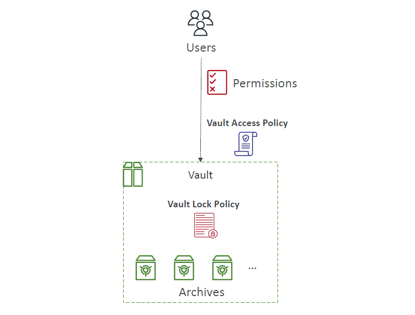
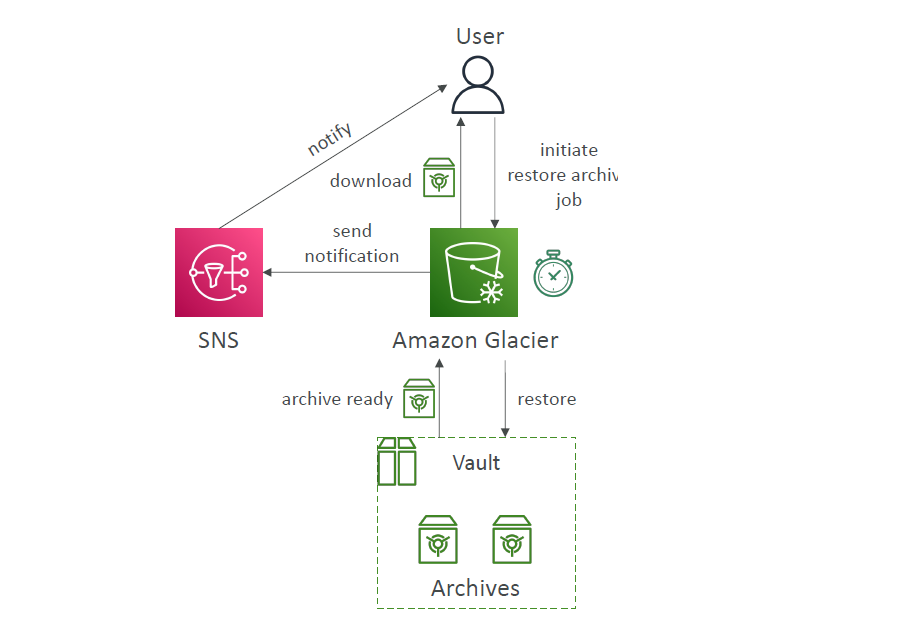

# ❄️ **Amazon S3 Glacier – Deep Archive for Long-Term Storage**

> _Secure, durable, and ultra-low-cost object storage for archiving and compliance._

---

## 📦 **What is Amazon S3 Glacier?**

Amazon S3 Glacier is designed for **long-term backups and archiving**. Think of it as cloud-based magnetic tape replacement — but better.

- 🧊 **Storage Classes**:

  - **S3 Glacier** – infrequent retrieval (Standard)
  - **S3 Glacier Deep Archive** – for rarely accessed data

- 💾 **Use Cases**:

  - Data archiving
  - Regulatory compliance (WORM)
  - Long-term backup (years to decades)

- 📈 **Durability**:

  - **99.999999999% (11 nines)** annual durability

- 💰 **Pricing**:

  | Storage Class         | Cost / GB / Month |
  | --------------------- | ----------------- |
  | S3 Glacier            | \$0.004           |
  | S3 Glacier Deep Arch. | \$0.00099         |

---

## 📁 **Core Concepts**

- ✅ **Archives** = individual files (up to 40 TB each)
- 📂 **Vaults** = containers that hold archives
- 🔐 **Encryption**: AES-256 by default, managed by AWS KMS

---

## 🛠️ **S3 Glacier Operations**

### 📚 Vault Operations

- `CreateVault` / `DeleteVault`
- `GetVaultMetadata`, `ListVaults`, `DownloadVaultInventory`

> ⚠️ Vault can’t be deleted unless it’s **empty**.

### 📤 Archive Uploads

- ✅ Single or **Multipart** upload (recommended for >100 MB)
- ✅ Use the Archive ID for future retrieval or deletion

### 📥 Archive Retrieval

- ✅ **Initiate Job** (restore)
- ✅ AWS stages the archive for you
- ✅ You then **download** the archive (within expiration time)

### ⚙️ Retrieval Options

| 📥 Option | 🕓 Speed    | 💵 Price (per GB)            |
| --------- | ----------- | ---------------------------- |
| Expedited | 1–5 minutes | \$0.03 + \$10/1000 reqs      |
| Standard  | 3–5 hours   | \$0.01 + \$0.03/1000 reqs    |
| Bulk      | 5–12 hours  | \$0.0025 + \$0.025/1000 reqs |

---

## 🔐 **Vault Access Control**

Each vault has **2 JSON-based policies**:

### 🔒 **Vault Lock Policy**

- Immutable once locked
- Great for compliance (e.g. WORM - write once, read many)
- Example: ❌ No deletion within 1 year

### ✅ **Vault Access Policy**

- Controls who can perform operations (IAM-like)

---

    

---

## 📣 **Restore Notifications**

### 🔔 Via Vault Notifications

- Use **SNS** to notify when a restore job completes

### 🔁 S3 Glacier via S3

- If using Glacier storage class with S3:

  - `s3:ObjectRestore:Post` – archive restoration initiated
  - `s3:ObjectRestore:Completed` – archive ready for use

---

    

---

## 🧠 **Exam Tips – Know This Cold**

✅ Use Glacier for:

- S3 lifecycle transition (e.g. move after 90 days)
- Long-term archive
- Regulatory protection (WORM via Vault Lock)

✅ You **must** initiate a retrieval job first — there’s no direct download from Glacier.

✅ Vault Lock policies are **permanent after confirmation**!
