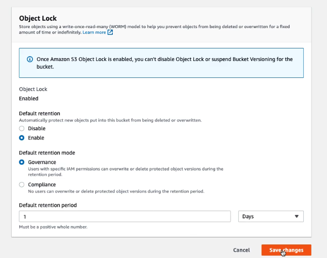
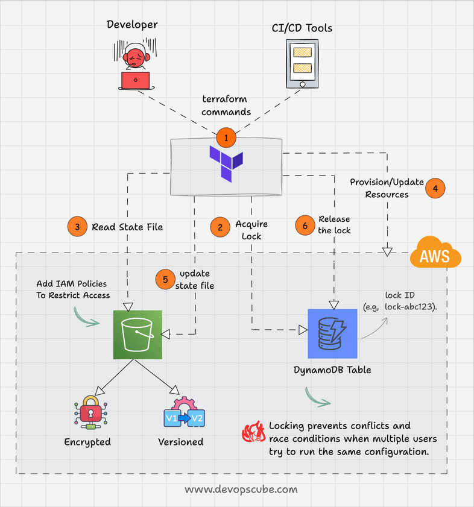

---
tags:
  - aws
  - aws/service
  - aws/domain/storage
  - aws/topic/s3
aliases:
  - "Amazon S3 Object Lock"
  - "S3 Lock"
---

# 🔒 **Amazon S3 Object Lock**

Amazon S3 **Object Lock** is a powerful feature that provides a **Write Once Read Many (WORM)** storage model. It helps you **prevent data from being deleted or overwritten** for a fixed time or indefinitely. This is critical for industries that need to meet strict **regulatory compliance**, retain immutable logs, or enforce legal holds.

<div align="center">
  
</div>

---

## 🌟 **What is Amazon S3 Object Lock?**

S3 Object Lock lets you store objects in S3 in a way that **prevents deletion or overwrite**. You can enforce this at:

- 🔹 **Object Level** — Specific objects can be locked
- 🔹 **Bucket Level** — All objects in the bucket are protected by default

🔐 **Versioning is required** for Object Lock to work.

---

## 🧩 **Key Features**

| Feature                    | Description                                                   |
| -------------------------- | ------------------------------------------------------------- |
| 🛡️ **WORM Protection**     | Enforces data immutability for compliance and data protection |
| 📁 **Scope**               | Object-level or bucket-level protection                       |
| 🔗 **Replication Support** | Works with CRR/SRR to replicate locked data securely          |
| 🔄 **Versioning Required** | Versioning must be enabled for any Object Lock to take effect |

---

## 📜 **Retention Modes**

### 🛡️ **Governance Mode**

- Prevents most users from deleting/modifying data.
- Admins with `s3:BypassGovernanceRetention` can override.
- Good for internal data protection.

### 🔐 **Compliance Mode**

- Even the root user cannot delete or overwrite the object.
- Cannot shorten or remove lock before the expiration.
- Perfect for strict legal/regulatory compliance (e.g., SEC, FINRA).

---

## ⏳ **Retention Controls**

### 📅 **Retention Period**

- You can define a **specific period** for object protection.
- During this period, the object **cannot be modified or deleted**.

### 📑 **Legal Hold**

- Prevents deletion **indefinitely** until manually removed.
  - using the `s3:PutObjectLegalHold` permission.
- Doesn’t require a set duration.

✅ **You can combine both Retention + Legal Hold for layered protection.**

---

## ⚙️ **How to Enable Object Lock**

### 🔧 **Step-by-Step:**

1️⃣ **Enable at Bucket Creation**

- Must be turned on when the bucket is created — can’t enable it later.

2️⃣ **Enable Versioning**

- Mandatory for Object Lock to work.

3️⃣ **Set Retention Mode & Period**

- Choose Governance or Compliance.
- Specify retention duration (days/years).

4️⃣ **Apply Legal Hold (Optional)**

```json
{
  "LegalHold": "ON"
}
```

---

## ❄️ **Object Lock for Glacier Vaults**

S3 Glacier Vaults support similar immutability through **Vault Lock Policies**:

- 🔐 Archives can be made immutable for legal retention.
- 📅 Retain archives for set duration (e.g., 365 days).
- 🕵️‍♀️ Block deletion based on tags for audits/legal cases.

---

## ✅ **Benefits of Object Lock**

### 🔐 **Data Protection**

- Prevents accidental deletion or overwriting.
- Enables immutable backups and logs.

### 📋 **Compliance**

- Supports standards like **SEC 17a-4**, **HIPAA**, **FINRA**.
- Enforces immutability using technology, not policy.

### 💰 **Cost Optimization**

- Use Lifecycle Policies to move non-current versions to cheaper tiers (Glacier, Deep Archive).

---

## 📝 **Important Notes**

- ⚠️ **Locks are irreversible** — once set, you can't shorten or remove before expiration (unless in Governance Mode with override).
- 🔒 **Secure IAM roles** — Only allow trusted roles to apply/remove legal holds or change lock settings.
- 🌍 **Replication Compatibility** — Ensure destination buckets also have versioning enabled to replicate Object Lock settings correctly.

---

## 📦 **Real-Life Use Case: Terraform State Locking**

Want to protect your Terraform remote state?

- Store backend state in S3
- Use **DynamoDB table for state locking**
- Pair with S3 Object Lock for extra immutability

[🔗 Guide: Setup Terraform S3 Backend with Locking](https://devopscube.com/setup-terraform-remote-state-s3-dynamodb/)

<div align="center">
  
</div>
---

## Related Notes
- [[aws-services/4.storage/1.s3/|Index]] - folder map
- [[aws-services/4.storage/1.s3/4.4.static-website-hosting|Amazon S3 Static Website Hosting]] - previous lesson
- [[aws-services/4.storage/1.s3/4.6.s3-select|Amazon S3 Select]] - next lesson
- [[aws-services/4.storage/1.s3/2.4.lifecycle-policies|Amazon S3 Storage Classes Lifecycle Policies Made Easy]] - mentions Lifecycle Policies
- [[aws-daily/aws-waf/5.1.cost-optimization|Cost Optimization]] - mentions Cost Optimization
- [[aws-services/4.storage/1.s3/2.3.s3-glacier|Amazon S3 Glacier Deep Archive for Long-Term Storage]] - mentions S3 Glacier
- [[aws-services/8.database/dynamodb/ddb-in-depth/1.1.ddb|Deep Dive into AWS DynamoDB]] - mentions DynamoDB
- [[aws-services/8.database/dynamodb/1.1.dynamodb|AWS DynamoDB]] - mentions Dynamodb
- [[aws-services/2.security/1.1.iam/1.fundmmentals/1.2.iam|AWS Identity and Access Management IAM]] - mentions IAM

---
