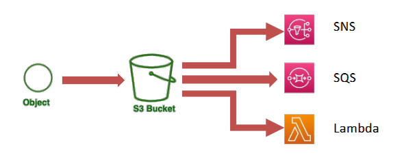
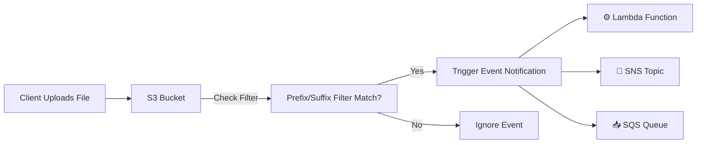
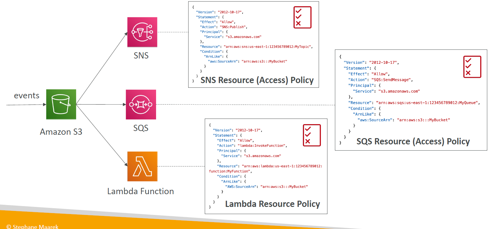

# 📢 **Amazon S3 Event Notifications – Let Your Buckets Talk**

**Amazon S3 Event Notifications** enable your S3 buckets to **automatically trigger actions** when objects are created, deleted, or restored — like giving your bucket a voice to say:

> "Hey! A new file just arrived — do something about it!" ⚡

---

<div align="center">
  
</div>

---

## 🔍 **What Are S3 Event Notifications?**

With S3 Event Notifications, you can **configure your bucket** to send event messages to:

- 🧠 **AWS Lambda** — to run serverless logic
- 📥 **Amazon SQS** — to queue jobs for processing
- 📧 **Amazon SNS** — to notify subscribers via email/SMS

---

## ⚙️ **How S3 Event Notifications Work**



---

## 🪪 **S3 Event Notifications – IAM Permissions**

> ✅ **You must allow `s3.amazonaws.com` to invoke the destination service**.

<div align="center">
  
</div>

---

## 🛠️ **How to Set Up S3 Event Notifications**

### 1️⃣ Open Your S3 Bucket

- Go to **AWS Console → S3 → Your Bucket**

### 2️⃣ Go to **Properties → Event Notifications**

- Scroll to **Event Notifications** section
- Click **“Create event notification”**

### 3️⃣ Define the Event Settings

- **Name:** e.g., `ImageUploadTrigger`
- **Event Types:** `PUT`, `DELETE`, `RESTORE`, etc.
- **Prefix/Suffix Filters:** e.g., `images/`, `.jpg`

### 4️⃣ Choose the Destination

- 🧠 **Lambda** – Trigger function execution
- 📧 **SNS Topic** – Send alert notifications
- 📥 **SQS Queue** – Buffer requests for async processing

### 5️⃣ Ensure IAM Permissions

Depending on your target (Lambda, SNS, or SQS), you must attach the following **IAM policy** to the resource's access policy:

```json
{
  "Principal": { "Service": "s3.amazonaws.com" },
  "Effect": "Allow",
  "Action": "lambda:InvokeFunction", // or "sqs:SendMessage", "sns:Publish"
  "Resource": "arn:aws:lambda:region:account-id:function:your-function-name",
  "Condition": {
    "ArnLike": {
      "AWS:SourceArn": "arn:aws:s3:::your-bucket-name"
    }
  }
}
```

📌 Replace `Action` and `Resource` as needed for **SNS or SQS**.

---

## ✨ **Common Use Cases**

| Scenario                   | What It Does                                          |
| -------------------------- | ----------------------------------------------------- |
| 📸 **Image Resizing**      | Trigger Lambda to resize uploaded photos              |
| 🧠 **AI Inference**        | Start ML jobs (e.g., text analysis) on uploaded files |
| 🔒 **Audit Logging**       | Log all `PUT/DELETE` events to DynamoDB               |
| 📤 **Email Notifications** | Alert admins when new files arrive via SNS            |
| 🌍 **Cross-Region Sync**   | Replicate files to buckets in other regions           |

---

## 🧠 **Best Practices**

- 🔐 **IAM Permissions Matter**:

  - Always grant **`s3.amazonaws.com`** the proper permissions to access Lambda, SNS, or SQS.

- 📉 **Avoid Over-Triggering**:

  - Filter by **prefix/suffix** to reduce noise and costs.

- 🧪 **Test with Dev Buckets**:

  - Before using in production, test your trigger behavior.

- 📊 **Monitor Events**:

  - Use **CloudWatch** to track trigger success/failure rates.

---

## 🧾 **Sample Event Payload (Lambda or SQS)**

```json
{
  "Records": [
    {
      "eventName": "ObjectCreated:Put",
      "s3": {
        "bucket": { "name": "my-upload-bucket" },
        "object": { "key": "images/user123.jpg" }
      }
    }
  ]
}
```

---

## ✅ **Why Use S3 Event Notifications?**

| Feature                      | Benefit                                             |
| ---------------------------- | --------------------------------------------------- |
| ⚡ **Event-Driven Workflow** | Avoid polling; respond in real time                 |
| 🔄 **Serverless Processing** | Combine with Lambda to build reactive architectures |
| 📬 **Flexible Destinations** | Supports queues, topics, and custom compute         |
| ☁️ **Scalable by Design**    | Handles millions of events without custom infra     |
