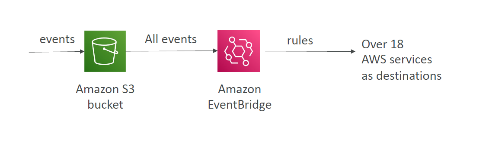
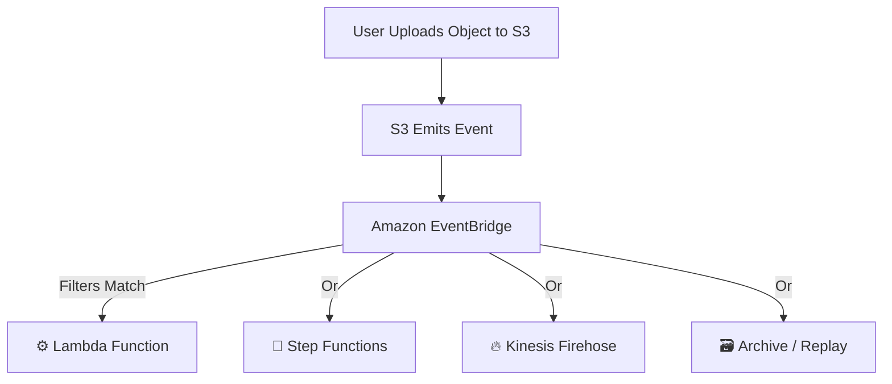

---
tags:
  - aws
  - aws/service
  - aws/domain/storage
  - aws/topic/s3
aliases:
  - "Amazon S3 Event Notifications with EventBridge"
  - "S3 With Eventbridge"
---

# 🔔 **Amazon S3 Event Notifications with EventBridge**

> 🎯 _Perfect for building event-driven, serverless architectures beyond the limitations of SNS, SQS, or Lambda triggers._

---

<div align="center">
  
</div>

---

## 🤝 **What Is S3 + EventBridge Integration?**

**Amazon S3** natively integrates with **Amazon EventBridge**, allowing you to capture detailed object-level events and route them to a variety of AWS services — **with rich filtering, reliable delivery, and replay support**.

With this integration:

- **S3 emits object-level events** (e.g., uploads, deletions).
- **EventBridge captures these events** as part of the **AWS default event bus**.
- You can **filter**, **route**, **store**, **replay**, or **transform** events — and send them to **multiple targets**.

---

## 🔍 **Why Use EventBridge Instead of S3 Native Notifications?**

| Feature                      | ✅ S3 with EventBridge                          |
| ---------------------------- | ----------------------------------------------- |
| 🔄 Supports Multiple Targets | ✔️ (Step Functions, Kinesis, Lambda, Firehose…) |
| 🔍 Advanced Filtering        | ✔️ (JSON rules on metadata, object name, size…) |
| 📁 No per-bucket limit       | ✔️ Use same bucket in multiple rules            |
| 💾 Archive & Replay          | ✔️ Archive events and replay anytime            |
| 📊 Event Observability       | ✔️ Monitor using EventBridge metrics/logs       |
| 🔁 Fan-out Support           | ✔️ Route one event to multiple targets          |

> 🧠 EventBridge is ideal for **decoupled**, **scalable**, and **audit-friendly** architectures.

---

## ⚙️ **How It Works**

<div align="center">



</div>

---

## 🧩 **Supported Event Types from S3**

- `ObjectCreated:*`
- `ObjectRemoved:*`
- `ObjectRestore:*`
- `Replication:*`
- `LifecycleExpiration:*`
  …and more.

---

## 🧪 **Example Rule – Filter by Object Size & Prefix**

```json
{
  "source": ["aws.s3"],
  "detail-type": ["Object Created"],
  "detail": {
    "bucket": {
      "name": ["my-uploads"]
    },
    "object": {
      "key": [{ "prefix": "images/" }],
      "size": [{ "numeric": [">", 1000000] }]
    }
  }
}
```

> ✅ Triggers only for files larger than 1 MB under the `images/` prefix.

---

## 🚀 **Destinations You Can Trigger via EventBridge**

| Destination             | Use Case Example                               |
| ----------------------- | ---------------------------------------------- |
| ⚙️ **Lambda**           | Run validation, processing, or notifications   |
| 📜 **Step Functions**   | Orchestrate workflows for AI processing, ETL   |
| 🔥 **Kinesis Firehose** | Stream files to S3, Redshift, or Elasticsearch |
| 💬 **SNS / SQS**        | Legacy integration for async message handling  |
| 🗃️ **Event Archive**    | Store and replay missed or historical events   |

---

## 🛡️ **Security and Permissions**

- S3 uses the **`s3.amazonaws.com`** service principal to emit events.
- You don’t need to configure S3 bucket permissions for EventBridge to receive events — but **the EventBridge rule target must allow invocation** via IAM.

Example IAM permission for Lambda target:

```json
{
  "Effect": "Allow",
  "Principal": {
    "Service": "events.amazonaws.com"
  },
  "Action": "lambda:InvokeFunction",
  "Resource": "arn:aws:lambda:region:account-id:function:your-function"
}
```

---

## 📈 **Benefits of Using EventBridge with S3**

| Feature              | ✅ Benefit                                                  |
| -------------------- | ----------------------------------------------------------- |
| 🔍 JSON filtering    | Filter based on **object metadata**, not just suffix/prefix |
| 🔁 Multiple targets  | Send one event to **many destinations** simultaneously      |
| 🔄 Event replay      | Reprocess events **on demand** (for debugging or recovery)  |
| 📦 No polling        | Fully event-driven; no need for cron or scans               |
| 🧩 Complex workflows | Trigger **Step Functions**, stream to **Firehose**, etc.    |

---

## ✅ **Final Thought**

Using **Amazon S3 + EventBridge** unlocks a **modern event-driven architecture** where your applications respond to S3 events with **flexibility, reliability, and power**.

> Perfect for workflows that need **fan-out**, **filtering**, **auditing**, or **complex orchestration** — all **without writing polling logic or managing retries**.
---

## Related Notes
- [[aws-services/4.storage/1.s3/|Index]] - folder map
- [[aws-services/4.storage/1.s3/7.1.event-notification|Amazon S3 Event Notifications Let Your Buckets Talk]] - previous lesson
- [[aws-services/4.storage/1.s3/8.1.s3-server-access-logging|Amazon S3 Server Access Logging]] - next lesson
- [[aws-services/7.application-integration/step-functions/1.step-functions|AWS Step Functions Orchestrate Your Serverless Workflows with Ease]] - mentions Step Functions
- [[aws-services/11.analytics/open-search/1.1.elastic-search|Elasticsearch]] - mentions Elasticsearch
- [[aws-daily/aws-waf/3.1.reliability|Reliability]] - mentions Reliability
- [[aws-daily/aws-architectures/3.1.serverless|Server-Based Architectures vs. Serverless Computing]] - mentions Serverless
- [[aws-services/10.developer/1.4.aws-sam/1.serverless|The Ultimate Guide to Serverless Computing & Tools]] - mentions Serverless
- [[aws-services/11.analytics/firehose/1.1.firehose|Amazon Data Firehose The Pipeline That Never Sleeps]] - mentions Firehose
- [[aws-services/11.analytics/redshift/1.redshift|Amazon Redshift]] - mentions Redshift
- [[aws-services/7.application-integration/sqs/1.1.sqs|Amazon SQS Mastering Serverless Message Queues]] - mentions SQS
- [[aws-services/7.application-integration/sns/1.sns|Amazon SNS The Clouds Pub/Sub Notification Engine]] - mentions SNS

---
