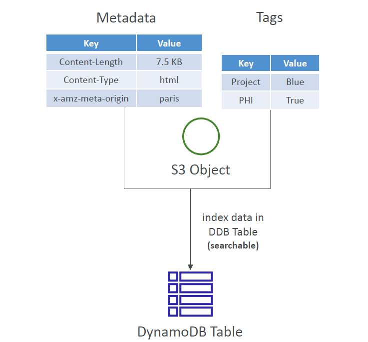

# 🏷️ **Amazon S3: User-Defined Metadata vs. Object Tags**

<div style="text-align: center;">
    
</div>

---

## 🧾 **S3 User-Defined Object Metadata**

> Custom key-value pairs added when uploading an object.

### 🔹 Key Facts

- Used to store **descriptive info** (e.g., origin, uploader, version).
- Keys **must start with**: `x-amz-meta-`
- Keys are **stored lowercase** by S3.
- Example:

  ```ini
  x-amz-meta-origin: paris
  x-amz-meta-department: hr
  ```

- Retrieved along with the object (via `GET` request or `HEAD`).
- ❌ **Not searchable** inside S3 — use external DB for indexing (e.g., DynamoDB).

---

## 🏷️ **S3 Object Tags**

> Separate key-value pairs used for **management and classification**.

### 🔹 Key Facts

- Up to **10 tags per object**.

- Example:

  ```ini
  Project=Blue
  PHI=True
  ```

- Used for:

  - **Access control** (fine-grained IAM/S3 policies)
  - **Cost allocation**
  - **Lifecycle policies**
  - **Analytics grouping (e.g., S3 Storage Lens)**

- ❌ Not searchable inside S3 — index externally if needed.

---

## 🔍 **Comparison**

| Feature               | User-Defined Metadata         | Object Tags                        |
| --------------------- | ----------------------------- | ---------------------------------- |
| Key Format            | Must start with `x-amz-meta-` | Any key                            |
| Max per object        | Unlimited (but size-limited)  | 10 tags max                        |
| Used for              | Descriptive info, headers     | Access control, analytics          |
| Shown in GET response | ✅ Yes                        | ❌ No (must call GetObjectTagging) |
| Searchable in S3      | ❌ No                         | ❌ No                              |
