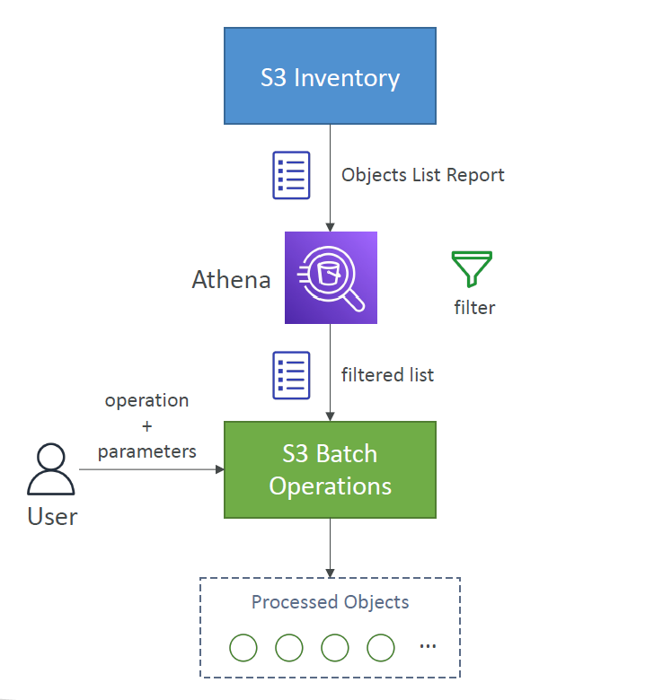

---
tags:
  - aws
  - aws/service
  - aws/domain/storage
  - aws/topic/s3
aliases:
  - "Amazon S3 Batch Operations"
  - "S3 Batch Operations"
---

# 🛠️ **Amazon S3 Batch Operations**

> "Need to do something to thousands or millions of S3 files at once? Batch Operations has your back!"

---

<div style="text-align: center;">
    
</div>

---

## ❓ What is S3 Batch Operations?

Amazon S3 **Batch Operations** let you **do the same action** (like tagging, copying, or restoring) on **lots of S3 objects** — even **millions of them** — with **one job**, without writing custom scripts or loops.

Think of it as a **bulk-action tool for S3**.

---

## 🧠 When Should You Use It?

Use S3 Batch Operations if you want to:

| 🛠️ Task                       | 🧾 Description                                                                  |
| ----------------------------- | ------------------------------------------------------------------------------- |
| ✅ Add/Update tags            | Retag thousands of objects automatically                                        |
| 📂 Copy files                 | Move files between buckets or regions                                           |
| ❄️ Restore files from Glacier | Restore archived files in bulk                                                  |
| 🔐 Change ACLs                | Update object permissions in one go                                             |
| 🧠 Run Lambda per object      | Run a custom Lambda function on each object (e.g., virus scan, reprocess image) |

---

## 🧰 **What Can You Do with S3 Batch Ops?**

| Action                            | Description                                                      |
| --------------------------------- | ---------------------------------------------------------------- |
| 📂 `CopyObject`                   | Copy objects from one bucket to another                          |
| 🏷️ `PutObjectTagging`             | Add or update object tags                                        |
| 🔐 `PutObjectAcl`                 | Set ACLs (access permissions) on objects                         |
| ❄️ `RestoreObject`                | Restore Glacier or Deep Archive objects                          |
| 🧠 `InvokeLambdaFunction`         | Run custom code (e.g., virus scan, thumbnail gen) on each object |
| 📝 `ReplaceMetadata` (via Lambda) | Change object metadata using Lambda logic                        |

---

## ✨ **Real-Life Use Cases**

- ✅ Retag thousands of log files for new billing categories
- 🔁 Copy an entire S3 bucket to another region for DR
- ❄️ Restore all archived files from Glacier before an audit
- 🧪 Run image analysis on millions of files with a Lambda function

---

## 🛠️ **How to Use S3 Batch Operations**

### 📍 **Step-by-Step via Console**

1. **Go to S3 → Batch Operations → Create Job**
2. Choose one of these **object lists**:
   - ✅ A CSV from S3 Inventory
   - ✅ A custom CSV with bucket/key pairs
3. Select the **operation** you want to perform (e.g. copy, tagging, Lambda).
4. Choose **IAM Role** that gives AWS permissions to run the job.
5. (Optional) Choose a **completion report bucket**.
6. Review and **start the job**!

---

### 🧪 Example: Retag Old Files

Let’s say you want to add a tag `{"project": "archive"}` to 500,000 `.zip` files.

- 🎯 Upload a CSV of file keys to S3.
- 🔧 Select `PutObjectTagging` as the action.
- 🚀 Submit the job and monitor progress.
- ✅ AWS will tag each file and provide a report at the end.

---

## 🧮 **Monitoring & Reports**

- 📊 Progress can be viewed in **AWS Console** or **CloudWatch Logs**
- ✅ Each job gives you:
  - A **summary**: succeeded/failed counts
  - A **detailed CSV** of each object's result
- 📧 You can also set up **SNS notifications** for job completion

---

## 🔐 **Permissions Required**

Make sure the IAM Role for the job has:

```json
{
  "Effect": "Allow",
  "Action": [
    "s3:GetObject",
    "s3:PutObject",
    "s3:PutObjectTagging",
    "lambda:InvokeFunction" // if using Lambda
  ],
  "Resource": "*"
}
```

---

## 🧠 Tips & Best Practices

- ✅ Use **S3 Inventory** for large object lists—it integrates natively!
- 🧪 Test on a **small subset** of data first (you can set limit ranges).
- ❄️ For Glacier restores, add lifecycle transitions afterward.
- 💰 Watch for **costs**: some operations (like copying or restoring) incur data transfer or request fees.

---

## 📚 Summary Table

| Feature       | Description                     |
| ------------- | ------------------------------- |
| 🚀 Scale      | Handles billions of objects     |
| 🔄 Operations | Copy, tag, ACL, restore, Lambda |
| 🧾 Input      | CSV list or S3 Inventory        |
| 📊 Output     | Completion report (CSV)         |
| 🔐 IAM Role   | Required to perform the job     |
| 📈 Monitoring | Console + CloudWatch Logs + SNS |

---

## Want to Automate it?

You can create and monitor jobs via:

- 🧰 **AWS CLI**
- ⚙️ **AWS SDK (Python, Java, etc.)**
- 📄 **CloudFormation / Terraform**
- 🕹️ **S3 Control API**
---

## Related Notes
- [[aws-services/4.storage/1.s3/|Index]] - folder map
- [[aws-services/4.storage/1.s3/9.1.performance-considration|Amazon S3 Performance Optimization Guide]] - previous lesson
- [[aws-services/4.storage/1.s3/9.3.s3-doesn't-support-object-locking-in-concurrent-writer|Amazon S3 Object Locking with Concurrent Writers]] - next lesson
- [[aws-services/1.management-governance/3.1.cloud-watch/3.1.cw-logs|Amazon CloudWatch Logs]] - mentions CloudWatch Logs
-[[1.1.cfn|AWS CloudFormation]]] - mentions CloudFormation
- [[aws-services/4.storage/1.s3/11.1.s3-inventory|Amazon S3 Inventory]] - mentions S3 Inventory
- [[aws-services/10.developer/1.1.aws-cli/aws-cli|AWS Cli]] - mentions AWS Cli
- [[aws-services/10.developer/1.2.aws-sdk/aws-sdk|AWS Sdk]] - mentions AWS Sdk
- [[aws-services/7.application-integration/sns/1.sns|Amazon SNS The Clouds Pub/Sub Notification Engine]] - mentions SNS
- [[aws-services/2.security/1.1.iam/1.fundmmentals/1.2.iam|AWS Identity and Access Management IAM]] - mentions IAM

---
