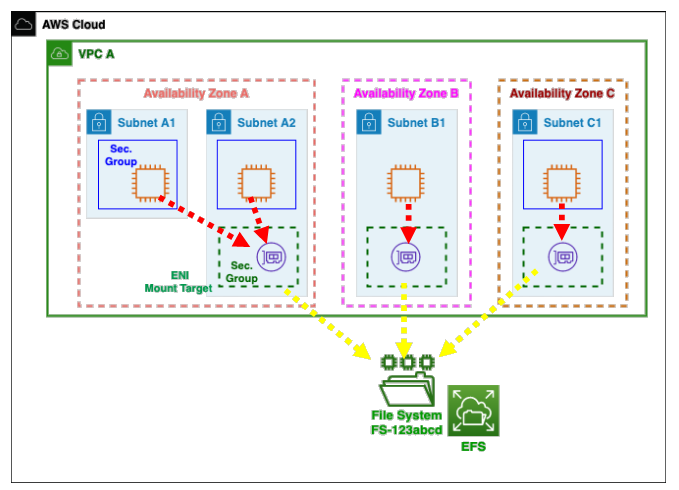
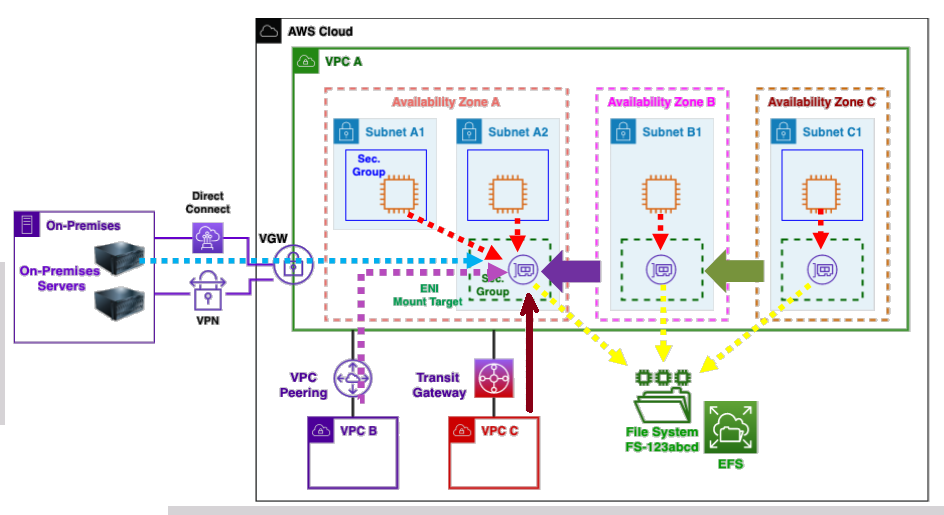

# 🗄️ **Amazon Elastic File System (EFS)**

**Amazon EFS** is a **fully managed**, **serverless**, **elastic**, and **POSIX-compliant** file storage system that enables you to mount a shared file system across thousands of EC2 instances and containers. Designed for scalability, durability, and ease of use, EFS grows and shrinks automatically, eliminating the need to provision or manage storage.

> ✅ Highly available | ✅ Multi-AZ | ✅ Auto-scaling | ⚠️ Expensive (\~3x gp2) | 💸 Pay-per-use

---

<div align="center">
  
</div>

---

## 🌟 Key Features

### 🔄 Elastic Scalability

- Scales from megabytes to **petabytes** with zero disruption.
- No need for capacity planning or manual intervention.
- Automatically adjusts throughput and IOPS based on your workload.

### 🛡️ High Availability & Fault Tolerance

- **Multi-AZ replication** provides continuous availability across an AWS Region.
- Designed for **99.999999999% (11 9s)** durability.
- Survives AZ failures with zero data loss.

### ⚙️ Serverless & Fully Managed

- AWS handles provisioning, patching, and maintenance.
- No need to manage or scale infrastructure.

### 🚀 Performance at Scale

- Up to **10+ GB/s throughput** and **500,000+ IOPS**.
- Supports burst and provisioned throughput modes.
- Ideal for performance-sensitive applications like big data or media rendering.

### 🔐 Fine-Grained Security

- **POSIX permissions** and **IAM policies** for access control.
- Supports **encryption at rest (KMS)** and **in transit (TLS)**.
- Controlled via **Security Groups** — must allow NFS traffic on port `2049`.

### 🌐 Broad Integration

- Mountable on **EC2**, **ECS**, **Lambda**, and **on-prem** via **AWS Direct Connect** or **VPN**.
- Supports **NFS v4.0/v4.1** – standard protocol, widely compatible.
- Mount across **peered VPCs** using **Transit Gateway**.

### 🧭 Monitoring & Audit

- Integrated with **CloudWatch** for performance metrics.
- Access logs available via **CloudTrail** for auditing.

---

## 🔗 File System Access Architecture

<div align="center">
  
</div>

> 📌 Each **Availability Zone** has a dedicated **Mount Target (ENI)**.  
> 📌 EC2 instances connect to EFS via **NFS protocol over ENIs**.  
> 📌 Ensure **Security Groups** allow TCP port **2049** between EC2 and mount targets.

---

## 🛠️ Configuration Notes

### ✅ Security Group Rules

```sh
# EFS ENI Inbound Rule
Type: Custom TCP
Port: 2049
Source: <EC2 Security Group or CIDR>

# EC2 Outbound Rule
Type: Custom TCP
Port: 2049
Destination: <EFS Security Group>
```

> 🔐 NFS port `2049` must be allowed in both directions between EC2 and EFS mount targets.

### ✅ EC2 Mount Commands

#### 🔧 Install NFS client

Amazon Linux:

```bash
sudo yum install -y nfs-utils
```

Ubuntu:

```bash
sudo apt-get install -y nfs-common
```

#### 🔗 Mount the EFS File System

```bash
sudo mount -t nfs4 -o nfsvers=4.1 \
<fs-id>.efs.<region>.amazonaws.com:/ /mnt/efs
```

Replace `<fs-id>` and `<region>` accordingly.

---

## 🧩 Advanced Features

### 🤝 Shared Concurrent Access

- Thousands of EC2 instances can mount and read/write concurrently.
- Use cases: **media processing, analytics, dev environments, CMS**, etc.

### 📂 POSIX-Compliant Directory Structure

- Supports complex folder hierarchies, unlike S3.
- Built for applications expecting standard filesystem behavior.

### 🧮 Consistent Read-after-Write

- Ensures immediate availability of newly written files.

### 📈 Automatic Scaling with Predictable Performance

- No pre-provisioning required.
- Maintains low latency and high throughput automatically.

---

## 🔍 Use Cases

| Use Case                    | Description                                              |
| --------------------------- | -------------------------------------------------------- |
| 📊 **Big Data & Analytics** | Fast access to shared datasets for Spark, EMR, or Glue   |
| 🧑‍💻 **Dev Environments**  | Shared dev workspaces and home directories               |
| 🌐 **Web Hosting / CMS**    | WordPress, Joomla, etc. needing shared file systems      |
| 🎥 **Media Processing**     | Render farms, video editing, multi-instance access       |
| ☁️ **Cloud Bursting**       | Elastic scale-out compute with shared persistent storage |

---

## 🛡️ Security Highlights

- **IAM + POSIX** = granular identity + file-level access
- **Encryption**:

  - At rest via KMS
  - In transit via TLS/NFS 4.1

- **Audit logs** via CloudTrail
- **SG-controlled NFS traffic** ensures tight access boundaries

---

## 📌 Summary: Why Use EFS?

| Feature                       | Value                                      |
| ----------------------------- | ------------------------------------------ |
| Elastic, Petabyte-scale FS    | ✅                                         |
| Fully managed & serverless    | ✅                                         |
| Native NFS + POSIX support    | ✅                                         |
| Secure, compliant & auditable | ✅                                         |
| Expensive (\~3x gp2)          | ⚠️ Use only when shared access is required |

> 🧠 **Pro Tip**: For simple object storage, use S3.
> For shared file systems with POSIX compliance and high concurrency, EFS is unmatched.
