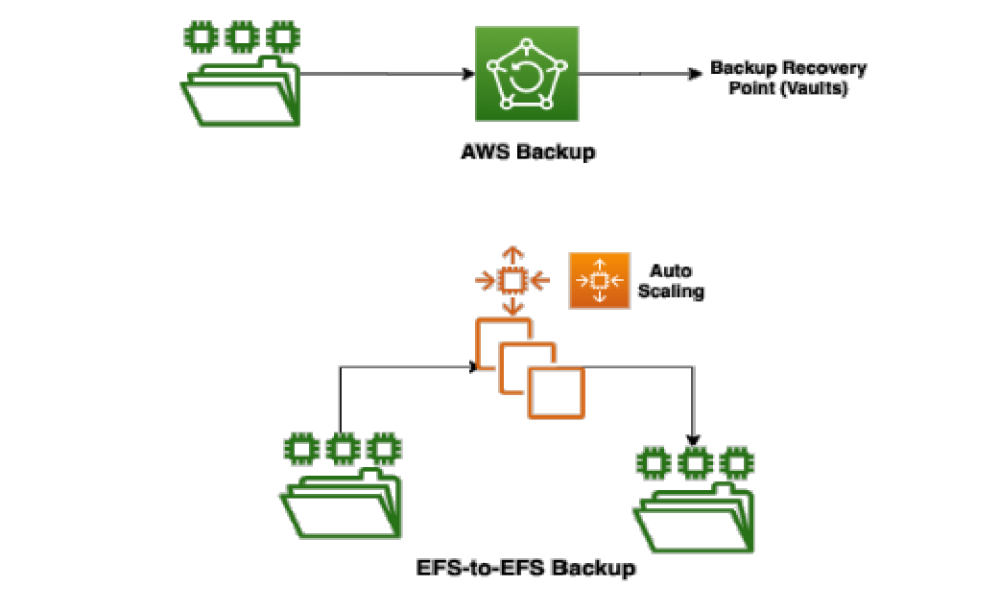
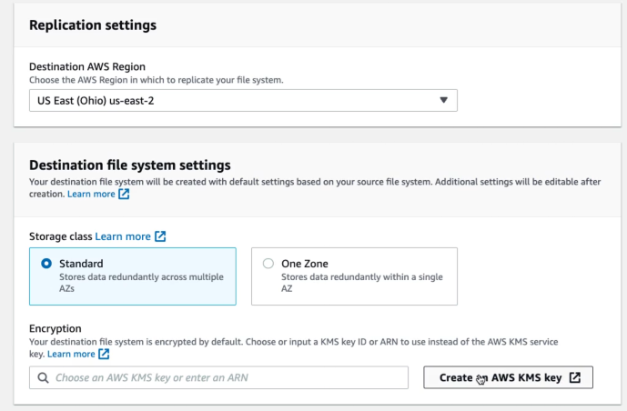
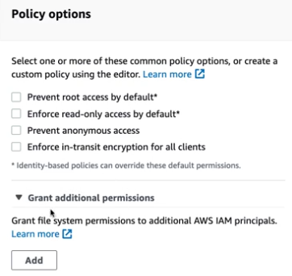

---
tags:
  - aws
  - aws/service
  - aws/domain/storage
  - aws/topic/efs
aliases:
  - "Amazon EFS Additional Features"
  - "EFS Other Features"
---

# 🛠️ **Amazon EFS Additional Features**

Enhance your Amazon Elastic File System (EFS) with a range of additional features designed to optimize security, performance, and data management. These functionalities ensure that your file storage is not only scalable and reliable but also tailored to meet your specific application needs.

---

## 🔒 **Data Encryption**

Protect your data with robust encryption mechanisms, ensuring both security and compliance.

### 🛡️ **Encryption in Transit**

- **Secure Transfers:** EFS supports encryption of data as it moves between your applications and the file system, safeguarding it from interception.

### 🔐 **Encryption at Rest**

- **KMS Integration:** Data is automatically encrypted at rest using AWS Key Management Service (KMS) keys. By default, EFS handles key management, but you can opt to disable this feature if needed.

---

## 💾 **Backup & Restore**

Ensure data durability and quick recovery with comprehensive backup solutions.

### 🔄 **1. AWS Backup** - _recommended ✅_

- **Comprehensive Solution:** Simplifies the creation, scheduling, restoration, deletion, and reporting of backups.
- **Flexible Restoration:** Restore your EFS file system from backups to the same or a new EFS file system, ensuring minimal downtime and data loss.

### 🔄 **2. EFS to EFS Backup**

- **Cross-Region Replication:** Copy data between EFS file systems in the same or different AWS Regions.
- **Use Case:** Ideal for scenarios where AWS Backup is unavailable in your target region.

---

  

---

## 🔄 **EFS Replication**

Enhance data resilience and availability by replicating your EFS file systems across regions.

- **Cross-Region Replication:** Create replicas of your EFS file system in different AWS Regions.
- **Automatic Syncing:** Ensures data and metadata are continuously synchronized, providing a **Recovery Point Objective (RPO)** and **Recovery Time Objective (RTO)** of minutes.
- **Read-Only Access:** Replicated file systems are read-only, safeguarding the integrity of your backup data.

---

  

---

## 📜 **File System Policy**

Control access and manage permissions at the file system level with resource-based policies.

- **Granular Access Control:** Define who can perform specific actions on your EFS file system.
- **Resource-Based Policies:** Attach policies directly to the file system to manage access without relying solely on IAM roles.
- **Enhanced Security:** Ensure that only authorized users and services can interact with your file system, maintaining data security and compliance.

---

  

---
---

## Related Notes
- [[aws-services/4.storage/2.1.efs/|Index]] - folder map
- [[aws-services/4.storage/2.1.efs/2.3.efs–performance-settings|Amazon EFS Performance Settings Guide]] - previous lesson
- [[aws-services/4.storage/2.1.efs/3.efs-access-point|Amazon EFS Access Points]] - next lesson
- [[aws-services/11.analytics/glue/9.1.additional-features|AWS Glue Additional Features]] - mentions Additional Features
- [[aws-services/8.database/dynamodb/1.6.additional-features|AWS DynamoDB Additional Features]] - mentions Additional Features
- [[aws-services/4.storage/1.s3/2.5.encryption|Amazon S3 Encryption]] - mentions Encryption
- [[aws-services/4.storage/4.aws-backup/aws-backup|AWS Backup]] - mentions AWS Backup
- [[aws-services/8.database/dynamodb/1.4.backup|AWS DynamoDB Backup]] - mentions Backup
- [[aws-services/4.storage/2.1.efs/2.1.efs|Amazon Elastic File System EFS]] - mentions EFS
- [[aws-services/2.security/1.1.iam/1.fundmmentals/1.2.iam|AWS Identity and Access Management IAM]] - mentions IAM

---
