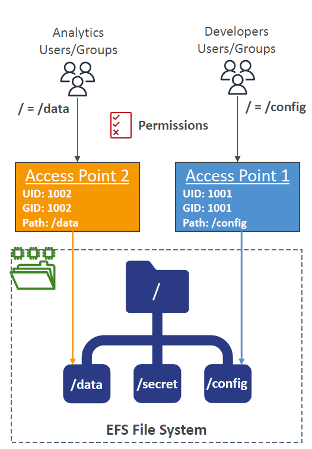

# 🛠️ **Amazon EFS – Access Points**

**EFS Access Points** provide a simplified way to manage application-specific access to shared EFS file systems.  
They act as entry gates into specific directories within the file system, each with **predefined permissions and identity settings**.

  

---

## 🔑 **Key Benefits**

- **App-Specific Access Control**
  Create distinct access contexts for different teams (e.g., `/config` for developers, `/data` for analytics), each with isolated paths.

- **POSIX Enforcement**
  Automatically apply **specific UID and GID** to enforce POSIX permissions, even if clients don’t set them.

- **Scoped Directory Access**
  Limit users to a subdirectory (e.g., `/data`, `/config`) instead of giving access to the full root (`/`) — enhances **security** and **segmentation**.

- **IAM Policy Integration**
  Combine access points with **IAM policies** to control NFS client access based on identity, ensuring only authorized roles can mount specific access points.

---

## 🧠 Example Use Case

- **Analytics team** mounts `/data` via Access Point 2 (UID 1002), restricted from `/config` and `/secret`.
- **Dev team** mounts `/config` via Access Point 1 (UID 1001), with no access to `/data`.

> 🎯 This allows **fine-grained, secure, and auditable** access separation within a shared EFS environment — ideal for multi-tenant or cross-functional architectures.
