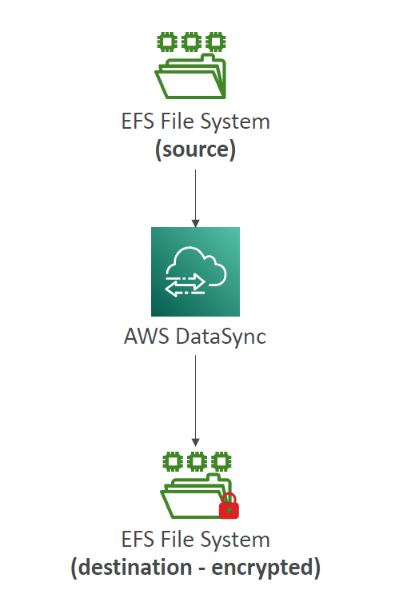

---
tags:
  - aws
  - aws/service
  - aws/domain/storage
  - aws/topic/efs
aliases:
  - "Amazon EFS Operations & Migrations Simplified"
  - "Efs Operations"
---

# 🛠️ **Amazon EFS – Operations & Migrations Simplified**

> Not every EFS configuration change requires a full migration — but some definitely do.

---

## ✅ **In-Place Operations** (No migration needed)

You can modify these **directly on the EFS** file system:

| Operation                  | 🔧 Description                                                  |
| -------------------------- | --------------------------------------------------------------- |
| **Lifecycle Policy**       | 📉 Enable/adjust **IA (Infrequent Access)** storage class rules |
| **Throughput Mode**        | ⚙️ Switch between **Bursting** and **Provisioned** throughput   |
| **Provisioned Throughput** | 📈 Increase or decrease the provisioned value (within limits)   |
| **EFS Access Points**      | 🎯 Add or modify access points for secure, role-based access    |

---

## 🔁 **Operations That Require Migration** (via AWS DataSync)

Some changes are **not possible directly** and require creating a new EFS and migrating data using **AWS DataSync**:

| 🚫 Direct Change Not Allowed            | 🛠️ Recommended Solution                                              |
| --------------------------------------- | -------------------------------------------------------------------- |
| Enable encryption on an unencrypted EFS | Use **DataSync** to migrate data to a new encrypted EFS 🔐           |
| Change **Performance Mode**             | Create new EFS with `MaxIO` (or other) and migrate using DataSync ⚡ |

📌 DataSync copies:

- All **file contents**
- **Metadata** (permissions, timestamps)
- **File attributes** (ownership, ACLs)

---

📊 **Diagram Example – EFS Migration with Encryption**

  

---

### 🧠 Summary

| ✅ In-place Ops      | 🔁 Migration Required      |
| -------------------- | -------------------------- |
| Lifecycle rules (IA) | Encryption (at rest)       |
| Throughput settings  | Performance Mode (Max IO)  |
| Access Points        | Cross-account/cross-region |
---

## Related Notes
- [[aws-services/4.storage/2.1.efs/|Index]] - folder map
- [[aws-services/4.storage/2.1.efs/3.efs-access-point|Amazon EFS Access Points]] - previous lesson
- [[aws-services/4.storage/2.1.efs/5.efs-monitoring|Amazon EFS CloudWatch Metrics]] - next lesson
- [[aws-services/4.storage/1.s3/2.5.encryption|Amazon S3 Encryption]] - mentions Encryption
- [[aws-services/4.storage/2.1.efs/2.1.efs|Amazon Elastic File System EFS]] - mentions Efs

---
