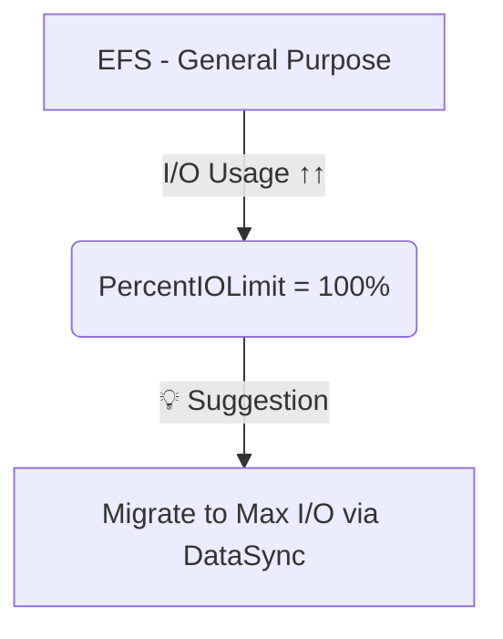

# 📊 **Amazon EFS – CloudWatch Metrics**

> _Monitor your Elastic File System usage & performance — know when to scale, migrate, or optimize._

---

## 📈 **Key EFS Metrics to Watch**

| 📌 **Metric**             | 🔍 **What It Shows**                                                                                                                                                                         |
| ------------------------- | -------------------------------------------------------------------------------------------------------------------------------------------------------------------------------------------- |
| **🧮 PercentIOLimit**     | Shows how close your file system is to its **I/O throughput limit** (General Purpose only).   🔸 At `100%`? You’ve maxed out — consider migrating to **Max I/O** mode using **DataSync**. |
| **💥 BurstCreditBalance** | Available **burst credits** used to exceed baseline throughput.   ⏳ If it drops to zero, throughput performance may degrade.                                                             |
| **📦 StorageBytes**       | Total size of the file system, reported every 15 mins.   Dimensions:   - `Standard` (frequent access)   - `IA` (Infrequent Access)   - `Total` = Standard + IA                   |

---

## 🧠 **Real-Life Implications**

| Scenario                                | Action Plan                                               |
| --------------------------------------- | --------------------------------------------------------- |
| `PercentIOLimit` near 100% consistently | Migrate to **Max I/O** Performance Mode                   |
| `BurstCreditBalance` trending to 0      | Reduce I/O or switch to **Provisioned Throughput**        |
| `StorageBytes.Total` growing fast       | Enable Lifecycle Policy to move files to IA automatically |

---

### 📸 Visual: When PercentIOLimit Hits 100%

---

## 🔍 **Metric Collection Frequency**

| Metric             | Frequency     |
| ------------------ | ------------- |
| PercentIOLimit     | Every minute  |
| BurstCreditBalance | Every minute  |
| StorageBytes       | Every 15 mins |

---

## 🧩 **Why It Matters for SOA Exam**

- Monitoring **EFS performance bottlenecks** is critical for resilient and high-performing architectures.
- Knowing when to switch modes (e.g., from GP to Max I/O) is often tested.
- You may also get questions about **Lifecycle + StorageBytes dimensions** for cost optimization.
