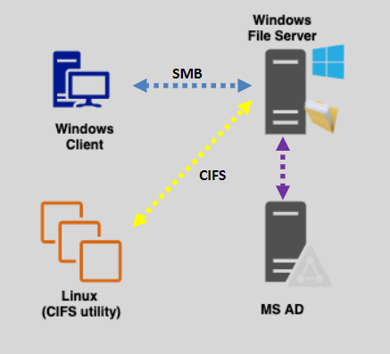

---
tags:
  - aws
  - aws/service
  - aws/domain/storage
  - aws/topic/fsx
aliases:
  - "What is Windows Server"
  - "Windows Server"
---

# 🧠 **What is Windows Server?**

> _The foundation of enterprise IT for Windows environments_

**Windows Server** is a specialized operating system developed by **Microsoft** to manage and run **network infrastructure**, **business applications**, **file and print services**, **web services**, and more — especially in **enterprise and data center environments**.

📦 **Why Not Just Windows 10/11?**

While **Windows 10/11** is designed for **end-users**, **Windows Server** is built for **serving other computers** (clients) across a network. It's like the **"brain" of an organization's IT systems**.

---

  

---

## 🧩 **Key Components of Windows Server**

| Component                      | Description                                                                 |
| ------------------------------ | --------------------------------------------------------------------------- |
| 🗄️ **Active Directory**        | Centralized authentication system for managing users, computers, and groups |
| 🖥️ **File & Storage Services** | Shared access to files and folders over the network                         |
| 🌐 **IIS (Web Server)**        | Host and manage websites and web apps                                       |
| 🧰 **Group Policy**            | Centralized management of settings for users and computers                  |
| 🔐 **DNS/DHCP Services**       | Network naming and IP address management                                    |
| 🔗 **Remote Desktop Services** | Allow users to remotely access Windows desktops                             |

---

## 🏢 **What Can You Use Windows Server For?**

### 1️⃣ **File & Print Server**

Store files centrally and manage printers across a business network.

### 2️⃣ **Domain Controller (Active Directory)**

Authenticate users and apply security policies — think login screen at big companies.

### 3️⃣ **Web & Application Hosting (IIS)**

Host .NET web apps or websites like you would on a Linux Apache/Nginx server.

### 4️⃣ **Virtualization (Hyper-V)**

Run virtual machines (VMs) directly on the server without third-party hypervisors.

### 5️⃣ **Database Server**

Host SQL Server or other enterprise-grade databases.

---

## 📋 **Common Windows Server Versions**

| Version                  | Key Highlights                                             |
| ------------------------ | ---------------------------------------------------------- |
| Windows Server 2012/2016 | Introduced Nano Server, Storage Spaces Direct              |
| Windows Server 2019      | Improved hybrid cloud features with Azure integration      |
| Windows Server 2022      | Latest version with better security and cloud-native tools |

---

## 💡 **Example: How a Windows File Server Works**

Imagine you have a small office:

- All employees need to access shared documents 📂
- You don’t want files spread across 20 PCs 💻
- So, you install **Windows Server** on a central machine
- Create **shared folders** with permissions 🔒
- Employees connect using the **SMB protocol** (built-in to Windows/Mac/Linux)

Now all files are:

- **Backed up**
- **Centrally managed**
- **Secured by user/group permissions**

---

## 🛠️ **Windows Server GUI vs Core**

| Mode          | Description                                                              |
| ------------- | ------------------------------------------------------------------------ |
| GUI (Desktop) | Full desktop experience like Windows 10 — easy for beginners             |
| Core          | Minimal UI — managed remotely or via PowerShell for security/performance |

---

## 🔐 **Security Features in Windows Server**

- **BitLocker:** Encrypt volumes at rest
- **Windows Defender:** Built-in antimalware
- **Firewall with Advanced Security:** Layered rules
- **Role-Based Access Control (RBAC):** Grant least-privilege access
- **Group Policy:** Enforce password policies, drive restrictions, etc.

---

## 🚀 **How Does This Relate to AWS FSx for Windows?**

When AWS gives you **Amazon FSx for Windows File Server**, it's like giving you:

- A pre-installed, auto-managed **Windows File Server**
- With **SMB**, **Active Directory**, **NTFS**, and **Windows ACLs**
- Hosted on a highly available, scalable, fault-tolerant cloud infrastructure.

You get the **benefits of Windows Server**, without managing it yourself.

---

## 🏁 **Summary**

| Concept             | Meaning                                                            |
| ------------------- | ------------------------------------------------------------------ |
| Windows Server      | An OS for managing enterprise networks, files, web apps, and users |
| Main Protocol       | SMB (for file sharing), Active Directory (authentication)          |
| Roles It Can Play   | Web host, file server, domain controller, virtualization platform  |
| Relation to AWS FSx | FSx for Windows gives you managed Windows File Server on the cloud |
---

## Related Notes
- [[aws-services/4.storage/2.2.fsx/|Index]] - folder map
- [[aws-services/4.storage/2.2.fsx/1.2.fsx-for-windows-server|Amazon FSx for Windows File Server]] - next lesson

---
