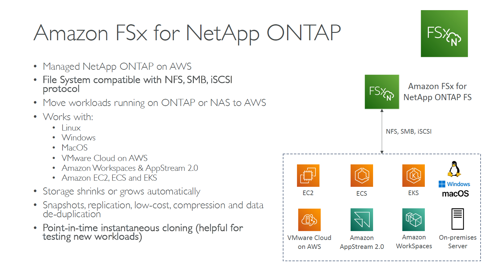

---
tags:
  - aws
  - aws/service
  - aws/domain/storage
  - aws/topic/fsx
aliases:
  - "Amazon FSx for NetApp ONTAP"
  - "Fsx For Netapp Ontap"
---

# 📞 **Amazon FSx for NetApp ONTAP**

  

---

## Related Notes
- [[aws-services/4.storage/2.2.fsx/|Index]] - folder map
- [[aws-services/4.storage/2.2.fsx/2.2.fsx-for-lustre|Amazon FSx for Lustre]] - previous lesson
- [[aws-services/4.storage/2.2.fsx/2.4.fsx-for-open-zfs|Amazon FSx for OpenZFS]] - next lesson

---
