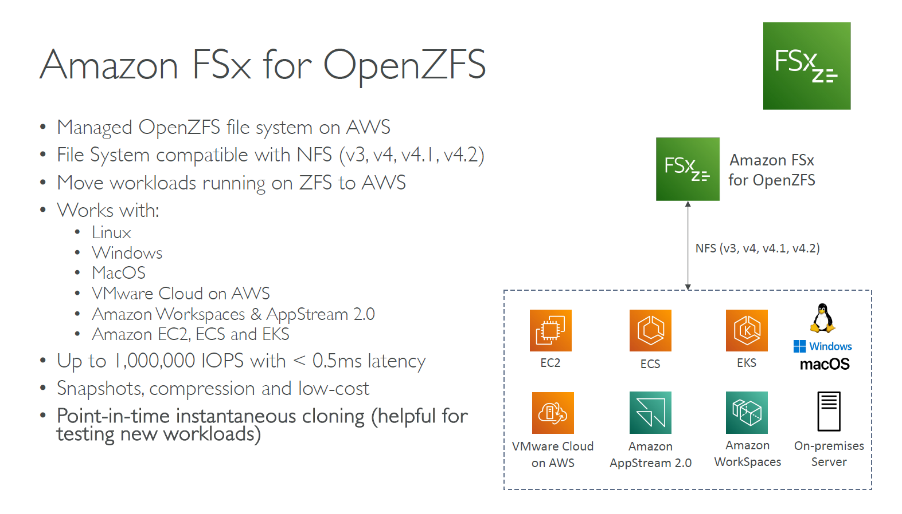

---
tags:
  - aws
  - aws/service
  - aws/domain/storage
  - aws/topic/fsx
aliases:
  - "Amazon FSx for OpenZFS"
  - "Fsx For Open Zfs"
---

# 🐧 **Amazon FSx for OpenZFS**

  

---

## Related Notes
- [[aws-services/4.storage/2.2.fsx/|Index]] - folder map
- [[aws-services/4.storage/2.2.fsx/2.3.fsx-for-netapp-ontap|Amazon FSx for NetApp ONTAP]] - previous lesson
- [[aws-services/4.storage/2.2.fsx/3.comparision|AWS Storage Services Comparison]] - next lesson

---
