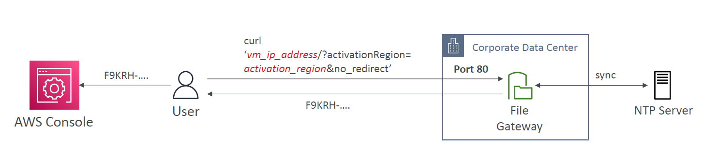
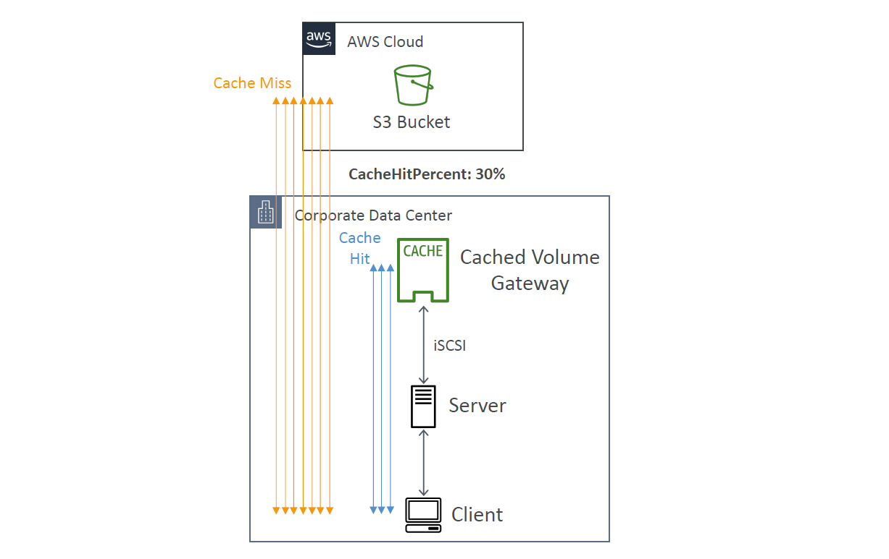
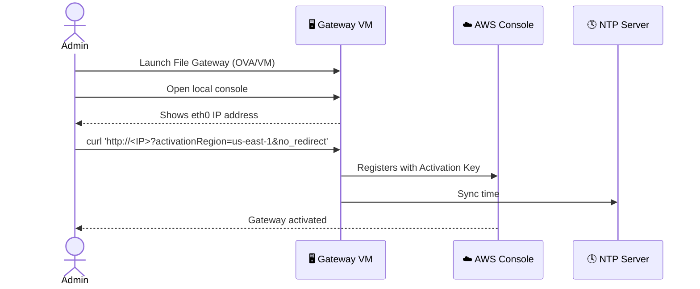

# 🗃️ **AWS Storage Gateway – SysOps Essentials**

> 🧰 For system administrators managing hybrid storage and optimizing S3-based access

---

## 🔌 What is AWS Storage Gateway?

**AWS Storage Gateway** connects your on-premises infrastructure to AWS cloud storage. It supports three modes:

- 📂 **File Gateway** → NFS/SMB access to Amazon S3
- 💾 **Volume Gateway** → Block storage via iSCSI
- 🎞️ **Tape Gateway** → Virtual tape library for backup

---

## 🧱 File Gateway – POSIX Friendly

📦 **POSIX Compliant**

- Supports Linux file systems (ownership, permissions, timestamps)
- Stores file metadata directly in **S3 object metadata**

✅ **Use Case**: Lift-and-shift Linux-based file systems with permissions intact

---

## 🔁 Rebooting Gateways (Maintenance/Recovery)

| Gateway Type            | Reboot Process                                                    |
| ----------------------- | ----------------------------------------------------------------- |
| **File Gateway**        | Just **restart the VM**                                           |
| **Volume/Tape Gateway** | 1️⃣ Stop Storage Gateway Service → 2️⃣ Reboot VM → 3️⃣ Start Service |

👉 Restart can be done via:

- 🖥️ Local VM Console
- 🌐 AWS Console
- 🧪 Storage Gateway API

---

## 🧑‍💻 Storage Gateway – Activation Process

To activate your gateway, you need an **activation key**.

---

<div style="text-align: center;">
    
</div>

---

### 🔑 Ways to Get Activation Key

1. **Gateway VM CLI**
   Select option `0` → Get activation key from the VM shell

2. **Web Method (Port 80)**
   Run this from your browser or CLI:

```bash
curl http://<vm_ip_address>/?activationRegion=<your_aws_region>&no_redirect
```

⚠️ **Troubleshooting Tips**:

- ✅ Ensure **port 80 is open**
- 🕒 Sync time via **NTP server**, or activation may fail

---

## 🧠 Cached Volume Gateway – Smart Block Storage

📥 **Cached Volume Mode**:

- Most recent blocks stored locally
- Remainder fetched on-demand from S3

---

<div style="text-align: center;">
    
</div>

---

### 📊 Key Metrics

| Metric             | Purpose                                              |
| ------------------ | ---------------------------------------------------- |
| `CacheHitPercent`  | % of reads served from local cache (higher = better) |
| `CachePercentUsed` | How full your cache disk is (lower is better)        |

### 🛠️ Tips to Improve Performance

- Expand your cache disk
- Create a larger volume → **clone** from existing cached volume
- Monitor via **CloudWatch**

---

## 🧪 Real-World Scenario: File Gateway Activation



---

## 📌 Summary

| Feature                | File Gateway  | Volume Gateway           |
| ---------------------- | ------------- | ------------------------ |
| Storage Type           | Object (S3)   | Block (iSCSI)            |
| Reboot Method          | Restart VM    | Stop → Reboot → Start    |
| Activation Method      | CLI / Port 80 | Same                     |
| Performance Tip        | Expand Cache  | Monitor iSCSI throughput |
| POSIX Metadata Support | ✅ Yes        | ❌ No                    |

---

## ✅ Best Practices

- Always sync time using **NTP**
- Watch **CacheHitPercent** for volume gateways
- Keep port 80 open during **activation**
- Use **File Gateway** for NFS/SMB workloads needing metadata
- Consider **cached mode** for read-heavy workloads
