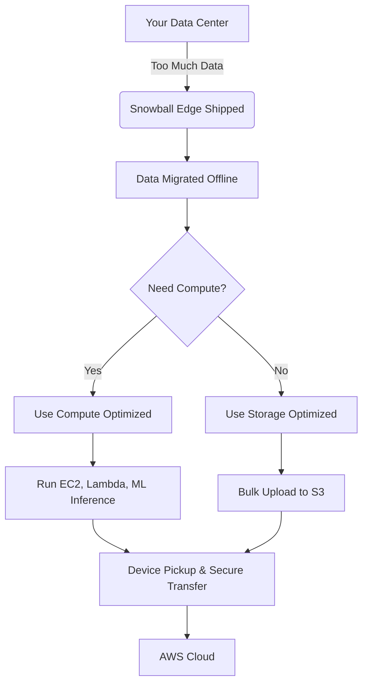
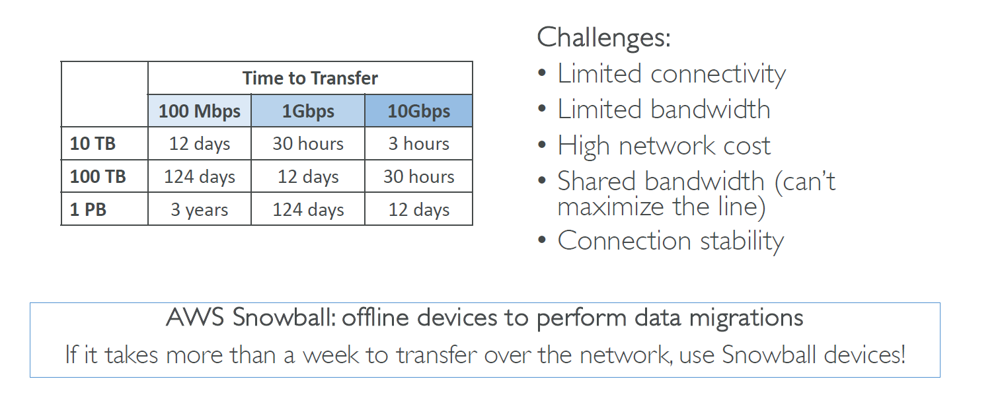
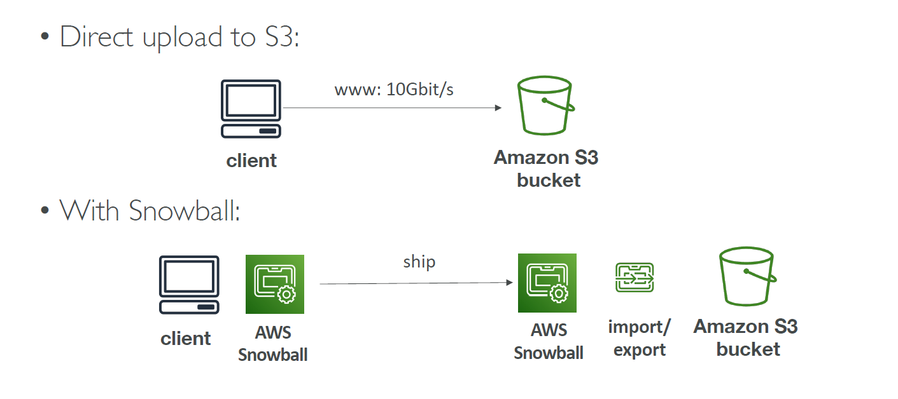
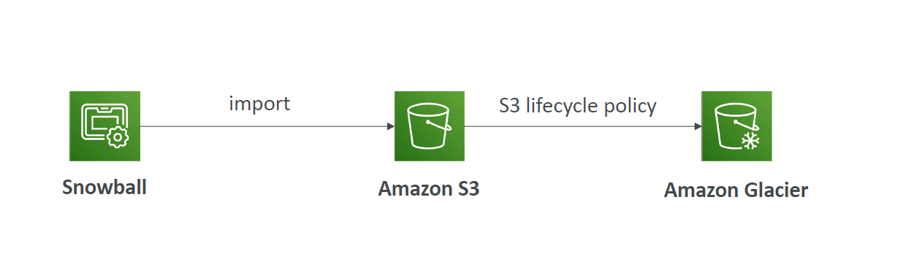

# ❄️🚚 **AWS Snow Family (2025 Edition)**

_Offline Data Transfer + Edge Compute, Now Smarter & Slimmer!_

> The **AWS Snow Family** is a collection of secure, rugged physical devices that help move massive datasets to and from AWS or run edge computing applications in **remote, disconnected, or bandwidth-constrained locations**.

---

## 🔄 📢 **🚨 Major 2025 Updates**

| ❌ Discontinued Devices                      | ✅ Replacing / Recommended Devices          |
| -------------------------------------------- | ------------------------------------------- |
| Snowcone (both HDD & SSD)                    | ❗No direct replacement — consider DataSync |
| Old Snowball Edge models (80 TB, 42 TB, GPU) | Newer Snowball Edge (210 TB, 104 vCPU)      |

> 🧯 **Support for discontinued devices ends November 12, 2025**. ([AWS Official Blog](https://aws.amazon.com/blogs/storage/aws-snow-device-updates/))

---

## 📌 Visual Summary

---

## 📦 **Current Snow Devices (2025)**

### 📁 **1. AWS Snowball Edge Storage Optimized**

| Feature       | Value                                    |
| ------------- | ---------------------------------------- |
| 💾 Storage    | **210 TB NVMe SSD**                      |
| ⚡ Throughput | Up to 1.5 GB/s                           |
| 📦 Use Case   | Large-scale offline data migration       |
| 🔐 Security   | KMS encryption, tamper-evident enclosure |

---

### 🧠 **2. AWS Snowball Edge Compute Optimized**

| Feature               | Value                                                                  |
| --------------------- | ---------------------------------------------------------------------- |
| 💽 Local Storage      | **28 TB SSD**                                                          |
| 🧮 Compute            | **104 vCPUs**, **416 GB RAM**                                          |
| ⚙️ Supported Services | EC2, Lambda, S3-compatible storage, IoT Greengrass                     |
| 📍 Use Case           | Machine learning inference, video analytics, disconnected edge compute |

---

## ⚖️ **Use Case Comparison**

| Capability                      | Storage Optimized 📁 | Compute Optimized 🧠 |
| ------------------------------- | -------------------- | -------------------- |
| S3-compatible data ingest       | ✅                   | ✅                   |
| Local EC2 compute               | ❌                   | ✅                   |
| Lambda & IoT Greengrass support | ❌                   | ✅                   |
| Data migration only             | ✅                   | ✅                   |
| High-performance processing     | ❌                   | ✅                   |

---

## 🛠️ **Recommended Alternatives**

### ☁️ AWS DataSync (for most migrations)

- **Use case**: Daily or incremental syncs from on-prem → S3, EFS, FSx
- **Advantages**: Network-based, agent-driven, no hardware shipping

### ⚙️ AWS Outposts (for persistent edge compute)

- For full AWS infrastructure in on-prem locations

---

## 🔒 **Security & Reliability**

- End-to-end encryption using **AWS KMS**
- **Tamper-resistant** enclosure + secure erasure after transfer
- Built to survive **harsh environments**, physical shocks, and temperature variations

---

## 💰 **Pricing Considerations**

| Component          | Description                                                  |
| ------------------ | ------------------------------------------------------------ |
| 📆 Rental Duration | Per-day or per-job pricing                                   |
| 🚚 Shipping        | Round-trip shipping included in many regions                 |
| 💻 Compute Charges | Additional charges if EC2 instances are used                 |
| 📤 Data Upload     | Standard S3 upload charges apply                             |
| 📉 Tiered Pricing  | 1-Year / 3-Year reserved pricing options for cost-efficiency |

---

## 📈 **Planning Transfer Capacity**

| Link Speed | Transfer per Day | Suitable For               |
| ---------- | ---------------- | -------------------------- |
| 100 Mbps   | ~1.08 TB/day     | Small workloads            |
| 1 Gbps     | ~10.8 TB/day     | Medium workloads           |
| Snowball   | 210 TB/device    | High-volume, fast transfer |

> 🧠 **Rule of Thumb**:  
> If your network can't finish the job within your timeframe → Go Snow!

---

    

---

    

---

## 🧰 **Snowball into Glacier**

⚠️ **Snowball cannot import to Glacier directly**  
🔖 You must use Amazon S3 first, in combination with an S3 lifecycle policy

---

    

---

## ✅ Final Thoughts

🔹 The **modern AWS Snow Family** is now streamlined: fewer devices, more power, better focus.  
🔹 For **offline petabyte-scale transfers**, **Snowball Edge (Storage Optimized)** is your go-to.  
🔹 For **powerful edge compute**, use the **Compute Optimized** model with EC2, Lambda, and S3 capabilities.  
🔹 For smaller or frequent transfers? Prefer **AWS DataSync**.

---
