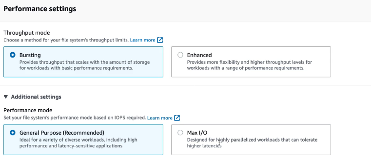

# 🚀 **Amazon EFS – Performance Settings Guide**

_Optimize Elastic File System (EFS) for speed, scalability, and workload patterns._

---

  

---

## 📈 **Throughput Modes**

_EFS throughput determines how much data per second your file system can read/write._

You can choose one of three modes based on your application pattern:

---

### 🎈 **1. Bursting Mode** _(Default & Smart Option)_

- 💡 **Auto-Scales With Size**: Up to **100 MB/s per TB**, scaling as the file system grows.
- ⚠️ **Burst Credit Based**:

  - When credits exist: up to **100 MB/s per TB**.
  - When depleted: baseline drops to **50 MB/s per TB**.

- ✅ **Best For**: General workloads with unpredictable access patterns (e.g., web apps, CMS, developer folders).

---

### ♎ **2. Provisioned Mode** _(Predictable & Reserved)_

- 🏗️ **Fixed Throughput**: You specify how much throughput you need (e.g., 100 MB/s).
- 🧾 **Bill Separately**: You pay for throughput whether used or not.
- ✅ **Best For**: Workloads with consistent I/O like data pipelines or ingestion jobs.

---

### 💫 **3. Elastic Throughput** _(New & Adaptive)_

- 🚀 **Auto-Scales Without Credit Model**.
- 🧠 **Smart Adaptation**: Dynamically adjusts throughput with workload spikes.
- ✅ **Best For**: Spiky workloads with unpredictable I/O (e.g., serverless workloads or CI/CD builds).

---

> 🔁 **Switching Rules**:
>
> You can switch throughput mode **once every 24 hours**.

---

## ⚙️ **Performance Modes**

_This setting determines how EFS handles latency and IOPS under the hood._

Choose **once at file system creation** (can’t change later):

---

### 🟢 **1. General Purpose** _(Default & Recommended)_

- ⚡ **Low Latency** (sub-millisecond)
- 🔄 **Optimal for Metadata-Heavy Ops**
- 🧰 **Use Case**: Web apps, CMS, home directories, developer workloads.
- 📈 **IOPS**: Up to **35,000+**

---

### 🔵 **2. Max I/O Mode** _(Scale First, Speed Second)_

- 🧪 **Designed for Parallel Access**
- 🕒 Slightly **higher latency**
- 🧰 **Use Case**: Big Data, genomics, media rendering, ML model training.
- 📈 **IOPS**: **500,000+** (at scale)

---

## 🧠 **Best Practice Matrix**

| Workload Type               | Throughput Mode    | Performance Mode | Notes                                  |
| --------------------------- | ------------------ | ---------------- | -------------------------------------- |
| Web Server or CMS           | Bursting / Elastic | General Purpose  | Default is ideal                       |
| Analytics Pipeline          | Provisioned        | Max I/O          | Consistent ingest and parallel compute |
| CI/CD or Dev Environments   | Elastic            | General Purpose  | Handles spiky workloads well           |
| Scientific / HPC Processing | Provisioned        | Max I/O          | Scales massively across EC2 nodes      |
| Mixed Patterns              | Elastic            | General Purpose  | Auto-adapts without tuning credits     |

---

## 📌 Final Tips

- 🧠 **Choose General Purpose unless you're doing distributed parallel I/O**
- 🔄 Use **Elastic throughput** for modern, unpredictable workloads
- 📊 Monitor throughput usage in **CloudWatch Metrics** to fine-tune performance
- 🧾 Don’t forget **Provisioned mode** is billed even if unused!
