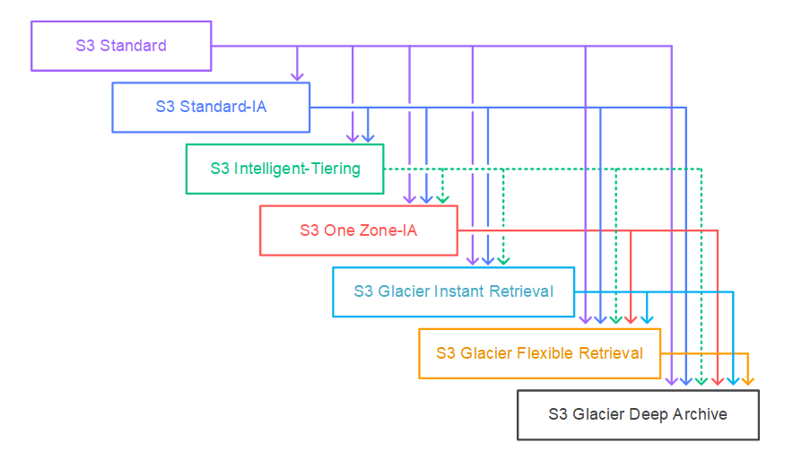
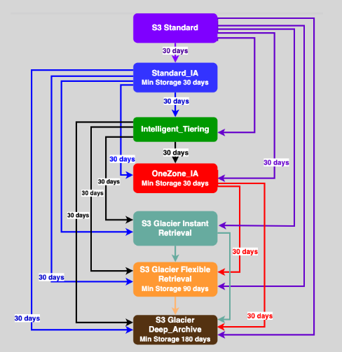

# 📅 **Amazon S3 Storage Classes – Lifecycle Policies Made Easy**

> Automate how your objects move between S3 storage classes or expire them entirely — and remember what transitions are valid (and which are NOT!) without stress.

---

  
  <!--  -->

---

## 🔄 **Lifecycle Policies Overview**

**Lifecycle policies** in Amazon S3 help you manage object storage **automatically over time**. You can:

- **⏩ Transition** objects to lower-cost storage classes as they age.
- **🗑️ Expire** (delete) them when they’re no longer needed.

This improves **cost-efficiency**, **performance**, and **data retention hygiene** in your S3 buckets — without manual cleanup.

---

## ✅ **Valid Lifecycle Actions**

### 🚀 **Transition Actions**

Automatically move objects across storage classes:

| From (🟢)   | To (🔵)                 | Earliest Transition Allowed |
| ----------- | ----------------------- | --------------------------- |
| S3 Standard | S3 Standard-IA          | After 30 days               |
| S3 Standard | S3 One Zone-IA          | After 30 days               |
| S3 Standard | S3 Intelligent-Tiering  | Anytime ✅                  |
| Any class   | S3 Glacier              | After 30 days               |
| Any class   | S3 Glacier Deep Archive | After 90 days (recommended) |

---

### 🧹 **Expiration Actions**

- **Delete current versions:** after X days.
- **Delete noncurrent versions:** after X days (for versioned buckets).
- **Remove incomplete multipart uploads:** after X days.

---

## ⚠️ **How to Remember _Invalid_ Transitions**

### ❌ Invalid Lifecycle Transitions (🔥 EASY RULE)

> **“You can’t skip levels or go backward!”**

| Invalid Transition Example                      | Why It’s Invalid                                  |
| ----------------------------------------------- | ------------------------------------------------- |
| S3 Standard → S3 Standard-IA **before 30 days** | Violates 30-day minimum storage                   |
| S3 Standard-IA → S3 Intelligent-Tiering         | No going “up” from IA to Intelligent              |
| Glacier Deep Archive → Glacier                  | Can’t go "back in time" from Deep Archive         |
| S3 One Zone-IA → Standard                       | One Zone-IA is less durable & can't be "upgraded" |

---

### 💡 Mnemonics to Memorize

- **“⛷ DOWN is allowed, UP is NOT.”**

  - You can slide down to colder storage, but not climb back up automatically.

- **“G → GDA: Go Gradually”**

  - Go from Glacier to Glacier Deep Archive, not in reverse.

- **“IA needs 30 days to relax”**

  - Standard to IA or One Zone-IA requires a **30-day waiting period**.

---

## 🎯 **Applying Lifecycle Policies**

- **All Objects:**
  Use lifecycle rules at the bucket level.

- **Filtered by Prefix or Tag:**
  Apply to only objects matching a path or tag (e.g., `prefix: logs/` or `tag: archive=true`).

---

- 🔼 **Can’t go back up!**
- 🕒 **IA/OneZone-IA = wait 30 days**
- ❄️ **Deep Archive = wait longer (90 days recommended)**

---

## 🏁 **Conclusion**

Amazon S3 Lifecycle Policies are your **hands-free solution** to managing data storage and cost optimization. Just remember:

- ✅ Only go **downward** in storage class hierarchy.
- 🧊 Use **Intelligent-Tiering** anytime for unknown access patterns.
- 🧠 Use the **“Down, Not Up”** rule and **30-day/90-day** thresholds to avoid invalid transitions.

---

## 📚 **References**

- [Amazon S3 Lifecycle Transition General Considerations](https://docs.aws.amazon.com/AmazonS3/latest/userguide/lifecycle-transition-general-considerations.html)
