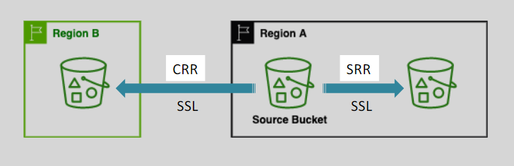

# 🔄 **Amazon S3 Bucket Replication**

Amazon S3 **Bucket Replication** is an **asynchronous, version-aware feature** that automatically copies objects from a source bucket to one or more destination buckets — **across regions, accounts, or within the same region** — to improve durability, availability, and compliance.

> 💡 Must enable Versioning in source and destination buckets

---

  

---

## 🌍 **Replication Types**

| Type    | Full Name                | Purpose                         | Example Use Case                  |
| ------- | ------------------------ | ------------------------------- | --------------------------------- |
| **SRR** | Same-Region Replication  | Data residency, log aggregation | Aggregate app logs in same region |
| **CRR** | Cross-Region Replication | Disaster recovery, compliance   | DR copy in another AWS region     |

> 🔐 **Both SRR and CRR require versioning** enabled on both source and destination buckets.

---

## 🧩 **Core Concepts & Exam Must-Knows**

| Feature                         | Exam & Work Relevance                               |
| ------------------------------- | --------------------------------------------------- |
| ✅ **Asynchronous**             | Copies happen in background — latency possible      |
| 🔁 **One-Way Only**             | No bidirectional sync or chaining (B1 → B2 → B3 ❌) |
| 👥 **Cross-Account Support**    | Great for multi-account backup strategy             |
| 🎯 **Prefix/Tag Filters**       | Selective replication = cost optimization           |
| 🔒 **IAM Role Required**        | Replication permissions must be explicitly granted  |
| ⚠️ **Deletes Not Fully Synced** | Delete with version ID is _not_ replicated          |

---

## 🧱 **Replication Requirements**

| Setting                  | Requirement                                                 |
| ------------------------ | ----------------------------------------------------------- |
| ✅ **Versioning**        | Must be enabled on both buckets                             |
| 🛠 **IAM Role**           | Must allow `s3:GetObject`, `s3:Replicate*`                  |
| 🔐 **Encryption**        | SSE-S3 and SSE-KMS supported (SSE-C ❌)                     |
| 📥 **Only New Objects**  | Replication applies to objects created **after** rule setup |
| ⏱ **RTC SLA (Optional)** | Guarantees 99.99% of objects within **15 minutes**          |

---

## 🚀 **Advanced Capabilities (For Work & Cost Optimization)**

### 1️⃣ **Batch Replication (Manually Triggered)**

- Replicate existing objects (created before replication was enabled).
- Also useful for retrying previously failed replications.

### 2️⃣ **Multiple Destinations**

- Create multiple replication rules targeting different buckets.
- Can be in different regions/accounts.

### 3️⃣ **Replication Metrics**

- Enable **CloudWatch metrics** to track:

  - Bytes replicated
  - Replication latency
  - Number of failures

---

## 🔒 **Handling Encryption in Replication**

| Encryption Type | Supported? | Notes                                                  |
| --------------- | ---------- | ------------------------------------------------------ |
| SSE-S3          | ✅ Yes     | Default encryption supported                           |
| SSE-KMS         | ✅ Yes     | Requires KMS permissions in **source and destination** |
| SSE-C           | ❌ No      | Not supported for replication                          |

📌 If the destination bucket has **default encryption**, unencrypted objects will be encrypted automatically on arrival.

---

## ⏱️ **Replication Time Control (RTC)**

**RTC** guarantees that 99.99% of new objects are replicated within **15 minutes**.

| RTC Benefit           | Details                                           |
| --------------------- | ------------------------------------------------- |
| ⏱️ Low Latency        | Near real-time replication                        |
| 🧾 SLA Backed         | Ensures compliance with **RTO** and business SLAs |
| 📊 Monitoring Support | Integrated with metrics and dashboards            |

---

## 📂 **Common Use Cases**

### 🔁 **Same-Region Replication (SRR)**

- 🔍 **Log Aggregation**: Collect logs from different buckets into one.
- 🔄 **Environment Sync**: Keep production and test environments consistent.
- 🛡 **Data Residency**: Ensure data remains in one region for compliance.

### 🌐 **Cross-Region Replication (CRR)**

- 🧑‍⚖️ **Regulatory Compliance**: Meet disaster recovery and regional policies.
- 🌍 **Global Latency Optimization**: Replicate closer to users or apps.
- 📊 **Distributed Processing**: Enable parallel regional compute pipelines.

---

## ✅ **Best Practices for Bucket Replication**

### 🧠 Setup & Security

- ✅ **Enable versioning** in both buckets.
- ✅ Use IAM roles with **least privilege** permissions.

### 🎯 Efficiency

- ✅ Use **prefix or tag-based rules** to replicate only needed data.
- ✅ Clean up incomplete replications using **Lifecycle Policies**.

### 🔍 Monitoring

- ✅ Enable **CloudWatch replication metrics**.
- ✅ Set up alerts for replication delays or failures.

### 🔄 Encryption & Testing

- ✅ Match or configure destination encryption settings.
- ✅ Periodically **test replication flows**.

---

## 🚨 **Replication Notes**

- 📌 Must enable Versioning in source and destination buckets
- 📌 After you enable Replication, only new objects are replicated
- 📌 Optionally, you can replicate existing objects using S3 Batch Replication
  - Replicates existing objects and objects that failed replication
- 📌 For DELETE operations
  - Can replicate delete markers from source to target (optional setting)
  - Deletions with a version ID are not replicated (to avoid malicious deletes)
- 📌 There is no “chaining” of replication
  - If bucket 1 has replication into bucket 2, which has replication into bucket 3
  - Then objects created in bucket 1 are not replicated to bucket 3
