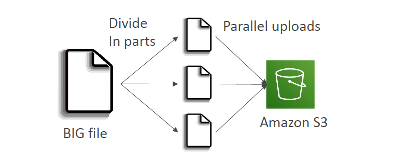
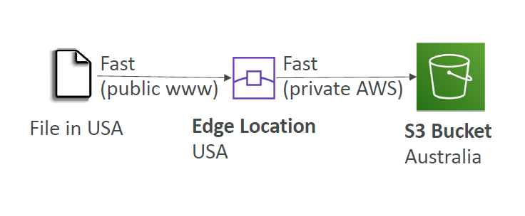
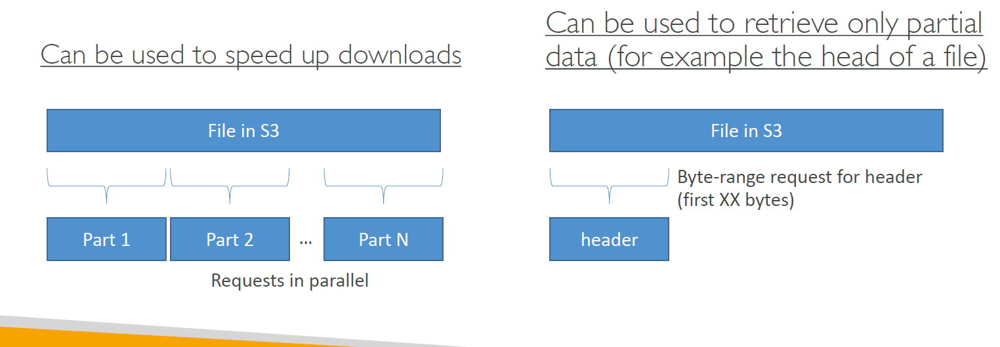

# 🚀 **Amazon S3 Performance Optimization Guide**

> _Make your S3 access blazing fast, cost-effective, and massively scalable._

---

## 📊 **1. S3 Baseline Performance – Know Your Limits (and How to Beat Them)**

Amazon S3 **automatically scales** to handle **tens of thousands of requests per second**, but your app architecture needs to be prefix-aware.

| Operation Type             | Performance Baseline `per Prefix` |
| -------------------------- | --------------------------------- |
| PUT / COPY / POST / DELETE | ✅ 3,500 requests/sec             |
| GET / HEAD                 | ✅ 5,500 requests/sec             |

### 🧩 What’s a "Prefix"?

A **prefix** is the object path after the bucket name — and S3 can scale **independently per prefix**.

| Example S3 Key             | Prefix Used      |
| -------------------------- | ---------------- |
| `bucket/folder1/sub1/file` | `/folder1/sub1/` |
| `bucket/folder1/sub2/file` | `/folder1/sub2/` |
| `bucket/1/file`            | `/1/`            |
| `bucket/2/file`            | `/2/`            |

> 💡 Spread reads across 4 prefixes = up to **22,000 GET/HEAD requests per second** 🚀

---

## ⏱️ **2. Timeouts & Intelligent Retries**

### 🔁 **Retry Logic: Smart, Not Blind**

- Retries **increase the chance of hitting a faster S3 path** or edge server.
- Use **exponential backoff** with jitter in your retry strategy.

> 💡 AWS SDKs (e.g., Boto3, AWS SDK for .NET) implement this logic for you.

### ⏳ **Timeout Configuration**

- Avoid hanging requests by setting sensible timeout values:
  - **Connect timeout**: e.g., 3–5 seconds
  - **Read timeout**: e.g., 30 seconds

---

## 🔗 **3. Use Multipart Uploads for Large Files**

> Split large files into smaller parts and **upload them in parallel** using the [Multipart Upload API](https://docs.aws.amazon.com/AmazonS3/latest/userguide/mpuoverview.html).

---

<div style="text-align: center;">
  
</div>

---

### 🛠️ Benefits

- 🔄 Retry individual parts instead of the whole file
- 🧵 Use multiple threads/connections
- 🚀 Significantly faster upload for objects > 100 MB

### 🧪 Real Example

```bash
aws s3 cp large.zip s3://your-bucket/ --expected-size 5GB
```

Or use the SDK's `multipart_upload()` method.

---

## 🌍 **4. Enable Transfer Acceleration for Long-Distance Access**

> ⚡ Amazon S3 **Transfer Acceleration** uses **CloudFront edge locations** to route uploads and downloads through **AWS’s backbone network** — not the slow public internet.

---

<div style="text-align: center;">
    
</div>

---

### 🌐 Best Use Cases

- Clients/users uploading from far regions
- Global applications
- Cross-continental backups

### 🧪 URL Format

```text
https://your-bucket.s3-accelerate.amazonaws.com/your-object-key
```

### 🧪 Try it yourself

👉 [S3 Transfer Acceleration Speed Test Tool](https://s3-accelerate-speedtest.s3-accelerate.amazonaws.com/en/accelerate-speed-comparsion.html)

---

## 🔄 **5. Scale Horizontally with Parallel Requests**

### 🚀 S3 is built for parallelism

- Split your workload across **multiple threads or processes**
- Use **concurrent GET/PUT requests**
- Great for:
  - Backup scripts
  - Data lake ETL
  - Batch uploads/downloads

### ✅ Tip

The more threads you use (within limits), the more throughput you get.

```bash
aws s3 cp --recursive . s3://my-bucket/ --jobs 8
```

---

## 📚 **6. Fetch Partial Data Using Byte Range Requests**

_Why download 5 GB if you only need the first 1 MB?_

---

<div style="text-align: center;">
    
</div>

---

### ✍️ Example

> Use the HTTP `Range` header to request **only a portion** of an object.

```http
GET /myfile.csv HTTP/1.1
Host: your-bucket.s3.amazonaws.com
Range: bytes=0-999999
```

### 🚀 Benefits

- Save bandwidth & time
- Ideal for:
  - Resuming interrupted downloads
  - Reading file headers
  - Paginating large files (e.g., logs, videos)

---

## 📝 **📘 Best Practice Summary Table**

| 🔧 Strategy              | ✅ Benefit                             | 🎯 Ideal For                        |
| ------------------------ | -------------------------------------- | ----------------------------------- |
| ⏱️ Timeouts & retries    | Handle hiccups gracefully              | All traffic                         |
| 📦 Multipart uploads     | Fast + resilient large uploads         | Files > 100MB                       |
| 🌍 Transfer Acceleration | Ultra-low latency across continents    | Global users, mobile apps           |
| 🚀 Parallel requests     | Scale throughput with concurrency      | ETL jobs, backups, migration        |
| 📚 Byte-range fetches    | Fetch only needed parts of large files | Logs, previews, resumable downloads |
| 🧩 Prefix spreading      | Unlock full S3 scalability             | High-volume workloads (>5K req/sec) |

---

## 🧪 **Bonus: Test Your Region’s S3 Performance**

```bash
curl -O https://your-bucket.s3.amazonaws.com/testfile.zip
```

Or benchmark with:

- `aws s3 cp --debug` to see latency
- [S3 Storage Lens](https://docs.aws.amazon.com/AmazonS3/latest/userguide/storage-lens.html)
- [CloudWatch S3 Metrics](https://docs.aws.amazon.com/AmazonS3/latest/userguide/metrics-dimensions.html)

---

## ✅ **Final Optimization Tips**

- ✅ Use **multipart upload** for large files
- ✅ Spread object keys across **multiple prefixes**
- ✅ Use **Transfer Acceleration** for long-distance uploads
- ✅ Enable **parallelization** in clients/scripts
- ✅ Apply **Byte Range Requests** to save time and bandwidth
- ✅ Monitor performance via **CloudWatch**, Storage Lens, and test scripts

> 🔐 Don’t forget: performance means nothing without **security**. Always enforce IAM, SSE (encryption), and Bucket Policies.
