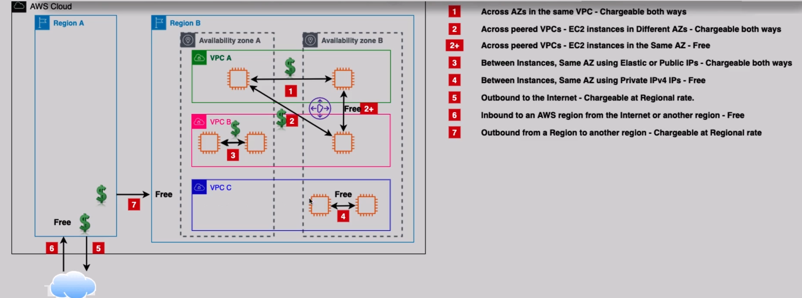

---
tags:
  - aws
  - aws/service
  - aws/domain/compute
  - aws/topic/ec2
aliases:
  - "EC2 Data Transfer Costs What You Pay for & How to Save"
  - "EC2 Data Transfer Costs"
---

# 💸 EC2 Data Transfer Costs – What You Pay for & How to Save

Amazon EC2 doesn’t just charge you for compute — **data movement also comes with a price tag**. Whether it's traffic between Availability Zones (AZs), VPCs, regions, or to the internet, understanding how **data transfer pricing works** in AWS is essential to avoid surprise bills.

Let’s break it all down 👇

---

    

---

## 📦 What Is Data Transfer?

In EC2, **data transfer** means traffic that moves:

- Between **instances**
- Between **AZs**
- Between **VPCs**
- To/from the **internet**
- Across **regions**

AWS **charges or exempts** you based on the direction, source, and method of communication.

---

## 🔍 EC2 Data Transfer Pricing – Common Scenarios

| **Scenario**                                               | **Charge?**                     |
| ---------------------------------------------------------- | ------------------------------- |
| Same AZ – Private IPs                                      | ✅ **Free**                     |
| Same AZ – Public or Elastic IPs                            | 💸 **Charged both ways**        |
| Across AZs – Same VPC                                      | 💸 **Charged both ways**        |
| Across VPCs – Same AZ (Peering)                            | ✅ **Free**                     |
| Across VPCs – Different AZs (Peering)                      | 💸 **Charged both ways**        |
| To Internet (outbound)                                     | 💸 **Charged at regional rate** |
| From Internet (inbound)                                    | ✅ **Free**                     |
| From One Region to Another (outbound inter-region traffic) | 💸 **Charged at regional rate** |

---

## 🧠 Behind the Scenes: How & Why Charges Apply

### ✅ **1. Private IP in Same AZ**

**Free** – Internal traffic using **private IPv4** or **IPv6** within a single AZ is **not billed**.

---

### 💸 **2. Elastic or Public IP in Same AZ**

**Charged** – Using Elastic or public IPs, even in the **same AZ**, routes the traffic **through the AWS network edge**, which incurs a cost.

---

### 💸 **3. Cross-AZ in Same VPC**

**Charged** – Despite being in the same VPC, traffic across AZs **uses AWS backbone infrastructure** and is **billed per GB in both directions**.

---

### ✅ **4. Peered VPCs (Same AZ)**

**Free** – If the instances are in **peered VPCs but same AZ**, traffic remains local and is **not charged**.

---

### 💸 **5. Peered VPCs (Different AZs)**

**Charged** – AWS treats this as cross-AZ traffic. It’s **billed twice** — at source and destination.

---

### 💸 **6. To the Internet (Outbound)**

**Charged** – Outbound internet traffic is **always billed**, based on the **region’s pricing** (e.g., first 1 GB/month is free, then \$0.09/GB+).

---

### ✅ **7. Inbound Internet / Cross-Region**

**Free** – Inbound traffic from the internet or another region is **not charged**.

---

### 💸 **8. Outbound Cross-Region**

**Charged** – Sending data between regions (e.g., us-east-1 ➡️ eu-west-1) is **billed per GB** and adds up quickly in multi-region apps.

---

## 💡 EC2 Data Transfer Optimization Tips

| 💡 **Tip**                            | 🚀 **Benefit**                                     |
| ------------------------------------- | -------------------------------------------------- |
| Use **private IPs** whenever possible | Avoids charges on same-AZ traffic                  |
| **Avoid cross-AZ communication**      | Prevents double billing for internal VPC traffic   |
| Use **CloudFront** for content        | Cuts down on outbound internet transfer costs      |
| **Direct Connect / VPN**              | Reduces cost for heavy on-prem ↔ AWS data movement |
| Co-locate services in **same AZ**     | Keeps latency low and bandwidth free               |

---

## ⚖️ Quick Comparison: Free vs Chargeable Transfers

| **Transfer Path**                      | **Free?** |
| -------------------------------------- | --------- |
| EC2 → EC2 (private IP, same AZ)        | ✅ Yes    |
| EC2 → EC2 (Elastic/Public IP, same AZ) | ❌ No     |
| EC2 → EC2 (different AZs, same VPC)    | ❌ No     |
| EC2 → EC2 (peered VPC, same AZ)        | ✅ Yes    |
| EC2 → Internet (outbound)              | ❌ No     |
| Internet → EC2 (inbound)               | ✅ Yes    |
| EC2 → EC2 (cross-region)               | ❌ No     |

---

## 📌 Bonus: AWS Free Tier

- The **first 1 GB/month** of **internet outbound** traffic per region is **free**.
- Use this for lightweight data pushes or development environments.

---

## 🏁 Final Thoughts

EC2 data transfer can quietly eat into your budget if you’re not paying attention. But with smart architectural choices — like **using private IPs**, **avoiding cross-AZ chat**, and **leveraging CloudFront** — you can dramatically reduce costs.

💬 Want to visualize this in a diagram or add region-specific pricing? Just ask!
---

## Related Notes
- [[aws-services/5.compute/1.1.ec2/|Index]] - folder map
- [[aws-services/5.compute/1.1.ec2/1.1.hypervisor|Hypervisors in AWS Xen vs Nitro Deep & Clear]] - previous lesson
- [[aws-services/5.compute/1.1.ec2/2.1.ec2-fundamental|EC2 Fundamental]] - next lesson
- [[aws-daily/aws-pricing/6.1.budget|AWS Budgets Track Alert and Optimize Your AWS Spending]] - mentions Budget

---
