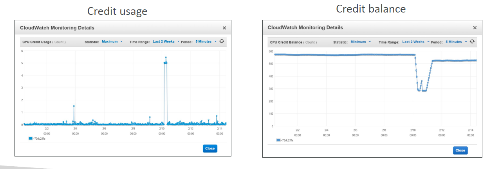
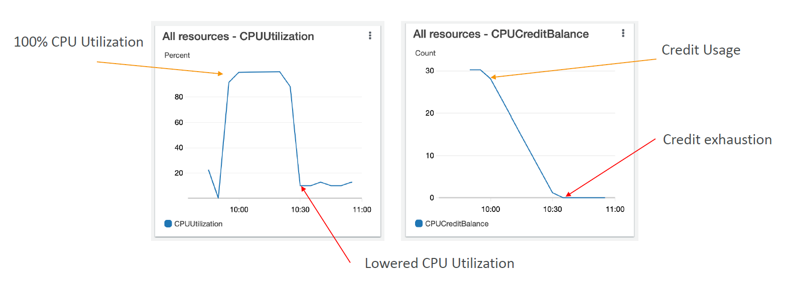
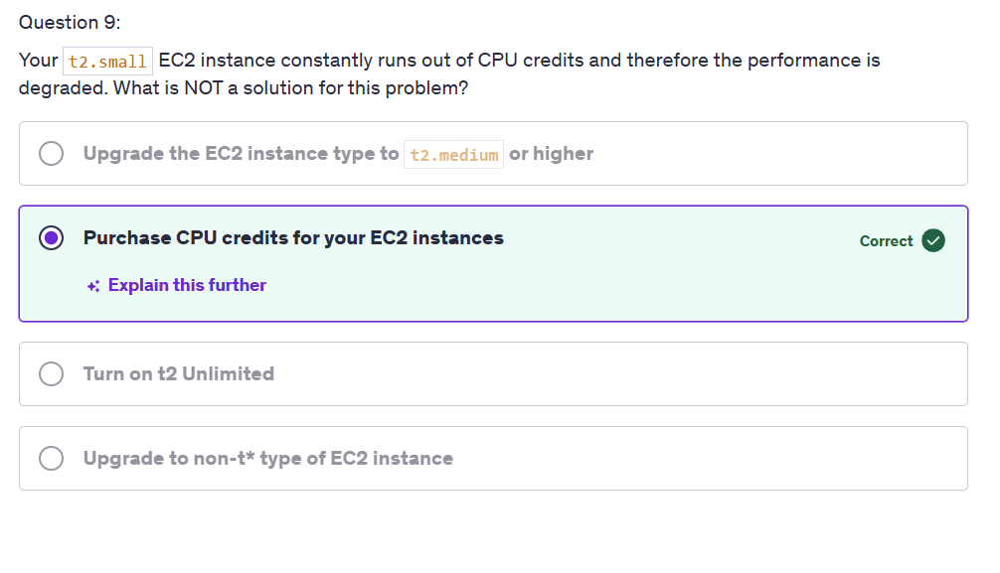

---
tags:
  - aws
  - aws/service
  - aws/domain/compute
  - aws/topic/ec2
aliases:
  - "What Are Burstable EC2 Instances T2/T3"
  - "Burstable Instances"
---

# 🚀 **What Are Burstable EC2 Instances (T2/T3)?**

> _“Burst” means you can go fast — but only when you’ve saved up some fuel (credits)._

---

## 🧩 **What Does “Burst” Mean?**

In AWS, **bursting** means an EC2 instance can temporarily use **very high CPU performance**, even if it normally operates at a **low baseline**.

🟢 **Think of it like a battery**:

- Your instance charges up **CPU credits** while idle.
- When needed, it **spends** those credits to burst to full CPU.

📌 Great for workloads that are:

- Idle or low-usage most of the time
- Occasionally need to do something fast (like handle traffic spikes)

---

## ⚖️ **How Burstable Instances Differ From General Purpose (M5, M6i)**

| Feature                   | Burstable (T2/T3)                    | General Purpose (M5/M6i) |
| ------------------------- | ------------------------------------ | ------------------------ |
| CPU Performance           | Variable (depends on credit balance) | Fixed and consistent     |
| Uses CPU credits?         | ✅ Yes                               | ❌ No                    |
| Cost                      | Lower (great for light workloads)    | Higher, but reliable     |
| Throttling when overused? | ✅ Yes (if credits exhausted)        | ❌ Never throttled       |
| Unlimited mode            | ✅ Optional                          | ❌ Not applicable        |

🧠 **Summary:**
Burstable = pay less most of the time, but performance **can be limited**.
General Purpose = pay more, but performance is **predictable**.

---

## ⚙️ **How the Burstable Credit System Works**

### 🔹 **When Idle:**

- Instance **accumulates CPU credits** (like charging a power bank).
- 1 credit = 1 vCPU running at 100% for 1 minute

### 🔸 **When Bursting:**

- Instance **spends credits** to exceed its baseline CPU performance.

### 🔻 **When Credits Run Out:**

- CPU is throttled to **baseline performance only** (e.g., 10% CPU for `t2.micro`)
- This can cause slowdowns in apps or servers

📉 **Example Behavior:**

    

---

## 🔍 **Baseline Performance of T2 Instances**

| Instance Type | Baseline Performance | Earned Credits/hr | Max Credit Balance |
| ------------- | -------------------- | ----------------- | ------------------ |
| t2.nano       | 5% of 1 vCPU         | 3 credits         | 72                 |
| t2.micro      | 10% of 1 vCPU        | 6 credits         | 144                |
| t2.small      | 20% of 1 vCPU        | 12 credits        | 288                |
| t2.medium     | 40% of 2 vCPUs       | 24 credits        | 576                |

💡 Baseline means: even **without credits**, this much CPU is guaranteed.

---

## 📈 **Real-World Example (With Graphs)**

    

---

> 🟠 **Left graph**: CPU spikes to 100% during a busy period  
> 🔵 **Right graph**: Credit balance drops → hits 0 → CPU drops back down (throttled)

---

## 🔓 **What Is T2/T3 Unlimited Mode?**

### ✅ You can **burst anytime**, even if your credit balance is **zero**

BUT:

- 🧾 You will be **billed for the over-usage**
- This allows your app to stay fast, but might cost you more

### 📉 **Metrics to Watch:**

- `CPUSurplusCreditBalance`
- `CPUSurplusCreditsCharged`

🧠 **Use this when:**

- You expect **spiky workloads**
- **Performance > Cost**

---

## 💼 **When to Use Burstable vs Non-Burstable**

| Scenario                        | Instance Type Recommendation    |
| ------------------------------- | ------------------------------- |
| Blog site with light traffic    | ✅ `t3.micro` with credit burst |
| Internal API server with spikes | ✅ `t3.small` with Unlimited    |
| Consistently high CPU workload  | ❌ Use `m5.large` or `c5.large` |
| Database server                 | ❌ Avoid burstable              |

---

## 📚 **Relevance for AWS SOA Exam**

The **AWS Certified Solutions Architect Associate (SOA-C03)** exam frequently includes:

- Diagnosing **poor performance** on T2/T3 instances due to **credit exhaustion**
- Knowing when to **use unlimited mode**
- Understanding when to **move to M5/R5** for steady workloads
- How to **monitor** CPU Credit metrics in **CloudWatch**

🧠 Example Exam Question:

> A user reports that their app on a `t2.micro` instance is slow after high traffic. What’s the likely cause?

**✅ Answer:** CPU credit exhaustion

---

    

> ☁️ **Note:** _"Purchase CPU credits for your EC2 instances" is correct because, in the context of t2 instances, you cannot directly purchase additional CPU credits; they are earned automatically based on your instance's usage and performance. This answer directly addresses the quiz question asking for an option that does NOT solve the performance issue._

---

## ✅ **Summary Cheat Sheet**

| Concept        | Description                             |
| -------------- | --------------------------------------- |
| Burstable      | Temporary high performance with credits |
| CPU Credit     | 1 vCPU at 100% for 1 minute             |
| Baseline       | Default performance with no credits     |
| Unlimited Mode | Burst even without credits (billed)     |
| Use Case       | Low-to-medium CPU workloads with spikes |
---

## Related Notes
- [[aws-services/5.compute/1.1.ec2/|Index]] - folder map
- [[aws-services/5.compute/1.1.ec2/2.3.instance-types|Amazon EC2 Instance Types Explained Clearly]] - previous lesson
- [[aws-services/5.compute/1.1.ec2/3.1.az-components|Inside AWS Availability Zones AZ The Physical Components Explained]] - next lesson

---
