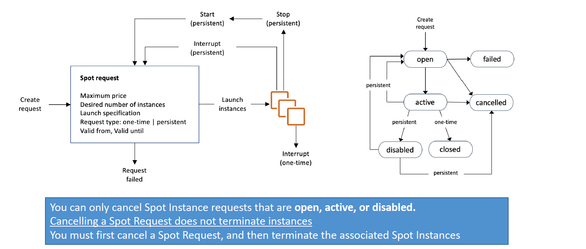
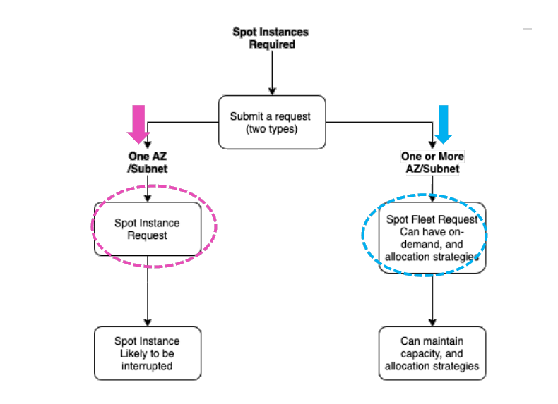
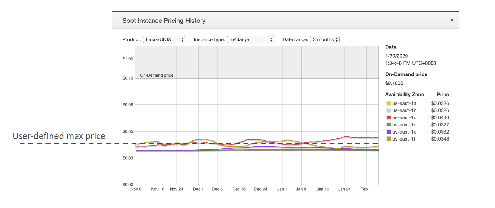

---
tags:
  - aws
  - aws/service
  - aws/domain/compute
  - aws/topic/ec2
aliases:
  - "EC2 Spot Instances Maximum Savings Minimal Waste"
  - "Spot Instances"
---

# 💥 **EC2 Spot Instances** – _Maximum Savings, Minimal Waste_

**Amazon EC2 Spot Instances** let you run workloads at up to **90% discount** compared to On-Demand pricing by using **spare EC2 capacity**.

> 🧠 Think: _“leftover EC2 power” for a fraction of the cost—if you can handle the interruptions._

---

## 🌟 **Core Highlights**

| Feature                    | Description                                                         |
| -------------------------- | ------------------------------------------------------------------- |
| 💸 **Cost**                | Up to 90% cheaper than On-Demand                                    |
| ⚠️ **Interruptible**       | Can be **terminated by AWS** with a **2-min warning**               |
| ❌ **No Availability SLA** | Capacity might be **unavailable** when needed                       |
| 🔄 **Flexible**            | Supports diverse **workload patterns** and **fleet configurations** |

---

## 🎯 **Best Use Cases**

🧪 Non-critical and fault-tolerant workloads such as:

- 🛠️ **Batch processing**
- 📊 **Big data analysis**
- 🧬 **Scientific simulations**
- 📝 **Background tasks**
- 🔄 **Containerized workers**
- 🎨 **Rendering jobs**

---

## **🔄 Spot Instance Request Types**

You can choose from different request types when launching Spot Instances, which will determine how the instance behaves when the Spot price changes or capacity is no longer available.

### 🕒 1. **One-Time Request**

- Fills your request **once** and **terminates** or **stops if interrupted**.
- Best for **ad hoc** tasks or testing environments.

### 🔁 2. **Persistent Request**

- AWS **automatically reattempts** if interrupted or capacity becomes available.
- Ideal for **resilient, long-running jobs**.

---

| Feature           | One-Time Request            | Persistent Request              |
| ----------------- | --------------------------- | ------------------------------- |
| **Duration**      | Until fulfilled or canceled | Remains until manually canceled |
| **Auto-Relaunch** | ❌ No                       | ✅ Yes                          |
| **Best For**      | Ad-hoc jobs                 | Long-lived, resilient workloads |

---

## **🚢 Fleet Management**

In the context of **Amazon EC2**, a **fleet** refers to a **group of EC2 instances**—not just one instance—that are launched and managed together to meet a specified **target capacity** using **a mix of instance types**, **purchase options**, and **availability zones**.

Think of it like this:

> 🔧 Instead of managing one EC2 instance at a time, you define a _plan_ (the fleet), and AWS intelligently provisions the best combination of instances to meet your needs.

### **🚀 EC2 Fleet**

- **Can Launch Multiple Instance Types**: EC2 Fleet can launch instances across multiple Availability Zones in one region.
- **Define On-Demand and Spot Capacity**: You can separately define how much On-Demand or Spot capacity you need.
- **Specify Maximum Price**: You can define the maximum amount you are willing to pay for the fleet.
- **API/CLI-Based**: EC2 Fleet can only be launched via CLI, SDKs, and APIs.

### **🚢 Spot Fleet**

> _Spot Fleets = set of Spot Instances + (optional) On-Demand Instances._

A **Spot Fleet** is a collection of Spot Instances and optionally On-Demand Instances. It’s designed to `maintain` the required capacity for your application based on a Spot Instance request.

- **Maintain Target Capacity**: Spot Fleet can replace terminated Spot Instances to `maintain` the required capacity.
- **Mixed Instances**: The Spot Fleet can launch a combination of Spot and On-Demand instances.
- **Spot Capacity Pools**: Spot Fleet selects the best Spot capacity pools to meet the request specifications.

## ⚔️ **Spot Fleet vs. EC2 Fleet**

| Feature                                       | ⚓ Spot Fleet | 🚀 EC2 Fleet         |
| --------------------------------------------- | ------------- | -------------------- |
| 📅 Launch Date                                | 2015          | 2018                 |
| 🔧 Console UI                                 | ✅ Yes        | ❌ No (API/CLI only) |
| 💼 On-Demand + Spot Combo                     | ✅ Yes        | ✅ Yes               |
| 🔐 Supports Reserved Instance pricing         | ✅ Yes        | ✅ Yes               |
| 🧠 Can maintain target capacity automatically | ✅ Yes        | ✅ Yes               |
| 🏷️ Can specify Capacity Reservation ID        | ❌ No         | ✅ Yes               |
| 💰 Price Ceiling                              | ✅ Yes        | ✅ Yes               |

---

## 📋 **How to Request Spot Instances**

    

---

You have two options:

| Method                    | Scope                                  |
| ------------------------- | -------------------------------------- |
| **Spot Instance Request** | Single AZ / Subnet                     |
| **Spot Fleet Request**    | Multi-AZ / Multi-type with flexibility |

---

    

---

## 🎛️ **Spot Fleet Allocation Strategies**

| Strategy                                      | Description                                                                       | Best For                          |
| --------------------------------------------- | --------------------------------------------------------------------------------- | --------------------------------- |
| 🔵 **Capacity Optimized**                     | Prioritizes instance pools with available capacity                                | Long-running, resilient workloads |
| 🔴 **Lowest Price**                           | Chooses cheapest Spot pools available                                             | Short jobs, cost-focused          |
| 🟡 **Diversified**                            | Spreads across multiple instance types to avoid pool depletion                    | Balanced risk & cost trade-offs   |
| 🟢 **PriceCapacityOptimized** _(recommended)_ | pools with highest capacity available, then select the pool with the lowest price | best choice for most workloads    |

---

## 🚨 **Spot Instance Interruption Mechanics**

When you launch an **EC2 Spot Instance**, you’re bidding on **unused EC2 capacity** at discounted rates — often **up to 90% cheaper** than On-Demand prices.

🧠 **However:** The spot price **fluctuates** based on supply and demand.

So AWS allows you to **set a maximum price** you're willing to pay per hour for that instance.

---

    

---

### ⚙️ Example Scenario

Let's say:

- You set **Max Spot Price** = `$0.05/hour`
- Current **Spot Price** = `$0.03/hour`

✅ Result: AWS gives you the instance, and you pay **\$0.03/hour**

Now if:

- Spot Price rises to **\$0.06/hour** (above your max)

🛑 Result: AWS **will stop or terminate** your instance — based on your settings — **after a 2-minute warning**

### 🔁 **What Happens When Price Increases?**

| 🛎️ **Event**                        | 🧠 **Explanation**                                                       |
| ----------------------------------- | ------------------------------------------------------------------------ |
| Spot price rises above your max     | AWS no longer lets your instance run                                     |
| 2-minute warning                    | AWS sends a signal for graceful shutdown or checkpointing                |
| You choose to “stop” or “terminate” | You configure this when you launch the Spot Instance                     |
| “Stop” (if supported)               | The instance is paused and can resume later (EBS-backed only)            |
| “Terminate”                         | The instance is **shut down permanently** (compute + local storage gone) |

---

### 💬 **Summary:**

> You **set a max hourly price** you're willing to pay.  
> If the **spot market price exceeds it**, your instance gets **interrupted** with **2 minutes' notice** — unless you've opted to **stop it gracefully** (if EBS-backed), or it will be **terminated**.

---

### 🔔 Interruption Signals

- 2-minute notice via:

  - ✅ EC2 metadata endpoint
  - ✅ Amazon EventBridge (rebalance notifications)

### 💥 Interruption Responses

- ❌ **Terminate** (default)
- ⏸️ **Stop** (EBS-backed only)
- 💤 **Hibernate** (EBS + supported OS only)

---

## 🔁 **Handling Spot Rebalancing**

Use **Amazon EventBridge** to monitor `rebalance-recommendation` events.
Proactively **migrate tasks** to healthy capacity pools before your Spot instance gets interrupted.

---

## ✅ **Final Summary: Why (and When) to Use Spot?**

| ✅ Pros                             | ⚠️ Cons                                 |
| ----------------------------------- | --------------------------------------- |
| 💸 Massive savings (up to 90%)      | ⛔ Instances can be interrupted anytime |
| 🚀 Mix with EC2/Auto Scaling/Fleets | ❌ Not ideal for mission-critical apps  |
| ♻️ Great for disposable workloads   | 🧠 Requires graceful fault handling     |

---

## 🧠 Smart Tip

> Pair Spot with **Auto Scaling Groups**, **Fargate Spot**, or **Spot Fleet Diversification** for **reliable + cost-effective scale**.
---

## Related Notes
- [[aws-services/5.compute/1.1.ec2/|Index]] - folder map
- [[aws-services/5.compute/1.1.ec2/5.3.fleet-types|Fleet Mean in EC2]] - previous lesson
- [[aws-services/5.compute/1.1.ec2/6.ec2-ami|Amazon EC2 AMIs Amazon Machine Images]] - next lesson
- [[aws-services/5.compute/1.1.ec2/2.3.instance-types|Amazon EC2 Instance Types Explained Clearly]] - mentions Instance Types
- [[aws-services/5.compute/2.ebs/1.1.ebs|Amazon EBS Elastic Block Store Scalable Persistent Storage for EC2]] - mentions Ebs

---
