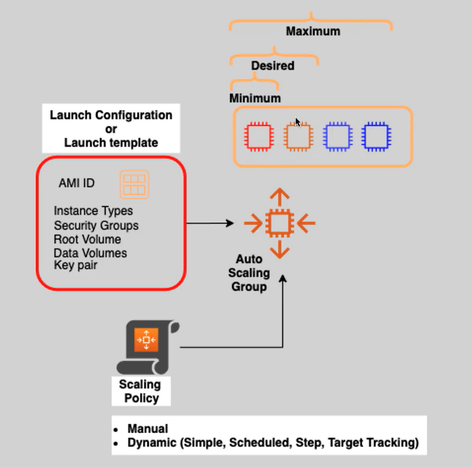
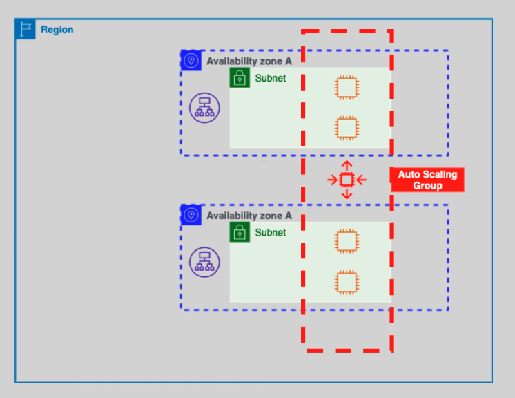
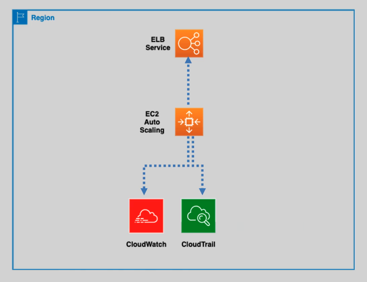

---
tags:
  - aws
  - aws/service
  - aws/domain/compute
  - aws/topic/ec2-auto-scaling
aliases:
  - "EC2 Auto Scaling"
---

# **🤹‍♀️ EC2 Auto Scaling**

Amazon **EC2 Auto Scaling** automatically adjusts your EC2 instance count to meet demand. It’s like a thermostat for your infrastructure—scaling up when your app heats up, and scaling down when things cool off, all while saving you money and improving reliability.

## **🧩 Core Components of EC2 Auto Scaling**

    

---

### **👜 Auto Scaling Group (ASG)**

- A logical group of EC2 instances that scales based on demand.
- You define:
  - **Minimum**, **desired**, and **maximum** instance count.
- AWS automatically adds/removes instances based on **scaling policies**.

### **📝 Launch Template (or Launch Configuration)**

- A template that defines how new instances should look:
  - AMI ID, instance type, user data, storage, security groups, etc.
- **Tip**: AWS recommends **Launch Templates** over the older **Launch Configurations** for more flexibility (like versioning and mixed instance types).

### **📊 Scaling Policies**

Define _when_ and _how_ to scale:

- **Dynamic Scaling**: Based on metrics (e.g., add 2 instances if CPU > 70% for 5 mins).
- **Scheduled Scaling**: Predefined time-based scaling (e.g., add 5 instances at 8 AM).
- **Manual Scaling**: Admin manually adjusts the instance count.

---

## **⚙️ Key Features of EC2 Auto Scaling**

### **🌐 Cross-AZ High Availability**

- Auto Scaling **distributes instances across multiple Availability Zones** for fault tolerance and better performance.
- If an AZ fails, healthy instances in other AZs pick up the slack.

  

---

### **🔗 Integration with Other AWS Services**

- **Elastic Load Balancing (ELB)**: Automatically routes traffic to healthy instances.
- **Amazon CloudWatch**: Monitors performance metrics (CPU, memory, etc.) to trigger scaling actions.
- **AWS CloudTrail**: Audits API calls and changes made to Auto Scaling configurations.

  

---

### **💰 Pay-as-You-Go Cost Efficiency**

- You only pay for EC2 instances used—Auto Scaling is **free**!
- Combine with **EC2 Spot Instances** for up to **90% cost savings** on flexible workloads.

---

## **🏆 Benefits of EC2 Auto Scaling**

| Benefit 🧠               | Description                                                         |
| ------------------------ | ------------------------------------------------------------------- |
| **Fault Tolerance** 💪   | Replaces unhealthy instances automatically and balances across AZs. |
| **High Availability** ⏱  | Scales based on demand to handle traffic spikes or failures.        |
| **Cost Optimization** 💵 | Avoids over-provisioning by matching resources to load.             |
| **Elasticity** 📈        | Scales in real-time as your traffic grows or shrinks.               |

---

## **🧠 Best Practices for EC2 Auto Scaling**

- **Use Launch Templates**: Support modern features like multiple instance types and T2/T3 Unlimited.
- **Set Realistic Thresholds**: Tune scaling policies to avoid flapping (rapid scale in/out).
- **Enable Health Checks**: Integrate with ELB for automatic instance replacement.
- **Combine with Spot Instances**: Use mixed instance policies to balance cost and availability.
- **Monitor & Test**: Use CloudWatch dashboards and alarms to fine-tune behavior.

---

## **🎯 Conclusion**

Amazon EC2 Auto Scaling is your smart, cloud-native assistant for keeping applications resilient, fast, and cost-efficient. It takes care of the scaling heavy lifting, so you can focus on innovation—not server babysitting.

> Let your infrastructure scale itself. Set your rules, sit back, and relax. 😎
---

## Related Notes
- [[aws-services/5.compute/1.3.ec2-auto-scaling/|Index]] - folder map
- [[aws-services/5.compute/1.3.ec2-auto-scaling/2.1.launch-configuration-vs-launch-template|EC2 Auto Scaling Launch Configuration vs. Launch Template]] - next lesson
- [[aws-services/1.management-governance/3.1.cloud-watch/2.3.cw-dashboards|Amazon CloudWatch Dashboards]] - mentions CloudWatch Dashboards
- [[aws-daily/aws-waf/5.1.cost-optimization|Cost Optimization]] - mentions Cost Optimization
- [[aws-services/5.compute/1.1.ec2/5.4.spot-instances|EC2 Spot Instances Maximum Savings Minimal Waste]] - mentions Spot Instances
- [[aws-services/5.compute/1.1.ec2/2.3.instance-types|Amazon EC2 Instance Types Explained Clearly]] - mentions Instance Types
- [[aws-daily/aws-waf/3.1.reliability|Reliability]] - mentions Reliability

---
