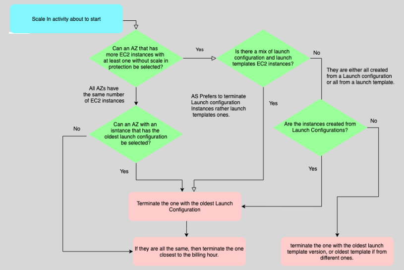

---
tags:
  - aws
  - aws/service
  - aws/domain/compute
  - aws/topic/ec2-auto-scaling
aliases:
  - "EC2 Auto Scaling Timers & Termination Policy"
  - "Timers And Termination Policy"
---

# **⏲️ EC2 Auto Scaling – Timers & Termination Policy**

**Amazon EC2 Auto Scaling** is like your app's personal traffic cop — keeping enough EC2 instances running to handle demand while trimming the fat when traffic is low. But to do it _smartly_, it needs timing rules and termination strategies.

This guide dives deep into the key timing features and termination policies that give you **precision control** over how and when EC2 Auto Scaling kicks in, adds instances, or decides which ones to let go.

---

## **🕒 Cooldown & Warm-Up Timers**

### **1️⃣ Cooldown Period – "Let It Breathe" 😮‍💨**

A **Cooldown Period** is like a timeout after Auto Scaling makes a move (scale out or in). It pauses further scaling actions for a bit so things can stabilize before another adjustment.

- **Why it matters**: It prevents _over-scaling_ (adding too many instances too fast) or _flapping_ (frequent scale in/out).
- **When used**: Mainly with **simple scaling policies** (which are largely phased out).
- **Default Cooldown**: 300 seconds (5 minutes), but you can tweak it.

📌 **Today’s Best Practice**: Use **Instance Warm-Up** instead. It’s more precise and suited for target tracking.

---

### **2️⃣ Instance Warm-Up Period – "Let It Cook" 🔥**

A **Warm-Up Period** is the time Auto Scaling waits after launching an instance **before** it counts that instance as "ready" in the scaling math.

- **Purpose**: Ensures Auto Scaling doesn’t assume the instance is working while it’s still booting or installing software.
- **Used With**: **Target Tracking** or **Step Scaling**
- **Default Warm-Up**: 300 seconds, but it should match your app's actual boot time.

🧠 **Why it's better**: Warm-up is instance-specific and avoids false triggers from half-ready EC2s.

---

## **🔐 Scale-In Termination Protection**

Ever had a vital instance get zapped during scale-in? That's what **Scale-In Protection** helps prevent.

- **What it does**: Prevents specific EC2 instances from being terminated **automatically** during scale-in.
- **Does NOT protect against**:
  - Manual termination
  - Health check failures
  - Spot interruptions

🛡️ **Best Use Case**: Flag key instances that run stateful services, long jobs, or anything you’d cry over if it vanished mid-run.

---

## **⚖️ Termination Policies – Who Gets The Boot?**

When Auto Scaling decides to scale in, it needs to **choose wisely** which instance gets terminated. Termination policies are the rules that govern that decision.

### **Termination Logic Explained:**

1. **AZ Balance**: It starts with the AZ that has the most instances.
2. **Launch Type Preference**: Prefers terminating instances from older **Launch Configurations** first.
3. **Oldest Instance Wins... or Loses**: If configs match, it chooses the **oldest instance**.
4. **Billing Efficiency**: If you're using billing-hour–based instances (like older pricing models), it'll try to terminate instances close to the end of the billing hour.

📝 **Visual Example**:

  

---

## **🧯 Standby State – Temporary Off-Duty Mode**

Need to do maintenance or debugging without triggering a termination or capacity change?

Put an instance into **Standby Mode**:

- It stays under ASG management
- Doesn’t count toward desired capacity
- Doesn’t get replaced
- You can return it to active duty anytime

---

## **🧠 Best Practices & Recommendations**

✅ **Use Target Tracking Scaling**

- Best for unknown or spiky workloads (e.g., CPU > 50%)
- Easy to configure, auto-adjusts intelligently

✅ **Use Predictive Scaling**

- Best for regular, predictable traffic
- Perfect for office hours, retail surges, events

✅ **Step Scaling for Advanced Control**

- Use when you need fine-grained scaling rules
- Supports multiple alarm thresholds

✅ **Always Use Instance Warm-Up**

- Avoid misleading CloudWatch metrics from freshly launched instances
- Prevent premature scale-ins

✅ **Protect Important Instances**

- Use Scale-In Protection for stateful, expensive-to-restart, or critical workload hosts

---

## **🎯 Conclusion**

Timers and policies in EC2 Auto Scaling are like the choreography behind the curtain — they make sure your app scales **gracefully**, without drama.

- 🕒 **Cooldown** helps you avoid knee-jerk scaling.
- 🔥 **Warm-Up** ensures new instances don’t skew metrics.
- 🔐 **Scale-In Protection** safeguards critical workloads.
- ⚖️ **Termination Policies** let you choose _who goes home_ when it’s time to shrink.
---

## Related Notes
- [[aws-services/5.compute/1.3.ec2-auto-scaling/|Index]] - folder map
- [[aws-services/5.compute/1.3.ec2-auto-scaling/2.5.asg-step-3|Configure group size and scaling]] - previous lesson
- [[aws-services/5.compute/1.3.ec2-auto-scaling/4.1.lifecycle-hooks|EC2 Auto Scaling Lifecycle Hooks Pause Prepare Proceed]] - next lesson
- [[aws-services/5.compute/1.3.ec2-auto-scaling/1.1.ec2-auto-scaling|EC2 Auto Scaling]] - mentions EC2 Auto Scaling

---
