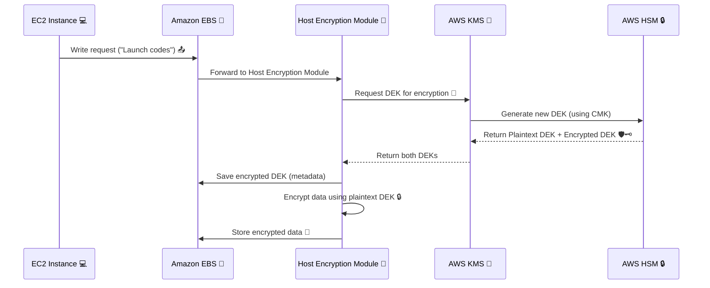
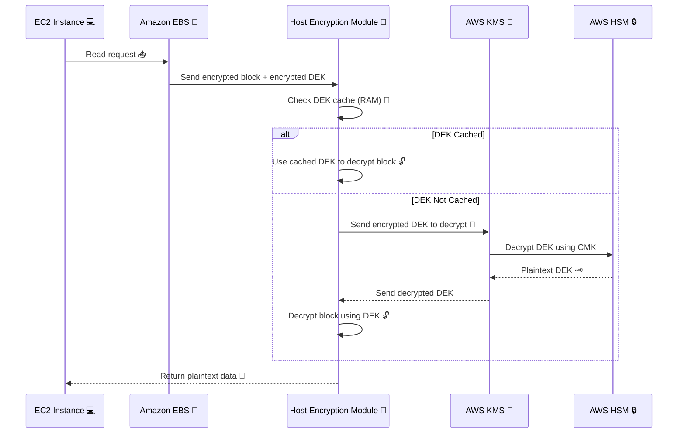

---
tags:
  - aws
  - aws/service
  - aws/domain/compute
  - aws/topic/ebs
aliases:
  - "EBS Encryption & Decryption How It Works Behind the Scenes"
  - "EBS Encryption In Details"
---

# 🛡️ **EBS Encryption & Decryption: How It Works Behind the Scenes**

Amazon **Elastic Block Store (EBS)** provides durable storage volumes that can be encrypted **at rest and in transit** — all **managed by AWS Key Management Service (KMS)**.

Let’s break down the **two main flows**:

- 🔐 Encryption flow (when **writing data** to the volume)
- 🔓 Decryption flow (when **reading data** from the volume)

---

## 🔐 **1. Updated Encryption Flow (Write Path)**

---

### 🧠 Step-by-Step Breakdown

1️⃣ **Write Request Begins**
EC2 sends data to write to EBS.

2️⃣ **EBS Hands Data to HEM**
The host-level module intercepts the write.

3️⃣ **HEM Requests a DEK**
It asks KMS to generate a **new DEK** for this volume.

4️⃣ **KMS via HSM Generates Keys**
The **HSM** produces:

- A **Plaintext DEK** for encryption
- An **Encrypted DEK**, wrapped with your CMK

5️⃣ **KMS Returns Both Keys**
HEM receives both versions.

6️⃣ **Encrypted DEK Is Stored**
Encrypted DEK is stored as **volume metadata** with EBS.

7️⃣ **Plaintext DEK Is Used in Memory**
HEM encrypts your data **in RAM only**, never storing plaintext keys.

8️⃣ **Encrypted Data Is Saved**
The encrypted block is stored in the volume. ✅

---

## 🔓 **2. Updated Decryption Flow (Read Path)**

---

### 🧠 Step-by-Step Breakdown

1️⃣ **EC2 Requests Read**
App on EC2 reads a file or data block.

2️⃣ **EBS Sends Encrypted Block**
Along with the **encrypted DEK**, stored during write.

3️⃣ **HEM Checks for Cached DEK**
It checks if the **plaintext DEK is still in memory**.

4️⃣ **If Cached ➜ Fast Decrypt**
Data block is decrypted instantly using cached DEK.

5️⃣ **If Not Cached ➜ Fetch from KMS**
HEM sends the **encrypted DEK** to KMS.

6️⃣ **KMS Uses HSM to Decrypt It**
Plaintext DEK is returned securely to HEM (RAM only).

7️⃣ **HEM Decrypts the Block**
Encrypted block is decrypted using the DEK.

8️⃣ **Plaintext Sent to EC2**
Application gets its data, unaware of the magic behind it.

---

## 🧩 Summary: Important Facts

| 💡 Concept                  | 🔐 Encryption                 | 🔓 Decryption                      |
| --------------------------- | ----------------------------- | ---------------------------------- |
| DEK generated by            | KMS + HSM                     | N/A (retrieved and decrypted)      |
| Keys returned               | Plaintext DEK + Encrypted DEK | Plaintext DEK (from encrypted DEK) |
| Encrypted DEK stored where? | With EBS metadata             | With EBS metadata                  |
| Plaintext DEK lifetime      | RAM only, short-lived         | RAM only, may be cached            |
| Can DEK be reused?          | Yes, until flushed            | Yes, if in RAM cache               |
| CMK visibility              | ❌ Never exposed              | ❌ Never exposed                   |

## ✨ Real-World Analogy

🔐 **Encryption = Sealing a Secret Letter**

- You (EC2) want to store a letter.
- The host encryption module is your **mailroom guy with a shredder and safe**.
- He calls AWS KMS to **get a vault key** (DEK) locked inside a box (encrypted under CMK).
- He opens the box **in memory**, encrypts your letter, locks it in a safe (EBS), and discards the key copy.

🔓 **Decryption = Opening the Safe**

- When you need the letter back, he retrieves it from the safe, unlocks the vault key again, opens the letter, and hands it to you.
- You never see the key or safe — just your letter.

---

## ✅ Benefits of This Design

- **Zero Touch**: All this encryption/decryption is transparent to your application.
- **Key Rotation**: You can rotate your CMK in KMS; AWS re-encrypts new data automatically.
- **Compliance**: Meets standards like PCI DSS, HIPAA, GDPR, etc.
- **No Performance Tradeoff**: Encryption is optimized — you don’t take a big performance hit.
---

## Related Notes
- [[aws-services/5.compute/2.ebs/|Index]] - folder map
- [[aws-services/5.compute/2.ebs/2.1.ebs-encryption|EBS Encryption Simplified Secure and Smart]] - previous lesson
- [[aws-services/5.compute/2.ebs/4.1.snapshot|Amazon EBS Snapshots Efficient Scalable Backup for Your Volumes]] - next lesson
- [[aws-services/2.security/2.1.kms/1.3.key-rotation|Key Rotation]] - mentions Key Rotation
- [[aws-services/4.storage/1.s3/2.5.encryption|Amazon S3 Encryption]] - mentions Encryption
- [[aws-services/2.security/2.1.kms/2.aws-kms|AWS KMS Centralized Key Management for Secure Cloud Encryption]] - mentions AWS KMS
- [[aws-services/5.compute/2.ebs/1.1.ebs|Amazon EBS Elastic Block Store Scalable Persistent Storage for EC2]] - mentions EBS

---
