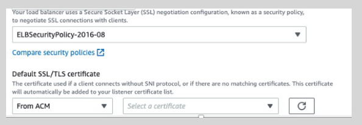

---
tags:
  - aws
  - aws/service
  - aws/domain/compute
  - aws/topic/elb
aliases:
  - "AWS Certificate Manager ACM"
---

# **AWS Certificate Manager (ACM) 🏨**

  

---

AWS Certificate Manager simplifies the process of managing SSL/TLS certificates for your ELBs.

- **Public SSL/TLS Certificates:**

  - **Cost:** **Free** when provisioned through ACM.
  - **Usage:** Easily attach to your ALB or NLB to secure your applications.

- **Importing Certificates:**

  - **Flexibility:** Import externally generated certificates to ACM or IAM.
  - **Use Case:** Utilize existing certificates from your preferred Certificate Authority (CA) for ELB SSL/TLS termination.
---

## Related Notes
- [[aws-services/5.compute/3.elb/|Index]] - folder map
- [[aws-services/5.compute/3.elb/3.1.x509-digital-ssl-tls-certs|X.509 / SSL / TLS Digital Certificates Explained the Smart Way]] - previous lesson
- [[aws-services/5.compute/3.elb/3.3.ssl-offload-vs-tcp-pass-through|SSL Offload vs TCP Pass-Through Secure Like a Pro]] - next lesson
- [[aws-services/2.security/1.1.iam/1.fundmmentals/1.2.iam|AWS Identity and Access Management IAM]] - mentions IAM

---
