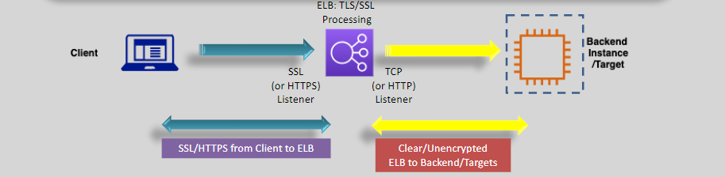
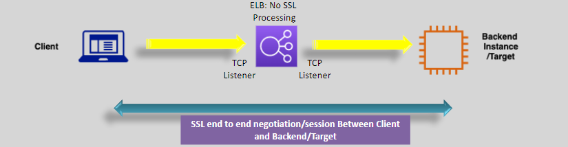

---
tags:
  - aws
  - aws/service
  - aws/domain/compute
  - aws/topic/elb
aliases:
  - "SSL Offload vs TCP Pass-Through Secure Like a Pro"
  - "Ssl Offload Vs Tcp Pass Through"
---

# **🔒🔄 SSL Offload vs TCP Pass-Through: Secure Like a Pro**

In the world of secure traffic on AWS, two main strategies battle it out: **SSL Offloading** and **TCP Pass-Through**. Which one wins for your use case? That depends on your balance of **performance**, **security**, and **control**. Let’s break it all down like a smart (and slightly paranoid) engineer would. 😎

---

## **🌐 1. What’s the Deal?**

### 🔐 **SSL Offload**

- **What it does**: Terminates the SSL/TLS session **at the load balancer**, freeing your backend from cryptographic heavy lifting.
- **Handled by**: **ALB** (Application Load Balancer) and optionally **NLB** (Network Load Balancer).
- **OSI Layer**: Layer **7** (for ALB), Layer **4** (for NLB with TLS listener).

### 🔄 **TCP Pass-Through**

- **What it does**: Passes encrypted traffic **directly to your backend**. Backend handles the decryption and handshake.
- **Handled by**: **NLB** only.
- **OSI Layer**: Layer **4**.

---

## **🔄🔐 2. SSL Offloading (Termination at Load Balancer)**

When you want to **offload encryption duties**, **simplify cert management**, and boost **backend performance**, SSL offload is your friend.

  

### 🛠️ How It Works

1. 📜 Upload your **TLS certificate** (X.509) to the ALB/NLB.
2. 🧠 Load balancer performs **SSL termination** – decrypts incoming traffic.
3. 🚚 Decrypted data is forwarded to backend over HTTP (or HTTPS if you want re-encryption).

### ✅ Benefits

- ⚡ **Performance Boost**: Backends skip CPU-intensive crypto.
- 🧘‍♂️ **Centralized Management**: Certs live at the LB. Easy to rotate.
- 🔄 **Flexible**: Can mix internal HTTPS with external HTTPS.

### ⚠️ Considerations

- 🔓 **Traffic to Backend** is unencrypted unless you explicitly re-encrypt.
- 🎯 **Security Focus**: Make sure internal traffic is locked down if unencrypted.

---

## **🔄🔒 3. TCP Pass-Through (End-to-End Encryption)**

When **no one touches your traffic but you**, this is your go-to. Your app gets full control, from handshake to cipher.

  

### 🛠️ How It Works

1. 🔐 Encrypted TLS traffic hits the **NLB**.
2. 🚫 NLB does **not decrypt** or inspect it.
3. 🎯 Encrypted traffic is routed directly to the backend instance.
4. 🧠 Backend instance performs **TLS handshake** and handles the encryption.

### ✅ Benefits

- 🔒 **End-to-End Security**: No middleman sees your unencrypted traffic.
- 🔧 **More Control**: You control ciphers, certificates, and TLS versions.

### ⚠️ Considerations

- 📉 **Performance Load**: Backends must do all the crypto math.
- 🗂️ **Cert Management at Scale**: You need to rotate certs **on every instance**.
- 👨‍🔧 **Operational Overhead**: More moving parts to monitor and update.

---

## **⚖️ 4. SSL Offload vs TCP Pass-Through: When to Use What?**

| Feature                      | SSL Offload (ALB/NLB)          | TCP Pass-Through (NLB)            |
| ---------------------------- | ------------------------------ | --------------------------------- |
| **Encryption Terminated At** | Load Balancer                  | Backend EC2 instance              |
| **Performance Efficiency**   | ✅ Backend is free from crypto | ❌ Backend handles encryption     |
| **Certificate Management**   | Centralized (ACM or uploaded)  | Distributed (on each backend)     |
| **End-to-End Encryption**    | Optional (depends on setup)    | ✅ Yes                            |
| **Compliance Needs**         | Not always enough              | Meets strict compliance           |
| **Best For**                 | Web apps, public APIs          | Regulated apps, zero-trust setups |

---

## **🧠 Real-World Examples**

### 🔄 SSL Offload

- Public-facing **e-commerce website** on ALB.
- Wants HTTPS termination and unencrypted internal microservices traffic.

### 🔒 TCP Pass-Through

- **Healthcare service** transmitting patient data.
- Needs **strict HIPAA** compliance and end-to-end TLS.

---

## 🎯 Final Thoughts

- 🧘‍♂️ **SSL Offload** is best for simplicity and performance.
- 🧱 **TCP Pass-Through** is best for **strict security** and **end-to-end encryption**.

In short, if you want performance and ease → go offload.
If you want zero compromise on encryption → go pass-through.

🔐 Choose wisely, architect smarter. 💡
---

## Related Notes
- [[aws-services/5.compute/3.elb/|Index]] - folder map
- [[aws-services/5.compute/3.elb/3.2.acm|AWS Certificate Manager ACM]] - previous lesson
- [[aws-services/5.compute/3.elb/3.4.sni-server-name-indication|Server Name Indication SNI One IP Many Secure Hosts]] - next lesson
- [[aws-daily/aws-waf/4.1.performance-efficiency|Performance Efficiency]] - mentions Performance Efficiency
- [[aws-services/4.storage/1.s3/2.5.encryption|Amazon S3 Encryption]] - mentions Encryption
- [[aws-services/11.analytics/open-search/1.2.battle|Elasticsearch and OpenSearch]] - mentions Battle

---
