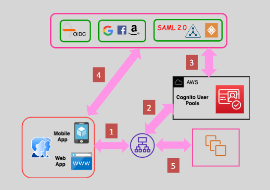

---
tags:
  - aws
  - aws/service
  - aws/domain/compute
  - aws/topic/elb
aliases:
  - "ALB Advanced Features"
  - "Alb Advanced Features"
---

# **🚀 ALB Advanced Features**

The **Application Load Balancer (ALB)** isn't just about splitting up traffic—it's a brainy traffic director! With its powerful features, you can secure connections, fine-tune performance, and shield your services like a pro. Let’s explore the magic behind its advanced capabilities.

---

## **🔄 1. Redirect Action**

Ever needed to redirect HTTP to HTTPS or tweak URL paths? ALB lets you do it _automagically_ with **redirect actions**.

### **✨ What It Does**

- Force HTTPS connections for security
- Redirect from one domain/path to another
- Modify ports or query strings dynamically

### **📌 Common Redirect Types**

- `HTTP_301`: Permanent redirect (search-engine-friendly)
- `HTTP_302`: Temporary redirect (used for testing or short-term redirection)

### **🔧 Example: Redirect HTTP to HTTPS**

```json
{
  "Type": "redirect",
  "RedirectConfig": {
    "Protocol": "HTTPS",
    "Port": "443",
    "Host": "#{host}",
    "Path": "/#{path}",
    "Query": "#{query}",
    "StatusCode": "HTTP_301"
  }
}
```

🧭 This tells ALB to send all HTTP traffic to its HTTPS twin without losing the path or query.

---

## **🔐 2. User Authentication**

Skip the custom login forms—ALB can **authenticate users** before they ever touch your app.

### **🔑 Auth Integration Options**

- **Amazon Cognito**: Add login with Google, Facebook, Amazon, or username/password
- **OIDC** (OpenID Connect): Connect to your enterprise identity provider
- **SAML / LDAP / Microsoft AD**: Supported via Cognito federation

### **💡 Why It’s Awesome**

- Built-in login flow, no backend coding needed
- Sessions handled by ALB, not your app
- Keeps traffic secure from the get-go

<div style="text-align: center;">
  
</div>

---

## **🐢 3. Slow Start Mode: _Don’t Overwhelm New Targets_**

When a new backend instance joins the target group, you don't want it hit with 1,000 requests per second instantly. That’s what **Slow Start Mode** is for.

### **⏱️ How It Works**

- Gradually increases traffic to new healthy targets
- Gives your instance time to warm up (e.g., load caches, connect to DB)

### **🛠️ Settings**

- Set per **target group**
- Duration: `0` (off) to `900` seconds (15 minutes)

🎯 **Best For**: Apps with cold starts, long boot times, or initialization logic.

---

## **🎯 Final Thoughts: Make ALB Work Smarter for You**

ALB is way more than a load balancer—it's a full-featured traffic director. With features like:

- 🔁 **Redirect Actions** to secure your app & clean URLs
- 🔐 **Authentication** handled right at the edge
- 🐢 **Slow Start Mode** to protect your newest targets

...you’re equipped to build smarter, faster, and safer applications.

🧠 **Pro Tip**: All of these features are **configurable via the console, CLI, or Infrastructure as Code (like Terraform or CloudFormation).**
---

## Related Notes
- [[aws-services/5.compute/3.elb/|Index]] - folder map
- [[aws-services/5.compute/3.elb/6.1.alb|Application Load Balancer ALB Overview]] - previous lesson
- [[aws-services/5.compute/3.elb/6.3.http-desync-attack|HTTP Desync Attacks]] - next lesson
-[[1.1.cfn|AWS CloudFormation]]] - mentions CloudFormation

---
