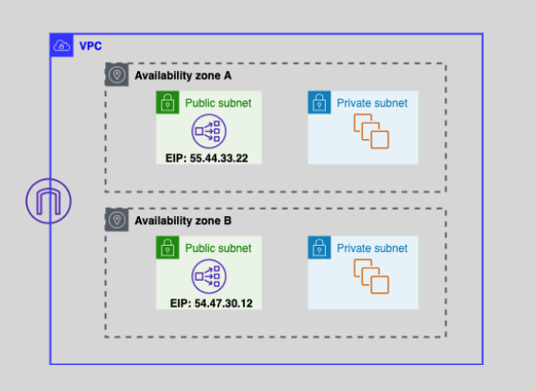
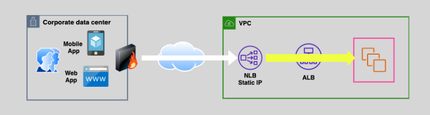

---
tags:
  - aws
  - aws/service
  - aws/domain/compute
  - aws/topic/elb
aliases:
  - "Network Load Balancer NLB"
---

# **⚡ Network Load Balancer (NLB)**

The **Network Load Balancer (NLB)** is AWS’s answer to extremely high-performance, low-latency, and scalable load balancing. It’s purpose-built for handling millions of requests per second while preserving the **original client IP**, supporting **TCP/UDP**, and delivering **elasticity** with minimal latency. If you’re building a high-throughput app like a game server, real-time messaging system, or a hybrid cloud integration — NLB is your go-to.

---

## **🚀 1. High Performance and Ultra-Low Latency**

- NLB can **scale automatically** to handle **millions of requests per second**.
- It maintains **sub-millisecond latency** and **low jitter**, which makes it ideal for:
  - 🏦 Financial applications
  - 📡 Real-time communication apps
  - 🎮 Gaming platforms
  - 📶 IoT data processing

> ⚠️ Unlike ALB, NLB forwards packets at the **TCP/UDP level** without needing to terminate the connection, giving you blazing-fast performance.

---

## **🌐 2. TCP & UDP Load Balancing**

NLB is a **Layer 4 (Transport Layer)** load balancer, which means it can forward **TCP** and **UDP** packets without interpreting application content.

- **TCP**: For web servers, databases, email services
- **UDP**: For VoIP, DNS, streaming

✅ **Same Port Support**: You can serve both TCP & UDP on the **same port**, like port 53 for DNS.

### **Example**

```text
Client ---(UDP:53)---> NLB ---(UDP)---> DNS EC2
Client ---(TCP:53)---> NLB ---(TCP)---> DNS EC2
```

---

## **🌍 3. IPv4 & Dual Stack (IPv6 Support)**

- NLB supports **IPv4**, **IPv6**, and **dual-stack** configurations.
- Useful when supporting modern devices that prefer IPv6.

### Use Case

You want your app accessible from both old IPv4 clients and modern IPv6 devices. NLB allows you to bridge that gap.

---

## **📌 4. `Static Elastic IPs per AZ`**

Each Availability Zone (AZ) can be assigned a **static Elastic IP (EIP)**. This ensures predictable IP-based access for external firewalls, legacy apps, or DNS pinning.

### Benefits

- Easy to **whitelist** in partner firewalls
- Simplified **DNS setup** using static IPs
- Great for **hybrid cloud** scenarios

> 🔧 You can even bring your own IP addresses (BYOIP) for advanced use cases.

---

<div style="text-align: center;"></div>

---

## **⚖️ 5. Cross-Zone Load Balancing (Optional)**

By default, NLB sends traffic **only to targets in the same AZ** as the client.

- ✅ You can **enable cross-zone balancing** to allow traffic to be distributed evenly across all healthy targets in **all AZs**.
- 🔁 Useful when your traffic or backend instances are unevenly distributed.

> 💡 Enabling this incurs **inter-AZ data transfer costs**.

---

## **🛡️ 6. Delete Protection**

Just like ALB, NLB supports **delete protection**, preventing accidental deletion of a production load balancer.

### Benefits

- Prevent outages caused by manual errors
- Adds a layer of safety in critical infrastructure

> 💡 You can enable/disable this via the console, CLI, or Terraform.

---

## **🔌 7. Integration with VPC Peering, VPNs, and Hybrid Networks**

NLB can handle traffic from a **peered VPC**, **AWS Site-to-Site VPN**, or even **3rd-party VPN appliances**.

### Use Cases

- Secure hybrid cloud connectivity
- Centralized services across VPCs
- On-prem traffic routed through AWS

> 🛠️ Works seamlessly with AWS Direct Connect too.

---

## **🔁 ALB Behind NLB (For HTTP Routing + Static IP)**

NLB supports **chaining** with an ALB. That means:

- Use **NLB** for **TLS termination** and **static IP needs**
- Route the traffic to **ALB** for **Layer 7 magic** like path-based or host-based routing

### Why Use This?

- Gives you the best of both worlds: **NLB performance + ALB flexibility**
- Perfect when clients expect static IPs but your app uses HTTP rules

---

<div style="text-align: center;"></div>

---

## **🎯 Conclusion**

The **Network Load Balancer** is the beast of AWS load balancing. It gives you:

- ⚡ Ultra-fast performance
- 🌍 Static IPs and IPv6 support
- 🔄 TCP/UDP balancing
- 🧠 Smart integration with ALB, VPNs, and VPCs

Use it when latency, performance, and throughput are your top priorities — whether for gaming, telecom, real-time apps, or critical internal systems. And if you need deep HTTP-level control? Combine it with ALB for a rock-solid setup.
---

## Related Notes
- [[aws-services/5.compute/3.elb/|Index]] - folder map
- [[aws-services/5.compute/3.elb/6.3.http-desync-attack|HTTP Desync Attacks]] - previous lesson
- [[aws-services/5.compute/3.elb/7.2.nlb-private-link|NLB PrivateLink and VPC Endpoint Services]] - next lesson
- [[aws-services/5.compute/3.elb/1.4.cross-zone-lb|Cross-Zone Load Balancing]] - mentions Cross-Zone Load Balancing
- [[aws-services/3.network/1.vpc/5.1.vpn/3.aws-direct-connect|AWS Direct Connect]] - mentions AWS Direct Connect
- [[aws-services/3.network/1.vpc/1.fundmentals/4.1.vpc-peering|VPC Peering]] - mentions VPC Peering

---
