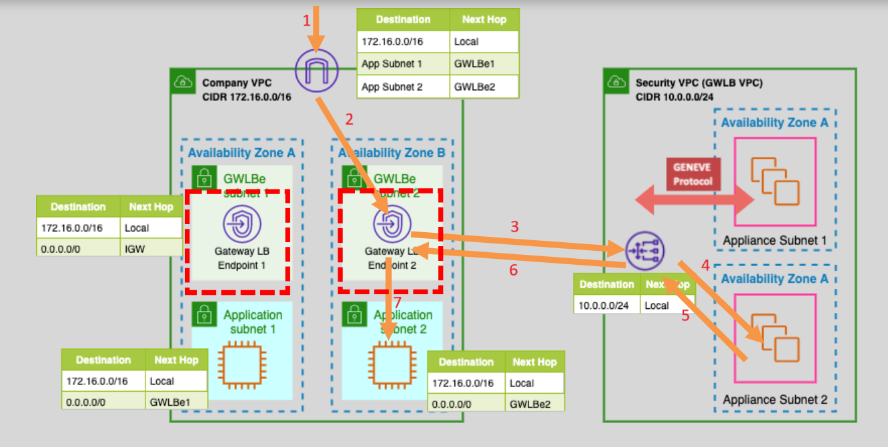
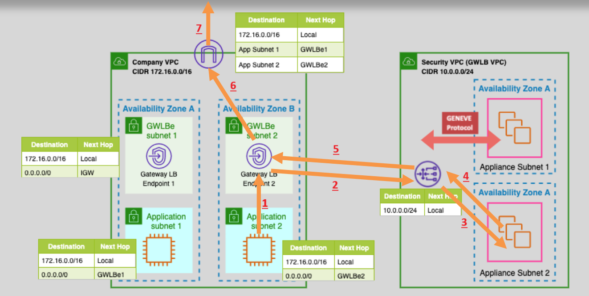
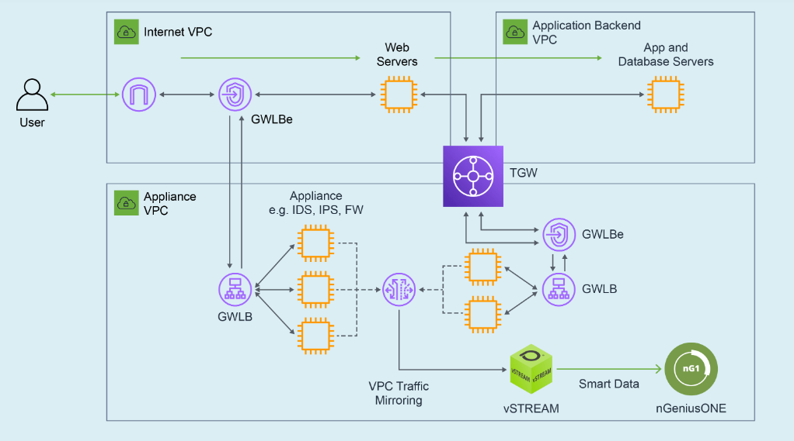

---
tags:
  - aws
  - aws/service
  - aws/domain/compute
  - aws/topic/elb
aliases:
  - "Gateway Load Balancer GWLB Explained the Smart Way"
  - "Gwlb"
---

# **🚓🧱 Gateway Load Balancer (GWLB) — Explained the Smart Way**

The **Gateway Load Balancer (GWLB)** is like the **traffic cop** of your AWS network. It’s not here to serve web pages or route APIs — instead, it's built to **direct and inspect traffic** using third-party **security appliances** (firewalls, IDS/IPS, packet analyzers). Think of it as a **security service bus** that helps you insert, manage, and scale deep-packet inspection tools **without disrupting your app architecture**.

---

## **🔐 What Is Gateway Load Balancer (GWLB)?**

- **Purpose:** GWLB is a **fully managed Layer 3/4 load balancer** that works hand-in-hand with **virtual appliances** (like firewalls, proxies, or intrusion detection systems).
- **Key Feature:** It tunnels traffic using the **GENEVE protocol** (UDP port **6081**) — this lets it **wrap the original packet** and send it to a virtual appliance for inspection.
- **Ideal Use Case:** For security-heavy use cases like threat detection, deep-packet inspection, or enforcing compliance in cloud traffic.

> 🔒 Unlike ALB/NLB, GWLB doesn't look into HTTP headers or just forward TCP packets — it **redirects raw network packets** to virtual appliances in a separate **Security VPC**.

---

## **⚙️ How GWLB Works (Step-by-Step)**

### 📥 **Inbound (Ingress) Traffic Flow**

- 1️⃣ The user sends traffic to your **Application VPC**.
- 2️⃣ The **GWLB Endpoint** in the App VPC intercepts and forwards it to the **GWLB** in the **Security VPC**.
- 3️⃣ The GWLB **encapsulates** the packet with **GENEVE**, then forwards it to the **security appliance**.
- 4️⃣ The appliance **inspects or modifies** the traffic.
- 5️⃣ The appliance sends it back to the GWLB → GWLB removes encapsulation → sends it to the **final destination EC2** in the Application VPC.

---

---

### 📤 **Outbound (Egress) Traffic Flow**

- 1️⃣ An EC2 instance in the Application VPC sends outbound traffic.
- 2️⃣ Traffic is routed to the **GWLB endpoint**.
- 3️⃣ GWLB encapsulates the traffic using **GENEVE**, sending it to the **security appliance**.
- 4️⃣ Appliance inspects and approves → traffic flows back to GWLB.
- 5️⃣ GWLB de-encapsulates → sends it to the **Internet Gateway (IGW)** or other destination.

---

---

## **🌟 Key GWLB Features**

### ✅ **GENEVE-Based Traffic Mirroring**

- Encapsulates packets using the GENEVE protocol (like a Layer 3 tunnel).
- Preserves original metadata (IP, ports, payload).

### ✅ **Appliance Load Balancing**

- Distributes traffic across a fleet of virtual appliances — register EC2s as targets.

### ✅ **VPC Endpoint Service Integration**

- Expose your security appliances to other VPCs/accounts using **PrivateLink + GWLB**.

### ✅ **Elastic Scaling & High Availability**

- Add/remove appliance EC2s anytime.
- Supports **multi-AZ** deployments.

### ✅ **Centralized Security Management**

- Inspect traffic from all VPCs in one place.
- No need to run firewalls inside every app VPC.

---

## **📈 Real-World Example: NETSCOUT**

- **NETSCOUT** uses GWLB to deploy deep packet inspection tools at scale.
- Seamlessly inspects inter-VPC traffic.

📖 [Read the Case Study](https://www.netscout.com/blog/aws-enhances-netscout-visibility)

---

## **💰 Pricing Breakdown**

- **\$0.01/hour** per VPC endpoint (per AZ).
- **\$0.01/GB** for the first 1PB/month (volume discounts apply).

---

## **🛠️ Setting It Up (Simplified)**

### 🔧 **In the Security VPC**

- Create a **GWLB**.
- Register security appliances (EC2s) as **targets**.

### 🔧 **In the Application VPC**

- Create a **GWLB endpoint**.
- Update **route tables** to send all incoming/outgoing traffic through it.

> ⚠️ GWLB doesn’t have listeners like ALB/NLB — it's a **tunnel gateway**, not a reverse proxy.

---

## **🎯 When to Use Gateway Load Balancer**

| ✅ Best For                    | ❌ Not Ideal For                      |
| ------------------------------ | ------------------------------------- |
| Deep Packet Inspection         | Web routing (use ALB)                 |
| Centralized 3rd-party security | Stateless HTTP apps (use ALB/NLB)     |
| Multi-VPC traffic inspection   | Internal-only apps without inspection |

---

**TL;DR:**
If you want traffic to be **inspected like airport security scanners** — **before** it hits your apps — without disrupting your architecture, **GWLB is the hero you need.**

Protect once. Inspect everywhere. Stay secure. 🔐
---

## Related Notes
- [[aws-services/5.compute/3.elb/|Index]] - folder map
- [[aws-services/5.compute/3.elb/7.2.nlb-private-link|NLB PrivateLink and VPC Endpoint Services]] - previous lesson
- [[aws-services/3.network/1.vpc/1.fundmentals/5.1.vpc-endpoint|AWS VPC Endpoints]] - mentions Vpc Endpoint

---
