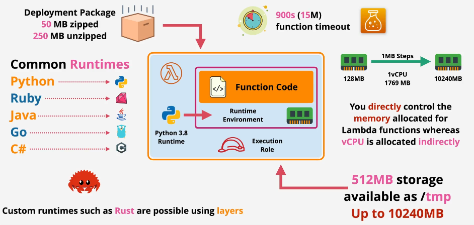

---
tags:
  - aws
  - aws/service
  - aws/domain/compute
  - aws/topic/lambda
aliases:
  - "AWS Lambda A Complete Guide with Components & Examples"
  - "Lambda Overview"
---

# 🚀 **AWS Lambda: A Complete Guide with Components & Examples**

## **📌 Introduction to AWS Lambda**

**AWS Lambda** is a **serverless computing service** that enables developers to run code without provisioning or managing servers. It automatically scales, executes code in response to events, and only charges for the compute time consumed.

### 🎯 **Why Use AWS Lambda?**

- ✅ **No Server Management** – AWS handles provisioning, scaling, and maintenance.
- ✅ **Scalability** – Lambda scales automatically from a few requests per day to thousands per second.
- ✅ **Cost-Efficient** – You pay only for the execution time used.
- ✅ **Event-Driven** – Easily integrates with AWS services like S3, DynamoDB, API Gateway, and more.

---

<div style="text-align:center;">
    
</div>

---

## 💅 **Shared Responsibility Model**

AWS Lambda operates under a shared responsibility model, where AWS and you, the customer, share security and operational responsibilities.

### 🛡️ **AWS Responsibilities:**

- **Infrastructure Management:**
  - Maintenance of compute and operating system resources.
  - Automatic scaling based on demand.
  - Capacity provisioning to handle workloads.
- **Monitoring and Logging:**
  - Continuous monitoring of the underlying infrastructure.
  - Logging via AWS CloudWatch.

### 👤 **Customer Responsibilities:**

- **Code Management:**
  - Writing and supplying the application code.
  - Creating and managing application versions (updating code as needed).
- **Configuration:**

  - Setting up memory allocation, timeout settings, and other function configurations.

- **Manage Roles:** Create and update IAM roles and policies to define permissions.

> **Note:** Customers do not have access to the underlying compute resources used by AWS Lambda.

---

## 🤔 **How AWS Lambda Works**

AWS Lambda executes code in response to **triggers** from services like **API Gateway, S3, DynamoDB, or CloudWatch Events**. Each function runs in an **isolated container** and is allocated a specific amount of **memory, CPU, and execution time**.

## 🏗 **AWS Lambda Components**

AWS Lambda consists of several components that work together to execute and manage serverless functions. Let’s break them down:

### 1️⃣ **Function** 🏆

The **function** is the core of AWS Lambda. It contains the **code** that gets executed when triggered. Functions can be written in various languages like:

- **Python 🐍**
- **Node.js 🌐**
- **Java ☕**
- **Go 🏎️**
- **C#/.NET ⚙️**

#### Example: A simple AWS Lambda function in Python

```python
def lambda_handler(event, context):
    return "Hello from AWS Lambda!"
```

---

### 2️⃣ **Event Source (Triggers) 🚀**

AWS Lambda functions need **triggers** to execute. A trigger is an event from an AWS service or an external source that activates the function.

🛎️ **Common AWS Lambda Triggers:**

- **S3 Bucket** – Runs when a file is uploaded
- **API Gateway** – Runs when an HTTP request is made
- **DynamoDB** – Runs when database changes occur
- **CloudWatch** – Runs on scheduled events or logs
- **SNS/SQS** – Runs when a message is sent

#### Example: Triggering Lambda when a file is uploaded to S3

```json
{
  "Records": [
    {
      "s3": {
        "bucket": { "name": "my-bucket" },
        "object": { "key": "new-file.txt" }
      }
    }
  ]
}
```

📌 **Lambda reads the event and processes the file.**

---

### 3️⃣ **Execution Role (IAM Permissions) 🔑**

Every Lambda function runs with a specific **IAM role** that grants it permissions to access AWS services.

✅ **Common IAM Policies for AWS Lambda:**

- **S3 Read/Write Access** – To process files
- **DynamoDB Access** – To read/write database records
- **CloudWatch Logs** – To store execution logs

#### Example: IAM Policy for Lambda to access S3

```json
{
  "Effect": "Allow",
  "Action": ["s3:GetObject", "s3:PutObject"],
  "Resource": "arn:aws:s3:::my-bucket/*"
}
```

📌 **Without the correct IAM role, Lambda cannot access AWS services.**

---

### 4️⃣ **Execution Environment 🖥️**

AWS Lambda runs in an isolated **execution environment** that includes:

- **Temporary storage** (`/tmp/` folder, 512MB)
- **Assigned memory** (128MB to 10GB)
- **Ephemeral compute** (short-lived execution)

📌 **Each function runs independently with no persistence beyond execution.**

---

### 5️⃣ **Concurrency & Scaling ⚡**

AWS Lambda **scales automatically** based on incoming requests.

- **Default concurrency**: One request per function instance
- **Parallel execution**: Spawns multiple instances if needed
- **Provisioned concurrency**: Reduces cold starts

💡 **Cold Start Issue:**  
When Lambda is inactive for a while, the first request takes longer to execute due to environment setup. **Provisioned Concurrency** can keep functions warm for faster execution.

---

### 6️⃣ **Lambda Layers 📦**

Lambda **Layers** allow you to **reuse code** across multiple functions.

🔹 **Example use cases:**

- Common libraries (e.g., NumPy, Pandas for Python)
- Custom business logic shared across functions
- Large dependencies to reduce function size

#### Example: Using a custom Layer for Python libraries

1. **Create a ZIP file** with your dependencies
2. **Upload to AWS Lambda Layers**
3. **Attach the layer to your function**

📌 **Layers help reduce code duplication and improve function management.**

---

### 7️⃣ **Monitoring & Logging 📊**

AWS Lambda integrates with **Amazon CloudWatch** for monitoring execution.

**🔹 Logs include:**

- Execution time
- Memory usage
- Errors & debugging information

#### Example: Enabling Logging in a Lambda Function

```python
import logging

logger = logging.getLogger()
logger.setLevel(logging.INFO)

def lambda_handler(event, context):
    logger.info("Processing event: %s", event)
    return "Logging enabled!"
```

📌 **View logs in the AWS CloudWatch console.**

---

## 🎯 **How AWS Lambda Works (Step-by-Step Example)**

Now that we understand AWS Lambda components, let’s see them in action.

### **🚀 Example: AWS Lambda with S3 Trigger**

We will create a function that **executes when a file is uploaded to an S3 bucket**.

#### **Step 1: Create an S3 Bucket**

- Go to **AWS S3 Console**
- Click **"Create bucket"**
- Enable **Event Notifications**

#### **Step 2: Create a Lambda Function**

- Go to **AWS Lambda Console**
- Click **"Create function"** → Choose **"Author from Scratch"**
- Select **Python 3.x** as the runtime
- Set an IAM role with **S3 read access**

#### **Step 3: Write the Lambda Code**

```python
import json

def lambda_handler(event, context):
    bucket_name = event['Records'][0]['s3']['bucket']['name']
    file_name = event['Records'][0]['s3']['object']['key']

    print(f"New file uploaded: {file_name} in {bucket_name}")

    return {
        'statusCode': 200,
        'body': json.dumps(f"Processed file: {file_name}")
    }
```

#### **Step 4: Set an S3 Trigger for Lambda**

- In the **Lambda console**, click **"Add trigger"**
- Choose **S3** → Select the bucket
- Set **Event Type** to `PUT` (file upload)
- Save and Deploy

📌 **Now, when you upload a file to S3, the Lambda function will execute!**

---

## ✅ **AWS Lambda Best Practices**

To optimize performance and cost, follow these best practices:

🔹 **Use environment variables** for configurations  
🔹 **Reduce function size** by using Layers  
🔹 **Optimize memory allocation** (More memory = faster execution)  
🔹 **Use asynchronous execution** when applicable  
🔹 **Monitor performance** with CloudWatch logs

---

## 🎯 **Final Thoughts**

AWS Lambda is **a powerful serverless computing tool** that simplifies cloud development by eliminating server management. By understanding its **core components**, you can build **scalable, efficient, and event-driven applications**.

💡 **Next Steps:**  
🔹 **Try building your own Lambda function**  
🔹 **Experiment with API Gateway, DynamoDB, and CloudWatch**  
🔹 **Optimize performance with concurrency and layers**
---

## Related Notes
- [[aws-services/5.compute/4.1.lambda/|Index]] - folder map
- [[aws-services/5.compute/4.1.lambda/_aws-lambda-notes|AWS Lambda Notes]] - previous lesson
- [[aws-services/5.compute/4.1.lambda/1.2.lambda-permissions|AWS Lambda Permissions]] - next lesson
- [[aws-daily/aws-cloud-Concepts/7.3.shared-responsibility-model|AWS Shared Responsibility Model]] - mentions Shared Responsibility Model
- [[aws-services/5.compute/4.1.lambda/4.2.lambda-layers|AWS Lambda Layers]] - mentions AWS Lambda Layers
- [[aws-services/1.management-governance/3.1.cloud-watch/3.1.cw-logs|Amazon CloudWatch Logs]] - mentions CloudWatch Logs
- [[aws-services/5.compute/4.1.lambda/9.1.lambda-with-s3|AWS Lambda with Amazon S3]] - mentions Lambda With S3
- [[aws-services/3.network/4.api-gateway/x.api-gateway|Amazon API Gateway Streamlining API Management]] - mentions API Gateway
- [[aws-services/3.network/4.api-gateway/1.1.api-gateway|AWS API Gateway The Front Door for Your APIs]] - mentions API Gateway
- [[aws-daily/aws-architectures/3.1.serverless|Server-Based Architectures vs. Serverless Computing]] - mentions Serverless
- [[aws-services/2.security/1.1.iam/1.fundmmentals/3.iam-policy|IAM Policies in AWS Control Access with Precision]] - mentions IAM Policy
- [[aws-services/10.developer/1.4.aws-sam/1.serverless|The Ultimate Guide to Serverless Computing & Tools]] - mentions Serverless

---
