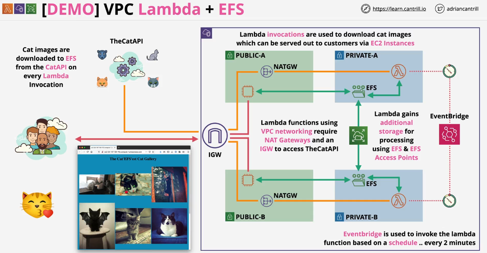

---
tags:
  - aws
  - aws/service
  - aws/domain/compute
  - aws/topic/lambda
aliases:
  - "Accessing Private VPC Resources using Lambda Project"
  - "Pro 3 Private Lambda With Efs And Event Bridge"
---

# Accessing Private VPC Resources using Lambda Project

    

---

## Related Notes
- [[aws-services/5.compute/4.1.lambda/|Index]] - folder map
- [[aws-services/5.compute/4.1.lambda/11.3.pro-2-lambda-with-alb|AWS Lambda with ALB example]] - previous lesson
- [[aws-services/5.compute/4.1.lambda/11.5.pro-4-pixelator|pro-3- Pixelator]] - next lesson

---
