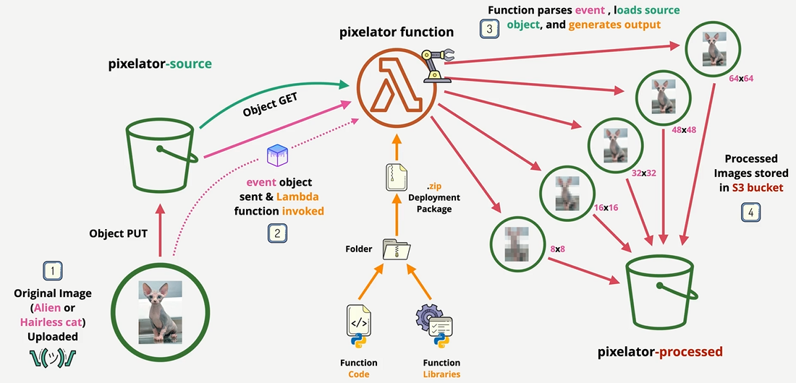

---
tags:
  - aws
  - aws/service
  - aws/domain/compute
  - aws/topic/lambda
aliases:
  - "pro-3- Pixelator"
  - "Pro 4 Pixelator"
---

# pro-3- Pixelator

    

---

## Related Notes
- [[aws-services/5.compute/4.1.lambda/|Index]] - folder map
- [[aws-services/5.compute/4.1.lambda/11.4.pro-3-private-lambda-with-efs-and-event_bridge|Accessing Private VPC Resources using Lambda Project]] - previous lesson
- [[aws-services/5.compute/4.1.lambda/11.6.lambda-use-cases|Lambda Use Cases]] - next lesson

---
